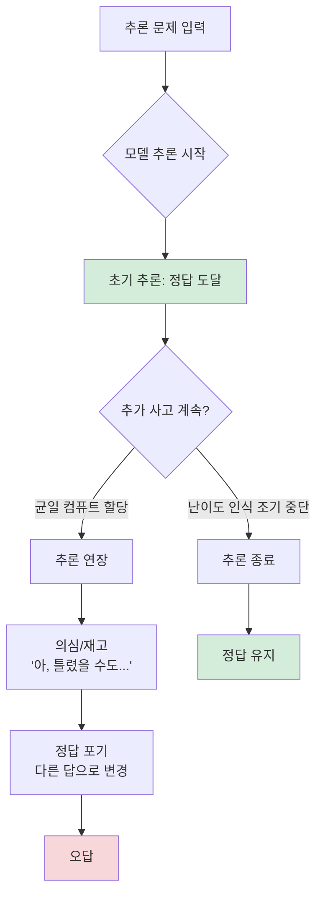

# 더 많은 사고가 오히려 해롭다: LLM 과사고(Overthinking) 현상 분석

## 논문 메타데이터

| 항목 | 내용 |
|------|------|
| arXiv ID | 2604.10739 |
| 저자 | Shu Zhou, Rui Ling, Junan Chen, Xin Wang, Tao Fan, Hao Wang |
| 연도 | 2026 |
| 분야 | 추론 / 테스트 시간 계산 |

## 핵심 기여

[[test-time-compute-scaling|테스트 시간 컴퓨트 스케일링(test-time compute scaling)]]이 항상 LLM 성능을 향상시킨다는 통념에 반기를 든다. 모델이 **과사고(overthinking)** 를 보여 추론을 과도하게 연장하면 이전에 맞았던 답을 포기하는 현상을 실증적으로 발견하고, **최적 추론 길이는 문제 난이도에 따라 다르다**는 것을 보인다.

## 핵심 발견: 과사고 현상

### 현상 설명
- 모델이 중간에 정답에 도달했음에도 추론을 **불필요하게 연장**
- 연장된 추론 과정에서 자기 의심(self-doubt) 패턴이 발생
- 최종 출력이 중간 정답을 **포기하고 오답으로 전환**
- 쉬운 문제일수록 이 현상이 더 두드러짐

## 왜 발생하는가

[[reasoning-llm]] 학습 시 긴 체인을 생성하도록 강화 학습(RL)으로 훈련된 모델은 "더 많이 생각하는 것이 좋다"는 편향을 갖게 된다. 그 결과:

1. 정답에 도달했어도 계속 생각하려는 경향
2. 추론 체인이 길어질수록 앞서 도달한 결론과 모순 발생
3. 최근 생성된 내용이 이전 정답을 덮어쓰는 메커니즘

## 난이도 인식 최적 추론 길이

| 문제 난이도 | 최적 추론 길이 | 과사고 위험 |
|------------|--------------|------------|
| 쉬움 | 짧게 | 높음 (조기 정답 후 번복 위험) |
| 중간 | 중간 | 중간 |
| 어려움 | 길게 | 낮음 (더 많은 사고가 실제로 도움) |

균일 컴퓨트 할당(모든 문제에 동일한 추론 토큰 수 허용)이 **쉬운 문제에서 과사고를, 어려운 문제에서 컴퓨트 부족**을 동시에 야기한다.

## 실험 결과

- 다양한 [[reasoning-llm|추론 LLM]]에서 과사고 현상 실증적 관찰
- 추론 길이를 강제로 늘릴수록 쉬운 문제 정확도 하락 확인
- 난이도 인식 조기 중단(difficulty-aware early stopping)으로 정확도 회복 가능

## 한계

- 문제 난이도를 추론 전에 자동 측정하는 방법이 명확하지 않음
- 모델 계열마다 과사고가 발현되는 패턴이 다를 수 있음
- 체인-오브-쏘트 추론과 내부 표현의 실제 관계에 대한 심층 분석 필요

## 실무 적용 관점

추론 모델 서빙 시 **최대 토큰 수를 일률적으로 높게 설정하는 것이 항상 유리하지 않다**. 입력 문제의 난이도를 분류하고, 쉬운 문제에 대해서는 조기 종료(early stopping)나 낮은 최대 토큰 한도를 적용하는 동적 컴퓨트 할당 전략이 필요하다. [[tempo-test-time-training]]에서도 크리틱 재교정으로 이 문제를 우회하지만, 근본 원인인 과사고 자체를 인식하는 것이 선행 조건이다.

> "Thinking more can sometimes be harmful rather than helpful."
> — 저자들의 핵심 주장. 추론 길이와 품질은 단조 관계가 아님을 실증한다.

## 관련 문서

- [[reasoning-llm]] - 추론 LLM 일반 개념
- [[test-time-compute-scaling]] - 테스트 시간 계산 스케일링 개념
- [[tempo-test-time-training]] - EM 기반 TTT 스케일링 (2604.19295)
