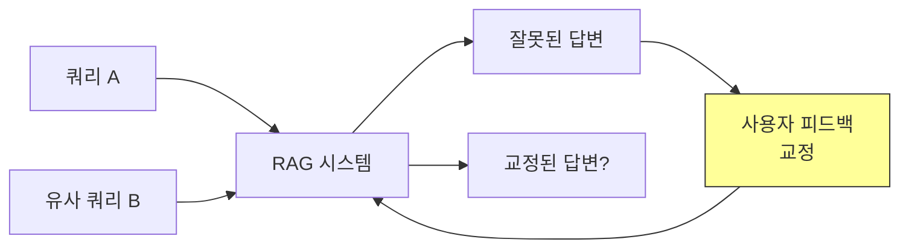

# PatchRAG: RAG를 위한 피드백 적응

## 핵심 기여

RAG 시스템의 **피드백 적응(feedback adaptation)**이라는 새로운 평가 차원을 정의하고, 재훈련 없이 추론 시점에 사용자/전문가 피드백을 통합하는 PatchRAG 방법을 제안한다. ACL 2026 Findings 수록.

핵심 성과:
- RAG 평가에서 기존 정적 메트릭이 놓치는 "피드백 반응성"을 평가 축으로 정립
- PatchRAG: 재훈련 없이 즉각적 교정 + 유사 쿼리로의 일반화 달성
- 학습 기반 적응의 속도-신뢰성 트레이드오프를 체계적으로 분석

## 문제 정의

기존 RAG 평가는 **정적 스냅샷**만 측정한다. 하지만 실제 배포 환경에서는:

> "교정 피드백이 향후 쿼리에 얼마나 효과적이고 빠르게 전파되는가?"

이 질문에 답하는 평가 프로토콜이 없었다.

핵심 질문: 쿼리 A에 대한 피드백이 유사 쿼리 B의 답변을 얼마나 빠르고 정확하게 개선하는가?

## 평가 프레임워크

두 가지 측정 축을 제안:

| 메트릭 | 설명 | 측정 대상 |
|--------|------|-----------|
| **Correction Lag** | 피드백 수신부터 행동 변화까지의 지연 | 반응 속도 |
| **Post-feedback Performance** | 교정 후 의미적으로 유사한 쿼리에서의 성능 | 일반화 능력 |

## 방법론: PatchRAG

PatchRAG의 핵심 아이디어는 **재훈련 없는 추론 시점 피드백 통합**이다:

- 사용자 피드백을 구조화된 패치(patch)로 변환
- 패치를 검색 인덱스 또는 프롬프트에 직접 주입
- 의미적으로 유사한 향후 쿼리에서 패치가 자동 활성화

### 학습 기반 적응과의 비교

| 접근법 | Correction Lag | 일반화 | 재훈련 필요 |
|--------|---------------|--------|-------------|
| PatchRAG (추론 시점) | 즉각적 | 강함 | 불필요 |
| Fine-tuning 기반 | 느림 (배치 학습) | 강함 | 필요 |
| RAG 인덱스 업데이트 | 중간 | 제한적 | 불필요 |

학습 기반 접근법은 속도와 신뢰성 사이의 본질적 트레이드오프가 존재한다.

## 실무 적용 관점

- **고객 서비스 RAG**: 잘못된 답변 즉시 교정, 유사 문의에 자동 반영
- **전문가 지식 시스템**: 도메인 전문가의 피드백이 즉각 시스템에 반영
- **RAG 평가 프로토콜**: 정적 벤치마크 외에 피드백 적응성을 평가 기준으로 추가

## 관련 문서

- [[에이전틱 RAG]] -- 에이전트가 검색 전략을 능동적으로 수립하는 RAG
- [[A-RAG]] -- 계층적 검색 인터페이스를 통한 에이전틱 RAG
- [[Corrective RAG]] -- 검색 결과의 품질을 자동 평가하고 교정하는 패턴
- [[적응형 RAG]] -- 쿼리 복잡도에 따른 동적 RAG 파이프라인
