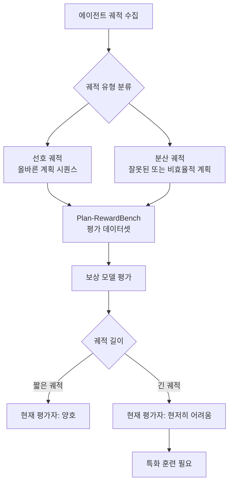

# Plan-RewardBench: 에이전트 계획 정렬을 위한 궤적 수준 보상 모델 벤치마크

## 논문 메타데이터

| 항목 | 내용 |
|------|------|
| arXiv ID | 2604.08178 |
| 저자 | Jiaxuan Wang, Yulan Hu, Wenjin Yang, Zheng Pan, Xin Li, Lan-Zhe Guo |
| 연도 | 2026 |
| 분류 | cs.AI, cs.CL |

## 핵심 기여

도구 통합 복잡 환경에서 에이전트의 **선호 궤적(preferred trajectory)** 과 **분산 궤적(divergent trajectory)** 을 판별하는 보상 모델 역량을 평가하기 위한 **Plan-RewardBench** 를 소개한다. [[ai-evaluation]] 분야에서 에이전트 계획(agentic planning) 특화 벤치마크가 부재했던 공백을 채운다.

위 다이어그램은 Plan-RewardBench의 평가 체계와 현재 보상 모델의 주요 취약점(긴 궤적에서의 성능 저하)을 보여준다.

## 방법론

### 벤치마크 구성

Plan-RewardBench는 세 가지 차원으로 구성된다:

1. **환경 복잡도**: 단순 도구 호출부터 복잡한 다단계 계획까지
2. **궤적 길이**: 짧은 궤적(3-5스텝)부터 긴 궤적(20+스텝)까지
3. **실패 유형**: 계획 오류, 도구 오용, 불완전 실행 등

### 평가 지표

기존 보상 모델 벤치마크(RewardBench 등)는 **단일 응답** 평가에 특화되어 있어 **궤적 시퀀스** 평가에 적합하지 않다. Plan-RewardBench는 다음을 측정한다:

- 선호/분산 궤적 쌍 판별 정확도 (pairwise accuracy)
- 긴 컨텍스트 이해 (long-context trajectory comprehension)
- 도구 사용 적절성 평가 (tool-use quality assessment)

### [[multi-agent-orchestration]] 과의 연관

에이전트 오케스트레이터가 서브에이전트 궤적을 평가할 때 보상 모델을 활용하는 경우, 긴 궤적에서의 성능 저하가 전체 멀티에이전트 시스템 품질에 직결된다.

## 실험 결과

| 평가 항목 | 현재 보상 모델 상태 |
|-----------|-------------------|
| 짧은 궤적 판별 | 양호한 성능 |
| 긴 궤적 판별 | 현저한 성능 저하 |
| 도구 통합 환경 | 특화 훈련 없으면 일반화 어려움 |

주요 발견: 최신 보상 모델들도 5스텝 이상의 계획 궤적에서 판별 정확도가 급격히 저하되며, 이는 일반 언어 이해 능력과 구별되는 **계획 인식 역량** 이 필요함을 시사한다.

## 한계

- 벤치마크 구성 시 자동 생성 궤적에 의존해 인간 판단 기준과 괴리 가능
- 특정 도메인(코딩, 웹 검색) 에 집중되어 범용성 제한
- 오픈소스 보상 모델 위주 평가로 최신 상용 모델 커버리지 부족

## 실무 관점

에이전트 시스템을 RLHF로 훈련하거나 에이전트 출력을 보상 모델로 평가하는 팀에게 중요한 시사점을 제공한다. 단일 응답 보상 모델을 에이전트 궤적 평가에 그대로 적용하면 긴 계획 시퀀스에서 오판이 빈번하므로, Plan-RewardBench로 현재 보상 모델의 계획 평가 역량을 먼저 측정하는 것을 권장한다.

## 관련 문서

- [[ai-evaluation]] - AI 평가 방법론 개요
- [[multi-agent-orchestration]] - 멀티에이전트 오케스트레이션
- [[coding-agent-behavioral-analysis]] - 코딩 에이전트 행동 분석 (관련 에이전트 벤치마크)
- [[rlhf]] - RLHF 개요
