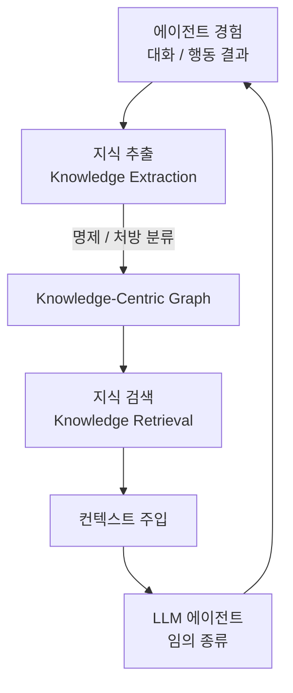

# PlugMem: Task-Agnostic Plugin Memory Module for LLM Agents

arXiv 2603.03296 | 2026-03-06 | Ke Yang, Zixi Chen, Xuan He, Jize Jiang, Michel Galley, Chenglong Wang, Jianfeng Gao, Jiawei Han, ChengXiang Zhai

임의의 LLM 에이전트에 탈착 가능한(plug-and-play) 장기 메모리 모듈. 경험을 원본 텍스트 그대로 저장하는 대신 **명제적·처방적 지식(propositional·prescriptive knowledge)**의 compact 그래프로 구조화하는 것이 핵심 아이디어다.

## 핵심 아이디어

> "Humans store experiences as abstract knowledge, not as raw episodic recordings."

인지과학에서 인간이 경험을 추상화된 지식으로 저장하는 방식을 모방한다. 기존 메모리 시스템이 엔티티나 텍스트 청크를 저장 단위로 삼는 반면, PlugMem은 **knowledge proposition**을 단위로 삼아 정보 밀도를 최대화한다.

두 가지 지식 유형:
- **Propositional knowledge**: 사실·상태에 관한 명제 (예: "사용자는 Python을 선호한다")
- **Prescriptive knowledge**: 행동 규칙·절차에 관한 지식 (예: "이 사용자는 간결한 답변을 원한다")

## GraphRAG와의 차이

| 비교 항목 | GraphRAG | PlugMem |
|-----------|----------|---------|
| 메모리 단위 | 엔티티 / 텍스트 청크 | Propositional / prescriptive knowledge |
| 그래프 구조 | 엔티티 중심 그래프(entity-centric) | 지식 중심 그래프(knowledge-centric) |
| 재사용성 | 태스크 특화 튜닝 필요 | **Task-agnostic** (범용) |
| 정보 밀도 | 중간 | **최고** (정보이론 분석 기준) |
| 에이전트 통합 | 에이전트별 재설계 필요 | Plug-and-play |

## 아키텍처 개요

PlugMem은 에이전트 루프 외부에서 독립적으로 동작하며 어떤 에이전트에도 붙일 수 있다.

## 벤치마크 결과

3개 벤치마크에서 평가:

| 벤치마크 | 태스크 유형 | 결과 |
|----------|------------|------|
| **Long-horizon conversational QA** (LoCoMo 등) | 장기 대화 질의응답 | Task-agnostic baseline 및 task-specific 메모리 설계 초과 |
| **Multi-hop knowledge retrieval** | 다단계 지식 검색 | 일관되게 우수 |
| **Web agent tasks** | 웹 탐색·조작 에이전트 | 일관되게 우수 |

Task-specific하게 설계된 메모리 시스템과 비교해서도 우위를 보인다는 점이 핵심 실험 결과다.

## 정보 밀도 분석

정보이론(information-theoretic) 관점에서 "메모리 단위당 저장 정보량"을 측정한 분석을 포함한다.

- 텍스트 청크 기반: 원본 정보를 많이 보존하지만 중복·노이즈 포함
- 엔티티 기반: 관계는 표현하나 행동 맥락 손실
- Knowledge proposition 기반: compact하게 핵심 의미만 압축, 단위당 정보량 최고

이 분석은 PlugMem이 단순히 "다른" 방식이 아니라 **이론적으로 더 효율적**임을 뒷받침한다.

## 시사점

1. **메모리 설계 패러다임 전환**: "어떤 정보를 저장하는가"에서 "어떤 추상화 단위로 저장하는가"로 이동
2. **인프라화 가능성**: Task-agnostic 특성 덕분에 에이전트 프레임워크 레벨의 범용 메모리 인프라 구성 가능
3. **Knowledge-centric 수렴**: [[agent-memory-systems|에이전트 메모리]]와 [[graph-based-agent-memory-survey-paper|그래프 기반 메모리 서베이]]에서 언급된 설계 원칙과 수렴

## 한계

- Knowledge extraction 단계에서 LLM을 사용하므로 추출 품질이 기반 모델에 의존
- 명제로 변환 과정에서 미묘한 맥락 정보가 소실될 수 있음
- 대규모 에이전트 배포 시 지식 그래프 유지 비용 검토 필요

## 관련 문서

- [[agent-memory-systems]] -- 에이전트 메모리 시스템 허브 concept
- [[graph-based-agent-memory-survey-paper]] -- Graph-based Agent Memory 종합 서베이 (2602.05665)
- [[gam-agentic-memory-paper]] -- 계층적 그래프 기반 에이전트 메모리 GAM (2604.12285)
- [[memory-in-the-age-of-ai-agents-paper]] -- 에이전트 메모리 대형 서베이 (2512.13564)
- [[temporal-knowledge-graph-memory]] -- Zep / Graphiti 시간 지식 그래프 메모리
