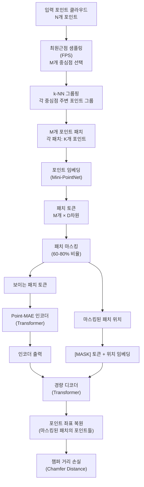

# Point-MAE: 포인트 클라우드 자기지도 학습을 위한 마스킹 오토인코더

## 메타데이터

| 항목 | 내용 |
|------|------|
| 제목 | Masked Autoencoders for Point Cloud Self-supervised Learning |
| 저자 | Yatian Pang, Wenxiao Wang, Francis E.H. Tay, Wei Liu, Yonghong Tian, Li Yuan |
| 소속 | Peking University, Tencent AI Lab, National University of Singapore |
| 발표 연도 | 2022 |
| 학회 | ECCV 2022 |
| arXiv | [2203.06604](https://arxiv.org/abs/2203.06604) |

## 핵심 기여

- MAE 원리를 비정형(irregular) 3D 포인트 클라우드(point cloud)에 성공적으로 적용한 최초 연구 중 하나
- **포인트 패치(point patch)** 개념: 3D 공간에서 이웃 포인트 그룹을 이미지 패치와 유사한 단위로 처리
- **최원근점 샘플링(Farthest Point Sampling, FPS)** 기반 패치 생성으로 3D 공간의 불균등 분포 문제 해결
- ShapeNet55 형상 분류에서 85.18%(전체), ModelNet40에서 94.04% 달성
- ScanObjectNN 실제 스캔 데이터에서 85.18%로 당시 자기지도 3D 학습 SOTA

## 배경 및 문제 정의

3D 포인트 클라우드는 자율 주행, 로봇 조작, 3D 장면 이해에 필수적이다. 그러나 레이블이 있는 3D 데이터는 2D 이미지에 비해 수집과 어노테이션이 훨씬 어렵고 비용이 많이 든다. 자기지도 학습으로 레이블 없이 3D 표현을 배울 수 있다면?

### 포인트 클라우드의 고유한 도전

이미지와 달리 포인트 클라우드는:
1. **비정형(irregular) 구조**: 규칙적인 격자(grid)가 없음. 포인트들이 3D 공간에 불규칙하게 분포
2. **순서 없음(orderless)**: 포인트 집합은 순열에 불변해야 함 (N개 포인트는 N! 가지 순열이 동일)
3. **밀도 불균일**: 객체 표면의 포인트 밀도가 위치마다 다름 (가까운 부분 = 밀집, 먼 부분 = 희소)
4. **실제 데이터의 노이즈**: 스캔 노이즈, 결측 영역, 불완전한 표면

MAE를 포인트 클라우드에 적용하려면 이러한 특성에 맞는 새로운 설계가 필요하다.

## 방법

### 전체 파이프라인



### 포인트 패치 생성

이미지의 규칙적인 패치와 달리, 3D 공간에서 패치를 만들려면 특별한 전략이 필요하다.

**1단계: 최원근점 샘플링(FPS)**

포인트 클라우드에서 $M$개의 대표 중심점을 선택한다. FPS는 이미 선택된 포인트들로부터 가장 먼 포인트를 순차적으로 선택하여 공간을 균등하게 커버한다:

```python
def farthest_point_sampling(points, M):
    """
    points: (N, 3) 포인트 클라우드
    M: 선택할 중심점 수
    반환: (M,) 선택된 인덱스
    """
    N = points.shape[0]
    selected = [torch.randint(N, (1,)).item()]
    distances = torch.full((N,), float('inf'))
    
    for _ in range(M - 1):
        # 현재 선택된 포인트들과의 최소 거리 갱신
        last = points[selected[-1]].unsqueeze(0)
        dist = ((points - last) ** 2).sum(dim=1)
        distances = torch.minimum(distances, dist)
        # 가장 먼 포인트 선택
        selected.append(distances.argmax().item())
    
    return torch.tensor(selected)
```

**2단계: k-NN 그룹핑**

각 중심점 주변의 $K$개 최근접 이웃(k-Nearest Neighbor) 포인트를 그룹으로 묶어 하나의 패치를 만든다.

**3단계: 포인트 임베딩 (Mini-PointNet)**

각 패치($K$개 포인트)를 임베딩 벡터로 변환하기 위해 경량 PointNet을 사용한다:
- 중심점을 원점으로 로컬 좌표 정규화
- 포인트별 MLP로 특성 추출
- 최대 풀링(max pooling)으로 집약

$$e_i = \text{MaxPool}(\text{MLP}(\{p_{i,j} - c_i : j = 1, \ldots, K\}))$$

여기서 $c_i$는 $i$번째 패치의 중심점이다.

### 마스킹 전략

포인트 패치를 60-80% 비율로 무작위 마스킹한다. 이미지 MAE(75%)와 유사하지만 3D 데이터 특성에 맞춰 조정한다.

### 위치 임베딩

마스킹된 패치의 위치 정보는 중심점 좌표에서 학습된 위치 임베딩으로 제공한다:

$$\text{pos\_emb}(c_i) = \text{MLP}(c_i)$$

중심점 3D 좌표를 MLP로 투영하여 위치 임베딩을 생성. 이는 이미지의 2D 격자 위치 임베딩과 달리 연속적인 3D 공간의 좌표를 인코딩한다.

### 복원 손실: 챔퍼 거리

이미지 MAE가 픽셀 MSE를 사용하는 것처럼, Point-MAE는 **챔퍼 거리(Chamfer Distance, CD)**를 사용한다:

$$\mathcal{L}_{CD} = \frac{1}{|\mathcal{M}|} \sum_{m \in \mathcal{M}} \left( 
  \frac{1}{|\hat{P}_m|} \sum_{p \in \hat{P}_m} \min_{q \in P_m} \|p - q\|_2^2 +
  \frac{1}{|P_m|} \sum_{q \in P_m} \min_{p \in \hat{P}_m} \|p - q\|_2^2
\right)$$

챔퍼 거리는 두 포인트 집합 사이의 양방향 최근접 거리 합이다:
- 예측 포인트 집합($\hat{P}_m$)의 각 포인트에서 실제 집합($P_m$)까지의 최소 거리
- 실제 집합의 각 포인트에서 예측 집합까지의 최소 거리

포인트 클라우드가 순서 없는 집합이므로 인덱스별 MSE가 아닌 집합 거리 메트릭이 필요하다.

### 디코더 출력

디코더는 각 마스킹된 패치의 $K$개 포인트 3D 좌표를 직접 예측한다. 출력 차원: $|\mathcal{M}| \times K \times 3$.

## 실험 및 결과

### ModelNet40 형상 분류

| 방법 | 학습 방식 | Top-1 정확도 |
|------|---------|------------|
| PointNet++ (지도학습) | 완전 지도 | 93.3% |
| PCT (지도학습) | 완전 지도 | 93.2% |
| OcCo | 자기지도 사전학습 | 93.0% |
| Point-BERT | 자기지도 사전학습 | 93.8% |
| **Point-MAE** | **자기지도 사전학습** | **94.04%** |

자기지도 사전학습 방법으로 완전 지도학습을 능가하는 최초 결과를 달성했다.

### ScanObjectNN 실제 스캔 분류

실제 3D 스캐너로 획득한 노이즈가 있는 포인트 클라우드:

| 방법 | 학습 방식 | OBJ-BG | OBJ-ONLY | PB-T50-RS |
|------|---------|--------|----------|----------|
| PointNet++ | 완전 지도 | 82.3% | 84.3% | 77.9% |
| DGCNN | 완전 지도 | 82.8% | 86.2% | 78.1% |
| OcCo | 자기지도 | 84.9% | 85.5% | 78.3% |
| **Point-MAE** | **자기지도** | **90.02%** | **88.29%** | **85.18%** |

실제 스캔 데이터에서 특히 큰 폭의 성능 향상. 자기지도 사전학습이 실제 환경 노이즈에 더 강건한 표현을 학습함을 시사.

### ShapeNet55 파트 분할 (Part Segmentation)

ShapeNet 55개 카테고리의 부품 분할 태스크:

| 방법 | 카테고리 평균 IoU | 인스턴스 평균 IoU |
|------|---------------|--------------|
| PointNet++ | 81.9% | 85.1% |
| PCT | - | 86.4% |
| Point-BERT | 84.1% | 85.6% |
| **Point-MAE** | **84.19%** | **86.10%** |

분류뿐 아니라 밀집 예측(파트 분할)에서도 강력한 성능을 보여 학습된 표현의 범용성을 입증.

### 마스킹 비율 분석

| 마스킹 비율 | ModelNet40 | ScanObjectNN |
|-----------|-----------|-------------|
| 45% | 93.80% | 84.23% |
| 60% | 94.00% | 84.82% |
| **75%** | **94.04%** | **85.18%** |
| 80% | 93.89% | 85.07% |
| 90% | 93.48% | 84.41% |

75%가 최적으로, 이미지 MAE와 동일하다. 포인트 클라우드도 3D 공간에서 공간적 중복성이 있지만 비디오(90%)보다는 낮은 마스킹이 최적이다.

### 패치 크기의 영향

| 패치 크기 (K) | ModelNet40 |
|------------|-----------|
| 16 | 93.59% |
| 32 | 94.04% |
| 64 | 93.76% |
| 128 | 93.53% |

패치 당 포인트 수 K=32가 최적. 너무 작으면 로컬 구조 정보 부족, 너무 크면 패치 수 감소로 맥락 부족.

## 한계 및 후속 연구

### 한계점

1. **FPS 계산 비용**: 최원근점 샘플링은 $O(NM)$ 시간 복잡도로 대규모 포인트 클라우드에서 느림
2. **스케일 의존성**: 패치 크기와 수 선택이 성능에 민감하며 도메인마다 최적값이 다를 수 있음
3. **대규모 포인트 클라우드 한계**: 실내 전체 장면(수백만 포인트)에 직접 적용하기 어려움
4. **색상/강도 정보 미활용**: 좌표만 사용하고 RGB나 LiDAR 강도 정보를 활용하지 않음

### 후속 연구

- **Point-BERT v2**: Point-MAE와 Point-BERT의 강점 결합
- **I2P-MAE**: 2D 이미지 지식을 활용한 포인트 클라우드 MAE
- **3DETR**: MAE 방식의 3D 객체 탐지
- **Ponder**: 포인트 클라우드와 폴리곤 메시의 멀티모달 MAE

### 3D 자기지도 학습의 흐름

Point-MAE는 3D 이해에서 자기지도 학습이 지도학습을 능가할 수 있음을 처음으로 명확히 보여줬다. 이후 3D 자기지도 학습은 자율 주행의 LiDAR 사전학습, 로봇 공학의 물체 파악, 의료 영상의 3D 구조 분석 등으로 빠르게 확산됐다.

## 실무 적용 관점

### 3D 데이터 도메인별 활용

| 도메인 | 활용 방식 |
|--------|---------|
| 자율 주행 LiDAR | 레이블 없는 주행 데이터로 사전학습 후 탐지/분할 파인튜닝 |
| 로봇 파악(grasping) | 객체 형상 표현 학습, 새로운 물체 일반화 |
| 의료 3D 영상 | CT/MRI 포인트 클라우드 표현, 병변 분류 |
| 산업 검사 | 불량 부품 형상 이상 탐지 |

### 구현 핵심 코드

```python
import torch
import torch.nn as nn

class PointPatchEmbed(nn.Module):
    """포인트 클라우드를 패치 토큰으로 변환"""
    def __init__(self, num_patches=64, num_points=32, embed_dim=384):
        super().__init__()
        self.num_patches = num_patches  # M개 패치
        self.num_points = num_points    # 패치당 K개 포인트
        
        # Mini-PointNet: 로컬 패치 특성 추출
        self.mini_pointnet = nn.Sequential(
            nn.Conv1d(3, 128, 1),       # 3D 좌표 → 특성
            nn.BatchNorm1d(128),
            nn.ReLU(),
            nn.Conv1d(128, 256, 1),
            nn.BatchNorm1d(256),
            nn.ReLU(),
            nn.Conv1d(256, embed_dim, 1)
        )
    
    def forward(self, patches):
        """
        patches: (B, M, K, 3) - 배치, 패치수, 포인트수, 좌표
        반환: (B, M, D) - 패치 임베딩
        """
        B, M, K, _ = patches.shape
        
        # 중심점으로 로컬 좌표 정규화
        centers = patches.mean(dim=2, keepdim=True)  # (B, M, 1, 3)
        local_coords = patches - centers              # (B, M, K, 3)
        
        # Mini-PointNet 적용
        x = local_coords.view(B * M, K, 3).permute(0, 2, 1)  # (B*M, 3, K)
        x = self.mini_pointnet(x)                              # (B*M, D, K)
        x = x.max(dim=-1)[0]                                   # 최대 풀링
        
        return x.view(B, M, -1)  # (B, M, D)


class PointMAE(nn.Module):
    def __init__(
        self,
        num_patches=64,
        num_points_per_patch=32,
        encoder_dim=384,
        encoder_depth=12,
        encoder_heads=6,
        decoder_dim=256,
        decoder_depth=4,
        mask_ratio=0.75
    ):
        super().__init__()
        self.mask_ratio = mask_ratio
        self.num_patches = num_patches
        
        # 패치 임베딩
        self.patch_embed = PointPatchEmbed(
            num_patches, num_points_per_patch, encoder_dim
        )
        
        # 위치 임베딩 (중심점 좌표 기반)
        self.pos_embed = nn.Sequential(
            nn.Linear(3, 128), nn.GELU(), nn.Linear(128, encoder_dim)
        )
        
        # [MASK] 토큰
        self.mask_token = nn.Parameter(torch.zeros(1, 1, decoder_dim))
        
        # 인코더 (Transformer)
        encoder_layer = nn.TransformerEncoderLayer(
            d_model=encoder_dim, nhead=encoder_heads,
            dim_feedforward=encoder_dim * 4, batch_first=True
        )
        self.encoder = nn.TransformerEncoder(encoder_layer, encoder_depth)
        
        # 인코더 → 디코더 차원 투영
        self.enc_to_dec = nn.Linear(encoder_dim, decoder_dim)
        
        # 디코더 (경량 Transformer)
        decoder_layer = nn.TransformerEncoderLayer(
            d_model=decoder_dim, nhead=4,
            dim_feedforward=decoder_dim * 4, batch_first=True
        )
        self.decoder = nn.TransformerEncoder(decoder_layer, decoder_depth)
        
        # 포인트 좌표 복원 헤드
        self.recon_head = nn.Linear(
            decoder_dim, num_points_per_patch * 3
        )
    
    def forward(self, points, centers):
        """
        points: (B, M, K, 3) - 패치된 포인트 클라우드
        centers: (B, M, 3) - 패치 중심점 좌표
        """
        B, M = centers.shape[:2]
        
        # 패치 임베딩 + 위치 임베딩
        tokens = self.patch_embed(points)      # (B, M, D_enc)
        pos = self.pos_embed(centers)           # (B, M, D_enc)
        tokens = tokens + pos
        
        # 마스킹
        num_visible = int(M * (1 - self.mask_ratio))
        noise = torch.rand(B, M, device=tokens.device)
        ids = torch.argsort(noise, dim=1)
        ids_visible = ids[:, :num_visible]
        ids_masked = ids[:, num_visible:]
        
        # 보이는 토큰만 인코더에 입력
        vis_tokens = torch.gather(
            tokens, 1, ids_visible.unsqueeze(-1).expand(-1, -1, tokens.shape[-1])
        )
        encoded = self.encoder(vis_tokens)
        encoded = self.enc_to_dec(encoded)
        
        # 디코더: 인코딩된 토큰 + 마스크 토큰 + 위치 임베딩
        mask_tokens = self.mask_token.expand(B, M - num_visible, -1)
        mask_pos = torch.gather(
            pos, 1, ids_masked.unsqueeze(-1).expand(-1, -1, pos.shape[-1])
        )
        # 마스크 토큰 디코더 차원으로 투영
        mask_tokens = mask_tokens + self.enc_to_dec(mask_pos)
        
        all_tokens = torch.cat([encoded, mask_tokens], dim=1)
        decoded = self.decoder(all_tokens)
        
        # 마스킹된 패치만 복원
        recon = self.recon_head(decoded[:, num_visible:])
        return recon.view(B, M - num_visible, -1, 3)  # (B, M_masked, K, 3)
```

### 챔퍼 거리 손실 구현

```python
def chamfer_distance(pred, target):
    """
    pred, target: (B, N, 3) 포인트 집합
    반환: 평균 챔퍼 거리
    """
    # pred → target 방향: pred의 각 포인트에서 target의 최근접 거리
    pred_exp = pred.unsqueeze(2)    # (B, N, 1, 3)
    tgt_exp = target.unsqueeze(1)   # (B, 1, M, 3)
    dist = ((pred_exp - tgt_exp) ** 2).sum(dim=-1)  # (B, N, M)
    
    loss_pred_to_tgt = dist.min(dim=2)[0].mean()
    loss_tgt_to_pred = dist.min(dim=1)[0].mean()
    
    return loss_pred_to_tgt + loss_tgt_to_pred
```

## 관련 문서

- [[mae-original-paper]] - Point-MAE의 직접적 원류, 이미지 마스킹 오토인코더
- [[videomae-paper]] - MAE를 비디오로 확장한 병행 연구
- [[dino-original-paper]] - 대조 학습 기반 2D 자기지도 학습 비교
- [[transformer-architecture]] - Point-MAE 인코더/디코더의 기반 구조
- [[masked-image-modeling]] - 마스킹 기반 모달리티 학습 개념
