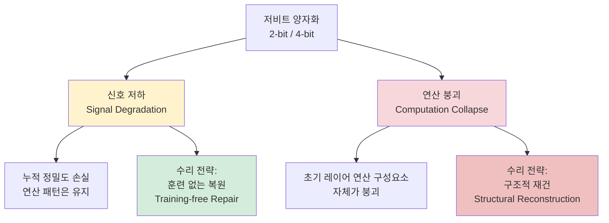

# LLM 양자화의 두 가지 실패 모드: 신호 저하 vs 연산 붕괴

## 논문 메타데이터

| 항목 | 내용 |
|------|------|
| arXiv ID | 2604.19884 |
| 저자 | Chenxi Zhou, Pengfei Cao, Jiang Li, Bohan Yu, Jinyu Ye, Jun Zhao, Kang Liu |
| 연도 | 2026 |
| 분야 | 추론 최적화 / 양자화 |

## 핵심 기여

저비트 [[quantization|양자화(quantization)]]가 실패하는 원인을 최초로 두 가지 메커니즘으로 **체계적으로 분류**한다. 이 분류는 수리(repair) 전략 선택에 직접적 함의를 갖는다 — 실패 유형을 잘못 진단하면 잘못된 처방이 된다.

## 두 가지 실패 모드

### 신호 저하 (Signal Degradation)
- 정의: 레이어를 통과하면서 **누적 정밀도 손실**이 발생하지만, 연산의 구조적 패턴(예: 어텐션 분포, FFN 활성화 패턴)은 유지됨
- 발생 위치: 중간~후기 레이어
- 특징: 모델이 "흐릿하게" 동작하지만 구조는 살아있음
- 수리: **훈련 없는 복원(training-free repair)** 으로 해결 가능 — 예: 아웃라이어 채널 재스케일링, 스무딩

### 연산 붕괴 (Computation Collapse)
- 정의: **초기 레이어**에서 어텐션 헤드나 FFN 뉴런의 활성화 분포 자체가 양자화로 인해 무너짐
- 발생 위치: 주로 초기 레이어 (0~4번 레이어)
- 특징: 이후 모든 레이어의 입력이 손상되어 연쇄 실패 발생
- 수리: **구조적 재건** 필요 — 해당 레이어만 고정밀도로 유지하거나, 혼합 정밀도(mixed-precision) 할당

## 왜 2비트에서 성능 절벽이 생기는가

| 비트 폭 | 지배적 실패 모드 | 특성 |
|---------|----------------|------|
| 8비트 | 거의 없음 | 무손실에 가깝 |
| 4비트 | 신호 저하 (경미) | 훈련 없는 수리로 회복 가능 |
| 2비트 | 연산 붕괴 (지배) | 구조적 재건 없이 회복 불가 |

4비트 대비 2비트에서 급격한 성능 하락이 발생하는 이유가 **지배적 실패 모드의 전환** 때문임을 밝힌다. 이는 "2비트는 그냥 정밀도가 낮은 4비트"라는 단순한 관점을 반박한다.

## 실험 결과

- 다수의 오픈소스 LLM(LLaMA-2, OPT 등)에서 두 실패 모드 식별 및 검증
- 실패 모드별 수리 전략 적용 후 성능 비교로 분류 프레임워크의 유효성 확인
- 연산 붕괴가 있는 초기 레이어를 FP16 혼합 정밀도로 유지하면 2비트 모델에서도 4비트에 근접하는 성능 회복 가능

## 한계

- 실패 모드 자동 진단 도구가 제시되지 않아 수동 분석이 필요
- 모델 구조(아키텍처, 크기)에 따라 붕괴 발생 레이어 위치가 달라질 수 있음
- 훈련 없는 수리와 구조적 재건 각각의 컴퓨트 오버헤드 비교 분석 미흡

## 실무 적용 관점

프로덕션에서 2비트 양자화를 시도하기 전에 **초기 레이어 활성화 분포를 먼저 검사**하는 것이 좋다. 연산 붕괴가 감지되면 해당 레이어만 4/8비트로 유지하는 혼합 정밀도 전략이 단순 2비트 전체 양자화보다 훨씬 낫다. [[adaptive-kv-quantization]]처럼 중요도 기반 비트 폭 동적 할당 연구와 맥락을 같이 한다.

## 관련 문서

- [[quantization]] - 양자화 일반 개념
- [[adaptive-kv-quantization]] - 토큰 중요도 기반 적응형 KV 캐시 양자화 (2604.04722)
- [[kv-cache-optimization]] - KV 캐시 최적화 전반
