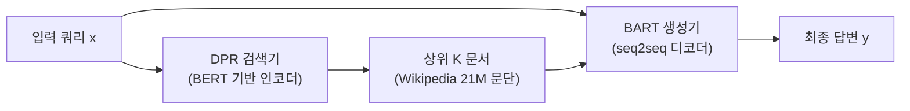

# Retrieval-Augmented Generation for Knowledge-Intensive NLP Tasks (Lewis et al., 2020)

## 핵심 기여

Facebook AI Research의 Patrick Lewis 등이 2020년 발표한 이 논문은 **사전학습된 seq2seq 모델에 밀집 검색기(Dense Passage Retriever, DPR)를 결합**하여 외부 지식 베이스를 비파라메트릭 메모리(non-parametric memory)로 통합하는 RAG(Retrieval-Augmented Generation) 프레임워크를 제안했다. 지식 집약적(knowledge-intensive) NLP 태스크에서 파라메트릭(parametric) 접근법(순수 LLM)을 초과하며 현대 RAG 시스템의 이론적 원형이 되었다.

## 방법

### 아키텍처: 두 가지 기억 형태의 결합

- **검색기(Retriever)**: DPR - 쿼리와 문서를 독립적으로 BERT로 인코딩 후 내적(dot product)으로 유사도 계산. Wikipedia 21M 문단 인덱스를 FAISS로 빠른 근접 이웃 탐색
- **생성기(Generator)**: BART(seq2seq) - 쿼리와 검색된 문단을 연결해 최종 답변 생성

### 두 가지 RAG 변형

- **RAG-Sequence**: 동일한 검색 문서를 사용해 전체 출력 시퀀스를 생성 후 주변화(marginalization)
- **RAG-Token**: 각 토큰 생성 시 독립적으로 문서를 주변화 - 더 유연하지만 계산 비용 높음

### 학습 방식

DPR 검색기와 BART 생성기를 엔드투엔드(end-to-end)로 공동 학습. 검색기 인코더 파인튜닝 포함.

## 결과 및 영향

- Open-domain QA(TriviaQA, NaturalQuestions): 파라메트릭 전용 T5 XXL을 큰 차이로 초과
- Fact Verification(FEVER): 기존 최강 모델 초과
- Knowledge-Grounded Dialogue, Abstractive QA에서도 SOTA
- **지식 갱신 비용 절감**: 파라메트릭 기억(모델 재학습) 대신 비파라메트릭 기억(인덱스 갱신)으로 최신 정보 반영 가능
- 현대의 LangChain, LlamaIndex, Haystack 등 모든 RAG 프레임워크의 원형

## 한계

- 검색 단계와 생성 단계가 분리되어 있어 최적 통합이 어려움
- 검색된 문서 품질에 출력이 강하게 의존 - "garbage in, garbage out"
- 긴 컨텍스트에서 검색된 문서들의 상대적 중요도 파악이 어려움 (관련 논문: Lost in the Middle)
- 실시간 동적 인덱스 갱신 지원이 어려움

## 실무 적용 관점

- 원 논문의 DPR+BART 조합은 현재 대부분 더 강력한 임베딩 모델(OpenAI Ada, BGE, E5 등)과 LLM(GPT-4, Claude 등)으로 대체
- 청킹(chunking) 전략과 임베딩 모델 선택이 RAG 성능의 70%를 결정
- 하이브리드 검색(BM25 + 밀집 검색)이 실제 프로덕션 환경에서 순수 밀집 검색보다 우수한 경우가 많음
- 검색된 K개 문서 중 어떤 것을 컨텍스트에 넣을지 리랭킹(reranking)이 중요

## RAG-Sequence vs RAG-Token 비교

| 항목 | RAG-Sequence | RAG-Token |
|------|-------------|-----------|
| 문서 사용 방식 | 전체 시퀀스에 동일 문서 | 토큰마다 독립 주변화 |
| 일관성 | 높음 | 낮음 |
| 계산 비용 | 낮음 | 높음 |
| 적합한 태스크 | 단일 답변 QA | 다양한 사실 집합 필요 |

## 현대 RAG와의 관계

원 논문의 구조와 현대 RAG 파이프라인을 비교하면:

| 원 논문 | 현대 표준 |
|---------|-----------|
| DPR (BERT 기반) | OpenAI Ada-002, BGE, E5, Cohere Embed |
| BART 생성기 | GPT-4, Claude, Llama-3 |
| Wikipedia FAISS | Pinecone, Weaviate, pgvector |
| 단순 Top-K 검색 | 하이브리드 검색 + 리랭킹 |
| 고정 청크 문단 | 적응형 청킹 전략 |

원 논문의 DPR+BART는 지금 보면 단순한 구조지만, "비파라메트릭 메모리로 외부 지식을 통합"한다는 핵심 철학은 2024년 현재까지 그대로 계승된다.

## 관련 문서
- [[rag-survey-paper]] -- Retrieval-Augmented Generation for Large Language Models: A Survey (Gao et al., 2024)

- [[tabr-retrieval-augmented]] - 정형 데이터에서 RAG 철학 적용
- [[advanced-rag-patterns]] - 원 논문 이후의 고급 RAG 패턴
- [[lost-in-the-middle]] - 검색 문서의 위치 편향 문제
- [[chain-of-thought-prompting]] - RAG와 결합되는 추론 기법
