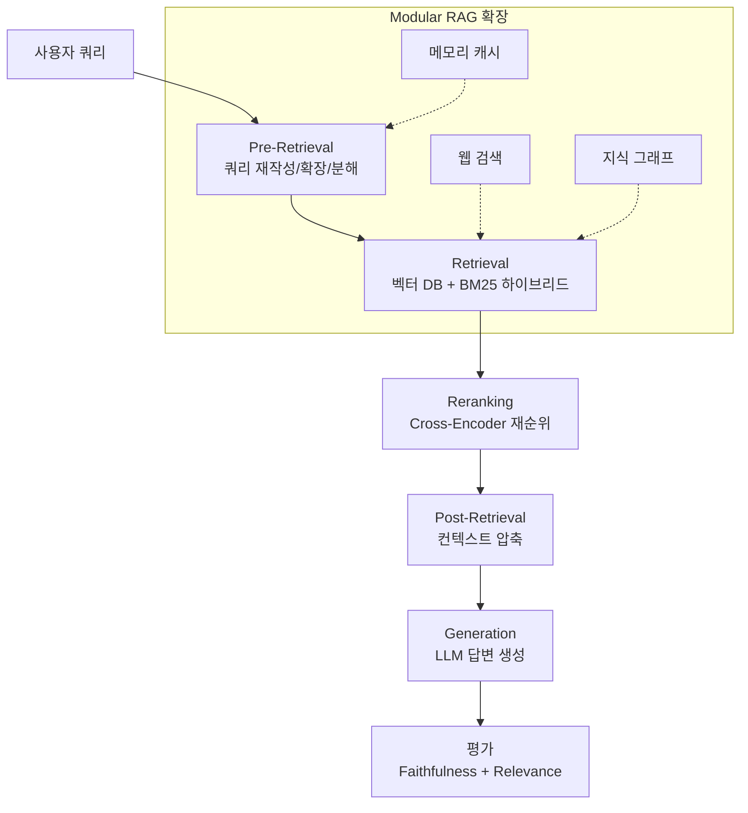

# Retrieval-Augmented Generation for Large Language Models: A Survey (Gao et al., 2024)

## 핵심 기여

Yunfan Gao 등이 2024년 발표한 RAG 분야 종합 서베이로, 빠르게 발전하는 RAG 연구를 **Naive RAG, Advanced RAG, Modular RAG** 세 패러다임으로 분류하고, 각 단계의 핵심 기술 스택과 한계를 체계적으로 정리했다. RAG 파이프라인을 인덱싱(Indexing), 검색(Retrieval), 생성(Generation)의 세 단계로 분해해 각 단계의 최신 기법을 매핑했으며, 아직 해결되지 않은 연구 방향도 명시했다. RAG 시스템을 처음 설계하거나 기존 파이프라인을 개선할 때 참조 지도로 활용 가능한 문헌이다.

## 방법 (세 패러다임 분류)

### Naive RAG

가장 기본적인 파이프라인:

1. 문서를 고정 크기 청크로 분할 → 임베딩 → 벡터 DB 인덱싱
2. 쿼리 임베딩 → 코사인 유사도 기반 Top-k 청크 검색
3. 검색 결과를 컨텍스트로 붙여 LLM에 전달 → 답변 생성

**한계**: 청크 분할이 맥락을 끊음, 쿼리와 문서의 의미 격차(semantic gap), 환각(hallucination) 억제 불충분.

### Advanced RAG

Naive RAG의 한계를 극복하는 개선 기법들:

- **Pre-Retrieval**: 쿼리 재작성(query rewriting), 쿼리 분해(HyDE - Hypothetical Document Embeddings), 쿼리 확장
- **Retrieval**: 하이브리드 검색(Dense + Sparse BM25), 계층적 인덱싱, 재순위화(reranking, Cross-Encoder)
- **Post-Retrieval**: 컨텍스트 압축(context compression), 선택적 요약, Lost-in-the-Middle 완화

### Modular RAG

RAG 파이프라인을 교체 가능한 모듈(module)로 추상화:

- **Search Module**: 웹 검색, 지식 그래프, 코드 실행 결과 등을 검색 소스로 확장
- **Memory Module**: 과거 검색 결과를 캐시해 반복 쿼리 효율화
- **Routing Module**: 쿼리 유형에 따라 다른 검색 전략 선택
- **Fusion Module**: 여러 검색 결과를 통합하고 중복 제거

### 평가 프레임워크

서베이는 RAG 평가를 세 축으로 정리:
- **Faithfulness**: 생성된 답이 검색 문서에 근거하는가
- **Answer Relevance**: 답이 질문에 관련 있는가
- **Context Relevance**: 검색된 문서가 질문과 관련 있는가

RAGAS, TruLens, ARES 등의 평가 도구를 소개하며 자동 평가 파이프라인 구성 방법을 설명.

## 결과 및 의의

- RAG 논문 100편 이상을 세 패러다임으로 체계적으로 분류 — 연구 지형 정리
- Fine-tuning 대비 RAG의 장점: 최신 정보 반영 가능, 도메인 전환 비용 낮음, 생성 근거 추적 가능
- Modular RAG가 현재 최신 동향이며 Agentic RAG([[agentic-rag]])로 발전 중
- 한계로 꼽은 미해결 문제: 멀티모달 검색, 다국어 RAG, 긴 문서 처리, 검색-생성 공동 학습

## 한계

- 서베이 특성상 개별 기법의 심층 분석보다 넓은 범위 커버에 집중
- 2024년 초 기준 논문이므로 이후 등장한 GraphRAG, HippoRAG 등은 미포함
- 실제 프로덕션 배포 경험보다 학술 벤치마크 중심의 평가

## 실무 적용 관점

- 새 RAG 시스템 설계 시 세 패러다임 체크리스트로 활용: "지금 우리 시스템은 Naive/Advanced/Modular 중 어디인가"
- 대부분의 초기 프로덕션 시스템은 Naive RAG로 시작하지만 품질 개선 시 Advanced RAG 기법(Reranking, HyDE, Hybrid Search)을 순서대로 추가하는 전략이 현실적
- 평가 파이프라인 없이 RAG 개선은 맹목적 — Faithfulness, Relevance 두 지표를 최소한 자동 측정해야 함
- Modular RAG는 LangChain, LlamaIndex의 아키텍처와 직접 대응됨

## 관련 문서

- [[rag-pipeline]]
- [[agentic-rag]]
- [[rag-original-paper]]
- [[lost-in-the-middle-paper]]
- [[vector-db-comparison|vector-database]]
