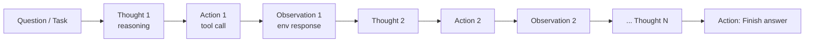

# ReAct: Synergizing Reasoning and Acting in Language Models (Yao et al., 2022)

## TL;DR

ReAct는 **추론(reasoning, chain-of-thought)** 과 **행동(acting, action plan generation)** 을 별개 연구 흐름이던 둘을 한 trajectory에 인터리빙하는 prompt 패턴이다. `Thought → Action → Observation → Thought ...` 시퀀스 형태로 LLM이 매 step마다 reasoning 단계와 action을 모두 생성하며, 환경 응답을 다음 thought에 반영한다. 1-2개의 in-context example만으로 ALFWorld에서 +34%, WebShop에서 +10%의 절대 성공률 향상을 보였고, 거의 모든 현대 LLM agent harness의 baseline pattern으로 자리잡았다.

## 핵심 기여

1. **Reasoning + Acting 통합 prompt 패턴** — `Thought → Action → Observation → Thought → ...` 인터리빙
2. **Hallucination 완화** — reasoning만으로 답하지 않고 외부 도구로 검증
3. **HotpotQA / Fever** — Wikipedia API 호출로 fact verification 정확도 향상 (Fever 64.6 vs CoT 56.3)
4. **ALFWorld +34%, WebShop +10%** — IL/RL 대비 1-2 example만으로 우수한 성능
5. **인간 해석 가능성** — 추론 trace가 그대로 디버깅 도구로 활용
6. **현대 에이전트 prompt 디자인의 근간** — 후속 거의 모든 LLM agent harness가 ReAct 변형

## 방법론

- **Action space 정의**: 환경별 `Search[entity]`, `Lookup[keyword]`, `Finish[answer]` 등
- **Few-shot prompting**: 1-6개 demonstration trajectory를 in-context로 제공
- **Thought-Action 인터리빙**: 매 step마다 reasoning과 action을 모두 생성
- **Observation feedback**: 환경 응답을 다음 thought 생성에 반영
- **학습 불필요** — prompt-only로 적용

## 실험/결과

- **HotpotQA EM**: ReAct 27.4, CoT 29.4, ReAct→CoT-SC 앙상블 **34.2** (SOTA)
- **Fever**: ReAct **64.6** vs CoT 56.3
- **ALFWorld**: ReAct **71%** vs Act 45% vs IL 37% (절대 성공률 +34%)
- **WebShop**: ReAct **40%** vs Act 30% vs IL+RL 28.7% (+10%)
- **사례 분석**: CoT 단독 → 사실 hallucination, Act 단독 → 추론 부족, ReAct가 둘을 보완

## 하네스 엔지니어링 관점

- **모든 LLM agent harness의 baseline pattern** — 현대 agent loop의 사실상 표준 ([[react-pattern]] 참조)
- **Action 공간 설계가 성능 결정** — 너무 자유롭게 두면 LLM 산만, 너무 좁으면 표현력 부족
- **Observation 길이 제어** — 검색 결과/tool output을 그대로 dump하면 컨텍스트 폭증, [[agent-context-management]]의 truncate/요약 패턴 필요
- **Thought 강제** — 매 step마다 reasoning을 명시적으로 생성하도록 prompt 강제. 일부 후속은 reasoning을 옵션화
- **Failure mode**: 무한 루프(같은 action 반복) → max_steps + cycle detection 필수 ([[agent-circuit-breaker]])
- harness에서 [[reflexion-paper]]와 결합: ReAct가 trajectory 생성, Reflexion이 trial 간 학습

## 한계 / 후속 연구

- **도구 수가 많아지면 action 선택 정확도 저하** — long-tail tool에 대한 routing 문제
- **Long-horizon에서 reasoning trace 누적** → 컨텍스트 폭증
- 후속:
  - [[reflexion-paper]] — 시간축 학습 (verbal RL)
  - [[toolformer-paper]] — 학습 기반 도구 사용
  - Tree-of-Thoughts — reasoning 탐색 트리화
  - [[swe-agent-paper]] — ACI 디자인으로 도구 사용 인터페이스 개선

## 관련 자료

- 프로젝트 페이지: react-lm.github.io
- [[react-pattern]] — 현대 harness에서의 ReAct 적용 패턴
- [[reflexion-paper]] — 후속작
- [[toolformer-paper]] — 학습 기반 대안
- [[agent-prompt-patterns]]
- [[agent-evaluation-framework]]
- [[agentbench-paper]] — ReAct를 baseline으로 사용한 멀티 환경 벤치마크
