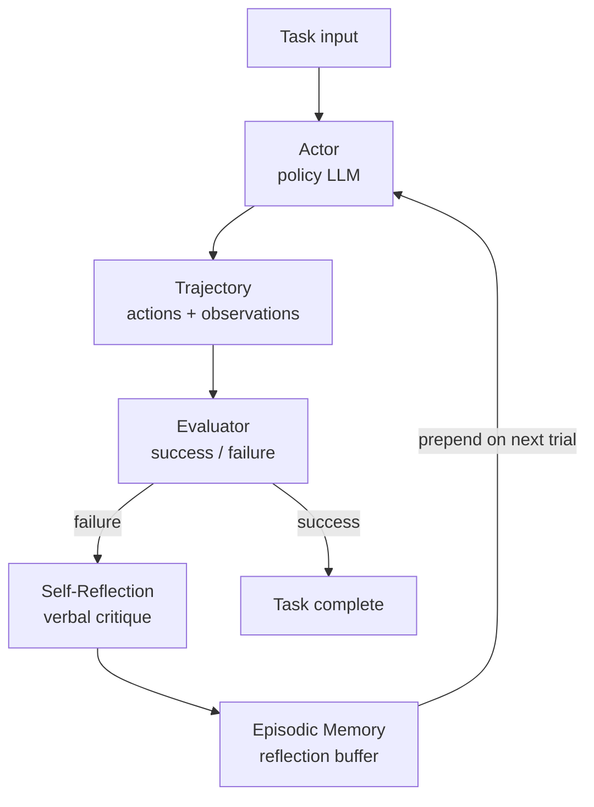

# Reflexion: Language Agents with Verbal Reinforcement Learning (Shinn et al., 2023)

## TL;DR

Reflexion은 **weight update 없이 자연어 reflection만으로 LLM agent를 강화**하는 프레임워크다. 실패 trajectory를 받아 "왜 실패했고 다음에 어떻게 할지"를 자연어로 작성하고(self-reflection), 이를 episodic memory buffer에 누적해 다음 trial의 prompt에 prepend한다. **Actor / Evaluator / Self-Reflection** 3-component 구조로, HumanEval에서 **91% pass@1** (당시 GPT-4 80.1% 대비 +11%p) 등 코딩·의사결정·reasoning 다양한 도메인에서 큰 폭 개선을 보였다.

## 핵심 기여

1. **Verbal Reinforcement Learning** — gradient 없이 언어적 reflection만으로 에이전트 정책 향상
2. **3-component 아키텍처** — Actor / Evaluator / Self-Reflection
3. **Episodic memory buffer** — 이전 실패의 reflection을 다음 trial의 컨텍스트에 주입
4. **HumanEval 91% pass@1** — 당시 GPT-4 baseline 80.1% 대비 +11%p
5. **다도메인 적용** — coding (HumanEval, MBPP), 의사결정 (AlfWorld), reasoning (HotpotQA)
6. **Closed-source LLM 호환** — weight 접근 불필요

## 방법론

- **Actor**: 환경과 직접 상호작용하는 정책 LLM. 보통 [[react-paper]] 패턴 적용
- **Evaluator**: 결과의 success/failure 판단. 환경 reward 또는 LLM-as-judge
- **Self-Reflection**: 실패 trajectory를 받아 "왜 실패, 다음에 어떻게"를 자연어로 작성
- **Memory**: reflection을 buffer에 누적, 다음 시도 prompt에 prepend
- **학습 = 자연어 텍스트 갱신** — 수치 gradient 없음

## 실험/결과

- **HumanEval (Python)**: **91.0% pass@1** (GPT-4 baseline 80.1%)
- **MBPP**: 77.1% pass@1
- **AlfWorld**: 130 task 중 6 trial 후 130 success (baseline 103)
- **HotpotQA**: ReAct 대비 reasoning trajectory 개선
- **Ablation**: reflection을 단순 binary feedback으로 대체 시 성능 큰 폭 하락 → **자연어 reflection 자체의 정보량이 핵심**

## 하네스 엔지니어링 관점

- **재시도 루프 설계의 정석** — 실패 시 단순 재시도가 아닌 "실패 분석 → 메모리 → 재시도"의 3-step 구조
- **Verbal feedback이 sparse reward 완화** — 0/1 보상보다 "왜 틀렸는지"가 LLM에게 더 actionable
- **Episodic buffer 크기 조정** — 너무 많이 누적하면 컨텍스트 폭증. 보통 최근 N trial만 유지
- **Evaluator 분리 권장** — 동일 LLM의 self-evaluation은 편향 위험. 다른 모델 또는 환경 신호 활용 ([[verifier-critic-models]])
- **Harness 통합 패턴**: [[swe-agent-paper]] / [[openhands-paper]]에서 trial loop wrapper로 적용
- 현대 agent harness에서는 [[agent-fallback-strategies]]와 자연스럽게 결합

## 한계 / 후속 연구

- **Evaluator 의존성** — 환경에서 직접 success signal이 없으면 LLM-as-judge 편향
- **Long-horizon task** — trial이 길어지면 reflection 품질 저하
- **Catastrophic reflection** — 잘못된 reflection이 다음 시도를 더 악화시킬 수 있음
- 후속:
  - ProAgent
  - [[voyager-paper]]의 skill library (실행가능 함수로 학습 누적)
  - Self-Refine (단일 prompt 내 반복 개선)

## 관련 자료

- GitHub: noahshinn/reflexion
- [[reflexion]] — 현대 harness에서의 적용 패턴
- [[react-paper]] — 동일 그룹 선행 연구, Reflexion이 baseline으로 사용
- [[voyager-paper]] — 실행가능 코드로 skill을 누적 (verbal vs code reflection 비교)
- [[verifier-critic-models]]
- [[agent-prompt-patterns]]
