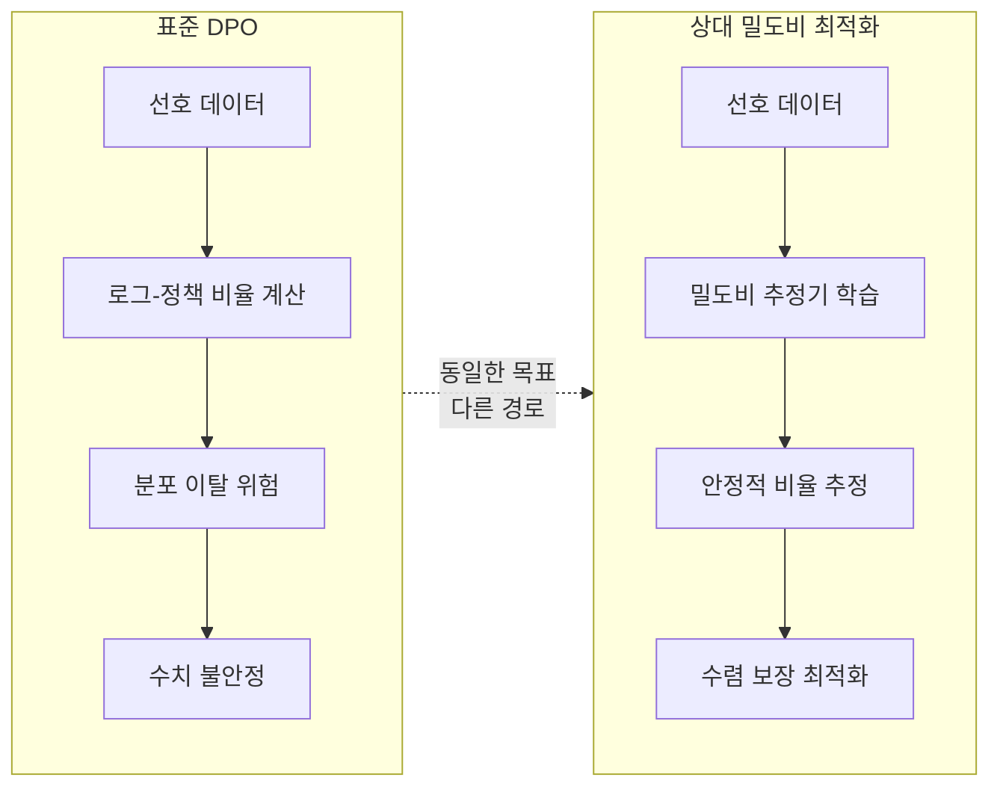

# 상대 밀도비 최적화: 안정적이고 통계적으로 일관된 모델 정렬

## 배경: DPO의 성공과 한계

DPO(Direct Preference Optimization)는 RLHF의 복잡한 보상 모델 학습을 우회하고, 선호 데이터에서 직접 정책을 최적화할 수 있다는 점에서 큰 주목을 받았다. 기술적으로 DPO의 암묵적 보상(implicit reward)은 다음 로그-비율(log-ratio)로 표현된다:

$$r_\theta(x, y) = \beta \log \frac{\pi_\theta(y|x)}{\pi_\text{ref}(y|x)}$$

여기서 $\pi_\theta$는 학습 중인 정책, $\pi_\text{ref}$는 기준 모델, $\beta$는 KL 패널티 강도다.

이 공식은 수학적으로 깔끔하지만 **실제 최적화 과정에서 수치 불안정성(numerical instability)** 문제를 일으킨다. 특히:

1. **분포 이탈(distribution shift)**: 학습이 진행되면서 $\pi_\theta$가 $\pi_\text{ref}$로부터 크게 벗어나면 로그-비율 값이 폭발적으로 커지거나 작아진다.
2. **확률 소실**: 특정 토큰 시퀀스에 대해 $\pi_\text{ref}$가 거의 0에 가까운 확률을 할당하면 로그-비율이 불안정해진다.
3. **통계적 일관성 부재**: 표준 DPO는 유한 샘플에서의 통계적 수렴 보장이 약하다.

## 핵심 기여: 밀도비 추정 프레임워크

이 논문은 선호 학습 문제를 **밀도비 추정(density ratio estimation)** 문제로 재구성한다.

핵심 아이디어: 선택된 응답(chosen)과 거부된 응답(rejected)의 분포 비율을 직접 추정하는 것이 로그-정책 비율을 계산하는 것보다 수치적으로 안정하다는 것이다.

**상대 밀도비(relative density ratio)** $r(y|x)$는 다음과 같이 정의된다:

$$r(y|x) = \frac{p_w(y|x)}{p_l(y|x)}$$

여기서 $p_w$는 선택된 응답의 분포, $p_l$은 거부된 응답의 분포다.

위 다이어그램은 DPO와 상대 밀도비 접근법의 핵심 차이를 보여준다. 두 방법 모두 선호 학습을 목표로 하지만, 최적화 경로의 수치 안정성에서 근본적으로 갈린다.

## 통계적 일관성 보장

이 논문의 가장 중요한 이론적 기여는 **통계적 일관성(statistical consistency) 보장**이다.

표준 DPO의 한계: 유한 샘플에서 학습된 DPO 정책이 이상적인 인간 선호를 얼마나 잘 근사하는지에 대한 이론적 보장이 약하다.

상대 밀도비 프레임워크: 밀도비 추정이 일관된(consistent) 추정량을 제공한다는 통계학적 사실을 활용하여, 샘플 수가 증가할수록 추정 밀도비가 진실 밀도비에 수렴함을 증명한다.

이론적 결과 요약:
- **수렴 속도 분석**: 유한 샘플에서의 근사 오차 상한 제시
- **최적화 경계**: 밀도비 추정 오차가 정책 최적화 목표에 미치는 영향 정량화
- **일반화 보장**: 학습 데이터 분포 밖에서의 성능 저하 이론적 분석

## 기존 정렬 방법과의 비교

| 방법 | 보상 모델 | 수치 안정성 | 이론적 보장 | 구현 복잡도 |
|------|---------|-------------|------------|------------|
| RLHF (PPO 기반) | 명시적 필요 | 중간 | 강함 | 높음 |
| DPO | 암묵적 | 약함 | 약함 | 낮음 |
| IPO | 암묵적 | 중간 | 중간 | 낮음 |
| KTO | 암묵적 | 중간 | 중간 | 낮음 |
| ORPO | 암묵적 | 중간 | 약함 | 낮음 |
| **상대 밀도비** | **암묵적** | **강함** | **강함** | **중간** |

### IPO, KTO, ORPO와의 관계

- **IPO (Identity Preference Optimization)**: DPO의 과적합 문제를 정규화로 해결하려 하지만 통계적 보장은 여전히 약하다.
- **KTO (Kahneman-Tversky Optimization)**: 인간 심리학의 손실 회피(loss aversion)를 모델링하지만 밀도비 추정 관점은 없다.
- **ORPO (Odds Ratio Preference Optimization)**: 참조 모델 없이 오즈비(odds ratio)를 사용. 이 논문의 밀도비 개념과 개념적으로 가깝지만 이론적 기반이 다르다.

## GRPO와의 연결

최근 DeepSeek-R1에서 사용된 GRPO(Group Relative Policy Optimization)는 그룹 내 상대적 보상으로 정책을 최적화한다는 점에서 "상대적" 비교를 활용하는 같은 방향성을 보인다. 상대 밀도비 프레임워크는 이 트렌드의 이론적 기반을 강화하는 작업으로 볼 수 있다.

## 왜 중요한가

LLM 정렬 연구는 실용적 방법론(DPO, ORPO 등)이 이론적 기반보다 앞서가는 경향이 있었다. 이 논문은 그 격차를 좁히는 시도다.

**실무 관점에서의 의미**:
1. 장시간 파인튜닝 시 DPO의 수치 폭발(gradient explosion) 문제를 겪은 팀에게 이론적으로 안전한 대안 제시
2. 소규모 선호 데이터셋에서 DPO가 불안정한 경우의 대안
3. 정렬 방법 선택 시 "이론적 보장이 있는가"를 기준으로 삼을 수 있는 근거 제공

## 한계 및 향후 연구

- 밀도비 추정기 학습을 위한 추가 설계가 필요하므로 순수 DPO보다 구현 복잡도 증가
- 대규모 LLM에서의 실험적 검증이 이론적 결과만큼 포괄적이지 않을 수 있다
- 다중 선호 순위(multi-way ranking) 데이터로의 확장은 향후 과제

## 관련 문서

- [[alignment-faking]] - 정렬의 한계와 모델 행동
- [[anti-patterns]] - DPO 불안정 등 정렬 안티패턴
- [[long-horizon-rl-training-for-agents]] - 강화학습 기반 정렬의 장기 관점
