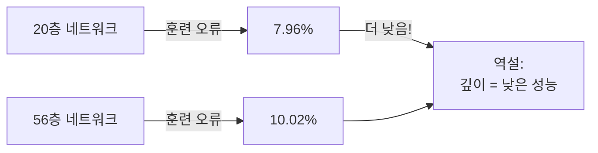
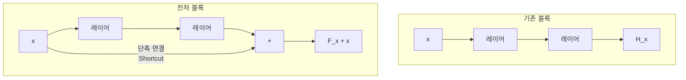
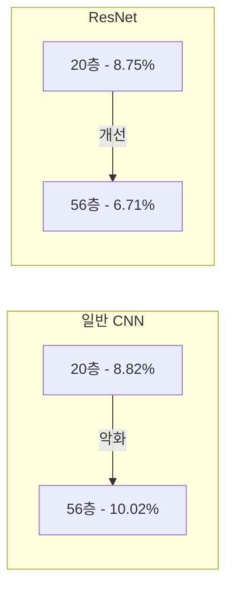
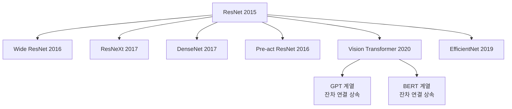

# ResNet 원논문: 깊은 잔차 학습을 통한 이미지 인식

## 메타데이터

| 항목 | 내용 |
|------|------|
| 제목 | Deep Residual Learning for Image Recognition |
| 저자 | Kaiming He, Xiangyu Zhang, Shaoqing Ren, Jian Sun |
| 소속 | Microsoft Research |
| 학회/저널 | CVPR 2016 (Best Paper Award) |
| arXiv ID | 1512.03385 |
| 제출일 | 2015년 12월 10일 |
| 인용 수 | 약 20만+ (2026 기준, 가장 많이 인용된 CS 논문 중 하나) |

## 핵심 기여

- **잔차 연결(residual connection) 제안**: 레이어가 원래 함수 $H(x)$ 대신 잔차 $F(x) = H(x) - x$를 학습하도록 구조를 변경하여 그라디언트 소실 문제를 구조적으로 해결
- **극도로 깊은 네트워크 학습 가능**: 이전 기술의 한계였던 19~22층을 뛰어넘어 34, 50, 101, 152층 네트워크를 성공적으로 학습
- **ILSVRC 2015 5관왕**: 이미지 분류, 검출, 지역화, COCO 검출, COCO 분할에서 모두 1위 달성
- **이후 아키텍처의 표준 블록**: ResNet 잔차 블록은 DenseNet, Wide ResNet, ResNeXt, EfficientNet 등 수많은 후속 아키텍처의 기반

## 배경 및 문제 정의

### 깊이의 역설

직관적으로 층이 깊을수록 표현력이 커져 성능이 향상될 것이다. 그러나 2015년 당시 실험들은 충격적인 현상을 보고했다: **56층 네트워크가 20층 네트워크보다 훈련 오류도 높았다.** 이는 과적합이 아니었다 - 훈련 데이터에서도 깊은 네트워크가 더 나빴다.

이 현상을 저자들은 **저하 문제(degradation problem)**라고 명명했다.



### 왜 발생하는가

이상적으로 56층 네트워크는 20층 네트워크에 36개의 항등 함수(identity mapping) 레이어를 추가한 것과 같거나 더 나아야 한다. 즉, 최소한 20층과 동일한 해를 학습할 수 있어야 한다.

그러나 실제로 일반적인 비선형 레이어들이 항등 함수를 학습하기 어렵다. 이것이 핵심 통찰이다: **항등 함수 학습이 어렵다면, 항등 함수를 구조적으로 쉽게 만들어주면 된다.**

## 방법

### 잔차 학습 (Residual Learning)

기존 접근: 레이어가 목표 함수 $H(x)$를 직접 학습  
ResNet 접근: 레이어가 잔차 $F(x) := H(x) - x$를 학습

따라서 실제 출력은:
$H(x) = F(x) + x$



**왜 쉬운가**: 학습 목표가 0이 되면(즉, $F(x) = 0$), 레이어는 단순히 0을 출력하면 되고, 출력은 입력 $x$가 그대로 전달된다. 0 함수 학습이 항등 함수 학습보다 훨씬 쉽다.

수학적으로, 역전파 시 그라디언트는:

$\frac{\partial L}{\partial x} = \frac{\partial L}{\partial H} \cdot \frac{\partial H}{\partial x} = \frac{\partial L}{\partial H} \cdot \left(1 + \frac{\partial F}{\partial x}\right)$

"1"이 더해지는 항으로 인해 그라디언트가 최소 1의 크기를 유지하여 소실이 방지된다.

### 잔차 블록 구조

**기본 블록(Basic Block)** - ResNet-18/34용:
```
입력 x
  → Conv 3×3
  → BatchNorm
  → ReLU
  → Conv 3×3
  → BatchNorm
  → (+x, 단축 연결)
  → ReLU
```

**병목 블록(Bottleneck Block)** - ResNet-50/101/152용:
```
입력 x
  → Conv 1×1 (채널 축소, 예: 256→64)
  → BatchNorm + ReLU
  → Conv 3×3 (병목 연산)
  → BatchNorm + ReLU
  → Conv 1×1 (채널 복원, 64→256)
  → BatchNorm
  → (+x, 단축 연결)
  → ReLU
```

1×1 합성곱으로 채널을 압축했다가 복원하여 3×3 연산의 계산 비용을 크게 줄인다.

### 차원 불일치 처리

단축 연결에서 입력과 출력의 차원이 다를 때(다운샘플링 또는 채널 수 변경):

$H(x) = F(x) + W_s x$

$W_s$는 1×1 합성곱으로 차원을 맞추는 투영(projection) 행렬이다.

### 아키텍처 변형 비교

| 모델 | 층 수 | 파라미터 | ImageNet Top-1 | 비고 |
|------|------|---------|---------------|------|
| VGG-16 | 16 | 138M | 71.5% | 비교 기준 |
| VGG-19 | 19 | 144M | 71.1% | 깊이 증가 효과 없음 |
| ResNet-18 | 18 | 11.7M | 69.8% | 기본 블록 |
| ResNet-34 | 34 | 21.8M | 73.3% | 기본 블록 |
| ResNet-50 | 50 | 25.6M | 76.0% | 병목 블록 도입 |
| ResNet-101 | 101 | 44.5M | 77.4% | - |
| ResNet-152 | 152 | 60.2M | 78.3% | ILSVRC 2015 우승 |

## 실험 및 결과

### ILSVRC 2015 분류 대회

ResNet 앙상블: **top-5 오류 3.57%** - 인간 수준(약 5%) 초과 달성.

단일 모델 ResNet-152도 4.49%로 이전 최고 기록을 크게 경신했다.

### 저하 문제 해결 검증



ResNet에서는 층이 깊어질수록 성능이 일관되게 향상됐다.

### 전이 학습 성능

ResNet으로 사전 훈련된 특성은 다양한 다운스트림 태스크에서 VGG 대비 우수한 성능을 보였다:
- PASCAL VOC 객체 검출: mAP 78.3% (VGGNet 75.3% 대비)
- MS COCO 검출 및 분할: 1위

## 한계 및 비판

### 이론적 근거 부족
논문이 현상을 설명하지만, "왜 잔차 학습이 항등 함수 학습을 쉽게 만드는가"에 대한 엄밀한 이론적 증명은 없다. 경험적 결과에 기반한 직관이다.

### 배치 정규화 의존성
ResNet은 배치 정규화(Batch Normalization)와 강하게 결합되어 있다. 배치 크기가 작은 환경(의료 영상, 영상 분할 등)에서는 그룹 정규화(Group Normalization) 등으로 대체가 필요하다.

### 행렬 경사 기여의 불균형
He et al.(2016b) "Identity Mappings in Deep Residual Networks" 후속 연구에서 사전 활성화(pre-activation) 구조가 더 우수함을 보였다. 원논문의 블록 구조가 최적이 아닐 수 있다.

### 계산 효율성
ResNet-152는 우수한 성능에도 불구하고 Inception 계열 모델에 비해 FLOPs 효율이 낮다.

## 후속 연구 및 영향

### 직접 확장
- **Wide ResNet** (Zagoruyko & Komodakis, 2016): 깊이 대신 너비를 늘린 변형
- **ResNeXt** (Xie et al., 2017): 카디널리티(cardinality) 개념 도입, 병렬 분기 구조
- **DenseNet** ([[densenet-dense-connections]]) (Huang et al., 2017): 모든 이전 레이어와 연결하는 조밀 연결
- **Pre-activation ResNet** (He et al., 2016): BatchNorm-ReLU-Conv 순서 변경

### 아키텍처 검색으로의 영향
ResNet 블록은 Neural Architecture Search (NAS)의 기본 검색 공간이 됐다. EfficientNet, RegNet 등 NAS 기반 모델들이 잔차 블록을 핵심 구성 요소로 사용한다.

### Transformer로의 전파
Vision Transformer (ViT)도 잔차 연결을 핵심 구조로 채택했으며, 대규모 언어 모델(GPT, BERT)의 Transformer 블록에도 잔차 연결이 필수 요소로 포함된다.



## 실무 적용 관점

### 언제 ResNet을 쓰는가
- 이미지 분류, 검출, 분할 등 대부분의 컴퓨터 비전 태스크
- 사전 훈련 모델이 필요할 때 (torchvision, timm 라이브러리에서 즉시 사용 가능)
- GPU 메모리가 제한적일 때 ResNet-50이 좋은 균형점

### 파이토치 구현

```python
import torch
import torch.nn as nn

class ResidualBlock(nn.Module):
    """ResNet 기본 잔차 블록"""

    def __init__(self, in_channels: int, out_channels: int, stride: int = 1):
        super().__init__()
        self.conv1 = nn.Conv2d(in_channels, out_channels, 3, stride=stride, padding=1, bias=False)
        self.bn1 = nn.BatchNorm2d(out_channels)
        self.relu = nn.ReLU(inplace=True)
        self.conv2 = nn.Conv2d(out_channels, out_channels, 3, padding=1, bias=False)
        self.bn2 = nn.BatchNorm2d(out_channels)

        # 차원 불일치 시 투영 단축 연결
        self.shortcut = nn.Sequential()
        if stride != 1 or in_channels != out_channels:
            self.shortcut = nn.Sequential(
                nn.Conv2d(in_channels, out_channels, 1, stride=stride, bias=False),
                nn.BatchNorm2d(out_channels)
            )

    def forward(self, x: torch.Tensor) -> torch.Tensor:
        out = self.relu(self.bn1(self.conv1(x)))
        out = self.bn2(self.conv2(out))
        out += self.shortcut(x)  # 잔차 연결 핵심 줄
        return self.relu(out)
```

### 사전 훈련 모델 활용

```python
import torchvision.models as models

# ImageNet 사전 훈련 가중치 로드
resnet50 = models.resnet50(weights=models.ResNet50_Weights.IMAGENET1K_V2)

# 전이 학습: 마지막 레이어만 교체
num_classes = 10
resnet50.fc = nn.Linear(resnet50.fc.in_features, num_classes)
```

## 관련 문서

- [[residual-connection]] - 잔차 연결 개념 상세 설명
- [[image-classification]] - 이미지 분류 태스크 전반
- [[densenet-dense-connections]] - 잔차 연결을 확장한 조밀 연결 네트워크
- [[batch-norm-original-paper]] - ResNet과 강하게 결합된 배치 정규화
- [[transformer-architecture]] - 잔차 연결을 상속한 Transformer 구조
- [[highway-networks]] - ResNet의 선행 연구 (Srivastava et al., 2015)
