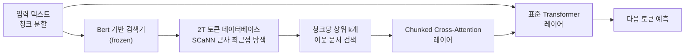

# Improving Language Models by Retrieving from Trillions of Tokens (RETRO, Borgeaud et al., 2022)

## 핵심 기여

DeepMind의 Sebastian Borgeaud 등이 2022년 발표한 RETRO(Retrieval-Enhanced Transformer)는 기존 RAG가 **추론(inference) 단계**에서 검색하는 것과 달리, **사전학습(pretraining) 단계부터 2조(2T) 토큰 규모의 외부 데이터베이스를 통합**하는 방식을 제안했다. 이를 통해 **7.5B 파라미터 RETRO가 GPT-3(175B) 수준의 성능**을 달성해 파라메트릭 메모리(parametric memory)와 비파라메트릭 메모리(non-parametric memory)의 트레이드오프를 실증했다.

## 방법

### 핵심 아이디어: 청크드 크로스 어텐션 (Chunked Cross-Attention)

### 청크 기반 검색 전략

- 입력 시퀀스를 64토큰 청크로 분할
- 각 청크에 대해 데이터베이스에서 가장 유사한 상위 k=2개 이웃 검색 (청크당 독립적으로)
- 검색된 이웃과 그 다음 청크를 컨텍스트로 사용 (연속성 활용)

### 청크드 크로스 어텐션 (CCA)

RETRO 블록에서 입력 청크와 검색된 이웃 문서 간 크로스 어텐션 수행:

- 표준 셀프 어텐션 레이어와 CCA 레이어를 교차 배치
- 검색기(retriever)는 사전학습 중 고정(frozen) - 추론 시 검색기 업데이트 불필요

### 데이터베이스 스펙

- 크기: MassiveText 1.75T 토큰 (Wikipedia, GitHub, Books, News 등)
- 청크 단위 임베딩 인덱스 구축 (SCaNN 기반)
- 검색 지연 시간: 추론 시 10-100ms 수준

## 결과 및 영향

- **Pile 언어 모델 벤치마크**: 7.5B RETRO가 175B GPT-3와 동등한 perplexity
- 모델 파라미터 25배 작으면서 동등한 성능 - 비파라메트릭 기억의 효율성 실증
- 사전학습 단계 검색 통합으로 모델이 더 근본적으로 검색 능력을 내면화
- 추론 시 데이터베이스 업데이트만으로 지식 갱신 가능 (재학습 불필요)

## 한계

- 추론 시마다 2T 규모 데이터베이스 검색이 필요 - **높은 추론 지연(latency)**
- 검색기가 frozen이어서 태스크에 최적화되지 않음
- RAG 대비 더 복잡한 아키텍처 수정 필요 - 기존 모델에 쉽게 추가 불가
- 청크 경계에서 검색 컨텍스트가 단절될 수 있는 문제

## 실무 적용 관점

- RETRO의 핵심 통찰: **사전학습 때부터 검색 통합하면 더 효율적** - 하지만 구현 복잡성이 큰 장벽
- 현실적으로는 기존 LLM에 RAG를 추론 단계에서 결합하는 방식이 더 실용적
- 외부 메모리 vs. 파라메트릭 지식의 트레이드오프: 지식 집약적 태스크일수록 검색 통합이 유리
- 데이터베이스 크기와 검색 품질이 성능의 핵심 변수 - 도메인 특화 인덱스 구축이 중요

## 관련 문서

- [[RAG 원논문 (Lewis et al.)]]
- [[RAG 아키텍처 진화]]
- [[chunking-strategies]]
- [[BERT 인코더 양방향 사전학습]]
