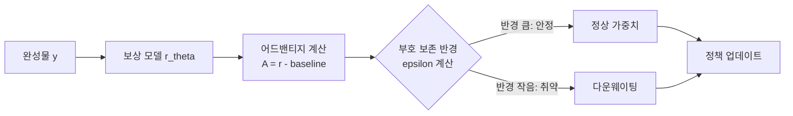

# 어드밴티지 부호 강건성으로 보상 해킹 완화 (SignCert-PO)

## 논문 메타데이터

| 항목 | 내용 |
|------|------|
| arXiv ID | 2604.02986 |
| 저자 | Shinnosuke Ono, Johannes Ackermann, Soichiro Nishimori, Takashi Ishida, Masashi Sugiyama |
| 소속 | RIKEN AIP / 도쿄대 |
| 연도 | 2026 |
| 분류 | cs.LG, cs.AI |

## 핵심 기여

[[reward-hacking-overoptimization]] 문제를 해결하기 위한 새로운 접근법인 **Sign-Certified Policy Optimization (SignCert-PO)** 를 제안한다. 핵심 아이디어는 보상 모델 교란에 대해 어드밴티지(advantage)의 **부호가 뒤집히지 않는 반경(sign-preservation radius)** 을 계산하고, 취약한 완성물을 훈련 중 자동으로 다운웨이팅하는 것이다.

어드밴티지 부호 보존 반경이 클수록 해당 완성물의 보상 추정이 안정적이며, 작을수록 보상 모델의 미세한 오차에도 정책이 잘못된 방향으로 최적화될 위험이 크다.

## 방법론

### 부호 보존 반경 (Sign-Preservation Radius)

어드밴티지 $A(x, y) = r_\theta(x, y) - b(x)$ 에서, 보상 모델 파라미터 $\theta$ 에 대한 $\ell_2$ 교란 $\delta$ 가 존재할 때 부호가 유지되는 최대 반경을 다음과 같이 정의한다:

$$\epsilon^*(x, y) = \frac{|A(x, y)|}{\|\nabla_\theta A(x, y)\|_2}$$

이 값이 클수록 해당 완성물의 어드밴티지 추정이 보상 모델 교란에 강건하다.

### 다운웨이팅 전략

훈련 목표를 다음과 같이 수정한다:

$$\mathcal{L}_{SignCert} = \mathbb{E}\left[w(\epsilon^*) \cdot A(x, y) \cdot \log \pi_\phi(y|x)\right]$$

여기서 $w(\epsilon^*)$ 는 반경에 단조증가하는 가중치 함수다. 반경이 작은 취약한 완성물은 가중치가 줄어 정책 업데이트에 덜 기여한다.

### 기존 방법과의 차이

| 방법 | 접근 | 요구 사항 |
|------|------|-----------|
| KL 페널티 (PPO) | 정책 분포 정규화 | 참조 정책 |
| 앙상블 보상 모델 | 불확실성 추정 | 복수의 보상 모델 |
| 훈련 데이터 필터링 | 오프라인 전처리 | 추가 데이터 접근 |
| **SignCert-PO** | 온라인 다운웨이팅 | 없음 (단일 보상 모델) |

## 실험 결과

- 표준 RLHF 벤치마크에서 보상 해킹 발생률 감소 확인
- 정책 견고성(policy robustness)과 보상 해킹 억제 사이의 트레이드오프를 **정량적으로 측정** (기존 연구에서 정성적으로만 논의되던 부분)
- 복수의 보상 모델이나 훈련 데이터 접근 없이 단일 보상 모델만으로 동작

## 한계

- 반경 계산에 그래디언트 연산이 필요해 계산 비용 증가
- 보상 모델의 비선형성이 강할 경우 1차 근사 기반 반경 계산의 정확도 저하
- 실제 대규모 LLM 훈련에서의 확장성 검증 미흡

## 실무 관점

보상 모델 하나만으로 운영하는 소규모 RLHF 파이프라인에서 보상 해킹을 줄이는 실용적 방법이다. 앙상블 보상 모델 구축 비용이 부담스러운 환경에서 대안으로 고려할 수 있다.

RLHF의 통계적 기반을 이해하려면 [[rlhf-statistical-perspective]] 를, 루브릭 기반 다른 보상 모델 개선 방법은 [[c2-rubric-reward-model]] 을 참고하라.

## 관련 문서

- [[reward-hacking-overoptimization]] - 보상 해킹 및 과최적화 개념
- [[rlhf]] - RLHF 전체 개요
- [[rlhf-statistical-perspective]] - RLHF 통계적 분석 서베이
- [[c2-rubric-reward-model]] - 루브릭 기반 보상 모델
