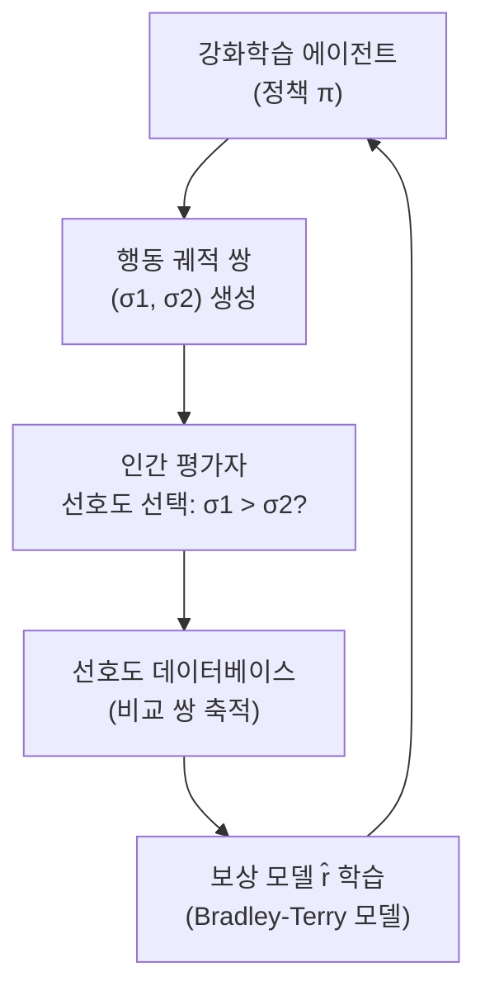

# Deep Reinforcement Learning from Human Preferences (Christiano et al., 2017)

## 핵심 기여

OpenAI와 DeepMind의 Paul Christiano 등이 2017년 발표한 이 논문은 **인간이 에이전트의 두 행동 궤적(trajectory) 중 더 선호하는 것을 선택**하게 하고, 그 선호도로부터 보상 함수(reward function)를 학습한 후 강화학습(RL)으로 정책을 최적화하는 RLHF(Reinforcement Learning from Human Feedback)의 원형을 제안했다. Atari, MuJoCo 연속 제어 태스크에서 검증되었으며, InstructGPT와 ChatGPT의 이론적 기반이 되었다.

## 방법

### 전체 파이프라인

### 핵심 구성 요소

**보상 모델 학습**:
인간의 비교 선호도 $(\sigma^1, \sigma^2, \mu)$ 데이터로부터 보상 함수 $\hat{r}$을 학습:

$$P[\sigma^1 \succ \sigma^2] = \frac{\exp \sum_t \hat{r}(\sigma^1_t)}{\exp \sum_t \hat{r}(\sigma^1_t) + \exp \sum_t \hat{r}(\sigma^2_t)}$$

이진 교차 엔트로피 손실로 학습.

**정책 최적화**: 학습된 $\hat{r}$을 보상 신호로 사용해 비동기 어드밴티지 액터-크리틱(A3C) 등 표준 RL 알고리즘 적용.

**비동기 업데이트**: 에이전트 학습과 보상 모델 업데이트, 인간 피드백 수집이 병렬로 진행.

### 피드백 효율성

- Atari Enduro: 900회 비교로 전문가 수준 달성
- MuJoCo Hopper: 700회 비교로 인간이 설계한 보상 함수와 동등한 성능

## 결과 및 영향

- Atari 게임 5개, MuJoCo 연속 제어 7개 태스크에서 인간 설계 보상 함수와 유사하거나 우수한 성능
- **보상 함수 설계 없이 새 태스크 학습 가능** - "Back Flip" 같은 인간이 보상 함수로 명시하기 어려운 태스크도 학습
- 최소한의 피드백(수백~수천 회)으로 효과적 - 실용적 인간 피드백 수집 가능성 실증
- InstructGPT(2022), ChatGPT, Claude 등 현대 정렬 AI의 직접 이론적 선조
- "AI Safety" 관점에서 인간이 원하는 것을 AI에 가르치는 방법론의 핵심 기반

## 한계

- **보상 해킹(reward hacking)**: 학습된 보상 모델이 완벽하지 않아 실제 인간 선호와 괴리된 최적화 발생 가능
- 인간 평가자의 편향, 피로, 불일치성이 보상 모델 품질 저하
- 보상 모델이 분포 외(out-of-distribution) 입력에서 부정확한 보상 추정
- 피드백 수집이 여전히 비용이 크고 확장성이 낮음 - RLAIF(Constitutional AI 등)로 보완

## 실무 적용 관점

- 인간 피드백 수집 인터페이스 설계 시 비교 선택(comparison) 방식이 절대 평가(rating) 방식보다 더 일관된 데이터 수집 가능
- 보상 모델의 불확실성(uncertainty)을 추정해 가장 정보가 많은(informative) 비교 쌍을 선택하는 능동 학습(active learning)이 효율적
- 현재 실무에서는 GPT-4/Claude를 AI 평가자로 사용하는 RLAIF가 대부분 대체
- 오픈소스 RLHF 구현: TRL, OpenRLHF, DeepSpeed-Chat 등

## 관련 문서

- [[InstructGPT RLHF 파이프라인]]
- [[Constitutional AI (Anthropic RLAIF)]]
- [[DPO 직접 선호도 최적화]]
- [[reward-hacking-overoptimization]]
