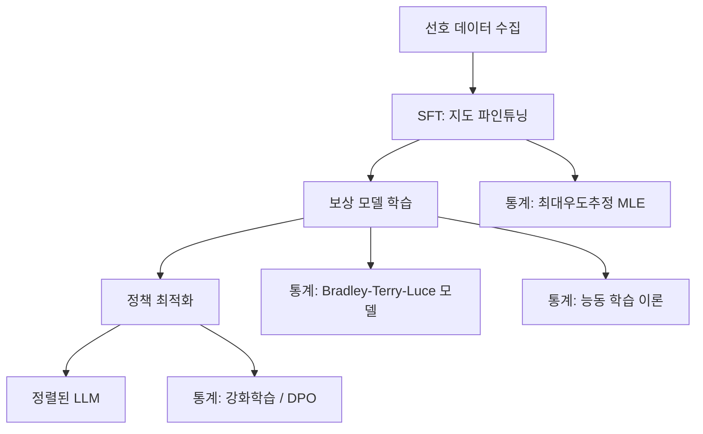

# 통계적 관점에서 본 RLHF 서베이

## 논문 메타데이터

| 항목 | 내용 |
|------|------|
| arXiv ID | 2604.02507 |
| 저자 | Pangpang Liu, Chengchun Shi, Will Wei Sun |
| 연도 | 2026 |
| 분류 | cs.LG, cs.AI |
| 주제 영역 | RLHF (Reinforcement Learning from Human Feedback), 통계 이론 |

## 핵심 기여

이 논문은 [[rlhf]] 의 세 핵심 구성요소인 SFT (Supervised Fine-Tuning, 지도 파인튜닝), 보상 모델링, 정책 최적화를 **확립된 통계 이론**과 연결하는 서베이다. 실무자와 연구자 모두에게 RLHF를 통계적 추론 문제로 재해석하는 프레임워크를 제공한다.

위 다이어그램은 RLHF 파이프라인의 각 단계가 어떤 통계 이론에 대응하는지를 보여준다.

## 방법론

### 1. 선호 데이터 모델링: Bradley-Terry-Luce (BTL)

선호 데이터 $y_w \succ y_l | x$ 를 다음 BTL 모델로 모델링한다:

$$P(y_w \succ y_l | x) = \sigma(r(x, y_w) - r(x, y_l))$$

여기서 $r(\cdot)$ 은 잠재 보상 함수, $\sigma$ 는 시그모이드 함수다. 이 모델은 Bradley-Terry (1952) 쌍별 비교 모형을 LLM 선호 학습에 직접 적용한다.

### 2. 보상 모델 학습의 통계적 해석

보상 모델을 훈련하는 것은 BTL 모델에서 최대우도추정(MLE)을 수행하는 것과 동일하다. 논문은 다음 두 가지 학습 효율 문제를 통계 관점으로 분석한다:

- **수동 선호 수집**: 고정 분포에서 쌍을 샘플링
- **능동 선호 수집**: 불확실성이 높은 쌍을 선택적으로 쿼리하여 샘플 효율을 높임

### 3. 2단계 vs 1단계 파이프라인 비교

| 방법 | 파이프라인 | 통계적 성질 |
|------|-----------|------------|
| 표준 RLHF (PPO) | SFT → 보상 모델 → PPO | 2단계, 오차 전파 |
| DPO | SFT → 직접 최적화 | 1단계, BTL 모델 내재화 |
| KTO, IPO 등 | SFT → 대안 손실 | 1단계, 다른 통계 가정 |

[[dpo-paper]] 에서 DPO는 보상 모델을 명시적으로 학습하지 않고 정책 자체에 BTL 모델의 최적해를 내재화하는 접근이다.

## 실험 결과

이 논문은 이론 서베이이므로 독립적 실험보다는 기존 문헌의 결과를 통계적 렌즈로 재해석한다. 주요 발견:

- 보상 모델의 과최적화(reward over-optimization)는 통계적으로 **모델 미스스펙(misspecification)** 문제로 해석 가능
- 능동 학습 기법이 선호 데이터 수집 효율을 이론적으로 향상시킬 수 있음
- KL 발산 페널티는 통계적 정규화(regularization)로 이해할 수 있음

## 한계

- 실증적 검증 없이 이론 분석에 집중
- BTL 모델이 실제 인간 선호를 완전히 포착한다는 가정에 의존
- 복잡한 통계 이론 배경이 필요해 진입 장벽 존재

## 실무 관점

이 서베이는 RLHF 연구자에게 두 가지 실용적 가치를 제공한다:

1. **알고리즘 선택 근거**: BTL 가정이 합리적이면 DPO, 그렇지 않으면 다른 손실 함수 검토
2. **데이터 수집 전략**: 능동 학습으로 레이블링 비용 절감 가능

보상 해킹 완화 연구인 [[reward-hacking-sign-robustness]] 와 루브릭 기반 보상 모델 연구인 [[c2-rubric-reward-model]] 과 함께 읽으면 RLHF 파이프라인 전반을 이해하는 데 도움이 된다.

## 관련 문서

- [[rlhf]] - RLHF 개요 개념 페이지
- [[dpo-paper]] - DPO 원논문 요약
- [[reward-hacking-sign-robustness]] - 보상 해킹 완화 기법
- [[c2-rubric-reward-model]] - 루브릭 보상 모델
