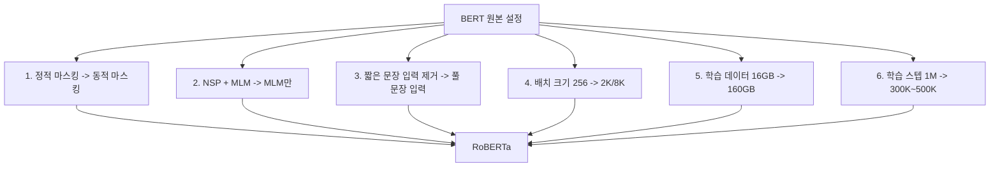
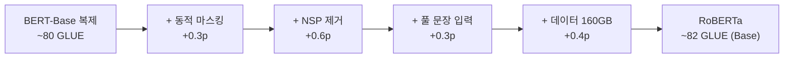

# RoBERTa 원논문 (Liu et al., 2019)

## 메타데이터

| 항목 | 내용 |
|------|------|
| 제목 | RoBERTa: A Robustly Optimized BERT Pretraining Approach |
| 저자 | Yinhan Liu, Myle Ott, Naman Goyal, Jingfei Du, Mandar Joshi, Danqi Chen, Omer Levy, Mike Lewis, Luke Zettlemoyer, Veselin Stoyanov |
| 소속 | Facebook AI Research (FAIR), University of Washington |
| 연도 | 2019 |
| arXiv | 1907.11692 |

---

## 핵심 기여

- **BERT 재현 연구를 통한 학습 레시피 최적화**: BERT 사전학습이 심각하게 미완성(undertrained) 상태임을 밝히고, 하이퍼파라미터·데이터·학습 기간을 재조정하는 것만으로 SOTA 달성
- **NSP 제거**: 다음 문장 예측(Next Sentence Prediction) 태스크가 오히려 성능을 해친다는 것을 실험적으로 증명
- **동적 마스킹(Dynamic Masking)**: 에폭마다 다른 마스킹 패턴을 사용하여 정적 마스킹 대비 성능 향상
- **더 크고 다양한 데이터**: 160GB 텍스트(원래 BERT 16GB 대비 10배) 사용
- **더 큰 배치 크기**: 배치 크기 8K로 학습하여 수렴 안정성 개선

---

## 배경 및 문제 정의

### BERT가 미완성인가?

원논문 제목의 "Robustly Optimized"는 의도적이다. 저자들은 BERT 후속 연구들이 모델 크기·아키텍처·사전학습 목표를 바꾸는 데 집중하는 동안, **기본 학습 레시피를 철저히 검증하지 않았음**에 주목했다.

연구 질문:
1. BERT의 각 사전학습 구성 요소가 실제로 얼마나 중요한가?
2. 더 오래, 더 많은 데이터로, 더 큰 배치로 학습하면 얼마나 향상되는가?
3. NSP 목표가 정말 필요한가?

---

## 방법

### 학습 레시피 변경 사항 전체



### 1. 동적 마스킹 vs 정적 마스킹

| 방식 | 설명 | 효과 |
|------|------|------|
| 정적 마스킹 (BERT) | 데이터 전처리 시 한 번 마스킹, 에폭마다 동일 패턴 | 동일 패턴 40번 반복 학습 |
| 동적 마스킹 (RoBERTa) | 입력 시퀀스를 모델에 공급할 때마다 새로운 마스킹 생성 | 다양한 마스킹 패턴으로 일반화 향상 |

원논문에서는 정적 마스킹 BERT 복제 대비 동적 마스킹이 일관된 소폭 향상을 보임.

### 2. NSP 제거 실험

네 가지 입력 포맷을 비교:

| 입력 포맷 | NSP 손실 | 설명 |
|---------|---------|------|
| 세그먼트 페어 + NSP | 있음 | BERT 원본 |
| 문장 페어 + NSP | 있음 | 단일 문장 2개 |
| 풀 문장 | 없음 | 문서 경계 무시하고 연속 채움 |
| **문서 문장** | **없음** | **문서 경계 존중하며 연속 채움** |

결과: NSP 제거 + 풀 문장/문서 문장 입력이 일관되게 우수. NSP는 문장 수준 분류 같은 특정 태스크에서는 도움이 되지만 전반적으로는 해로움.

### 3. 데이터 규모

| 데이터셋 | 크기 | 설명 |
|---------|------|------|
| BookCorpus + Wikipedia (BERT) | 16GB | BERT 원본 |
| + CC-News | +76GB | CommonCrawl 뉴스 기사 |
| + OpenWebText | +38GB | Reddit 링크 텍스트 |
| + Stories | +31GB | CommonCrawl 스토리 필터 |
| **합계** | **160GB** | RoBERTa 학습 데이터 |

### 4. 배치 크기와 학습 스텝의 상관관계

배치 크기를 키우면 학습 스텝당 더 많은 데이터를 처리하므로, 동일한 계산량에서 더 적은 스텝이 필요하다. 논문에서는 배치 256, 2K, 8K로 비교:

- 배치 8K + 31.2K 스텝 ≈ 배치 2K + 125K 스텝 ≈ 배치 256 + 1M 스텝 (토큰 수 기준 동등)
- 큰 배치가 더 효율적으로 수렴하며 분산 학습에 유리

---

## 실험 및 결과

### GLUE 벤치마크

| 모델 | GLUE 평균 |
|------|----------|
| BERT-Large | 80.5 |
| XLNet-Large | 88.4 |
| **RoBERTa-Large** | **88.5** |

### SQuAD (독해 이해) v1.1 / v2.0

| 모델 | SQuAD 1.1 F1 | SQuAD 2.0 F1 |
|------|------------|------------|
| BERT-Large | 93.2 | 83.1 |
| XLNet-Large | 95.1 | 90.6 |
| **RoBERTa-Large** | **94.6** | **89.4** |

### RACE (독해 및 추론)

| 모델 | 정확도 |
|------|--------|
| BERT-Large | 72.0% |
| **RoBERTa-Large** | **86.8%** |

### 단계별 절제 실험 (Ablation)



각 변경사항이 누적적으로 기여하며, 단 한 가지 변경으로 극적인 개선은 없고 레시피 전체가 조합될 때 효과가 나타남.

---

## 한계 및 후속 연구

### 원논문의 한계

- **자기회귀 모델 대비 생성 능력 부재**: 인코더 전용 모델이므로 텍스트 생성 태스크에 직접 사용 불가
- **마스킹 독립성 가정**: MLM에서 마스크된 토큰들이 서로 독립적으로 예측됨 (ELECTRA, XLNet이 이 문제를 지적)
- **단방향 어텐션 없음**: 자기회귀 디코딩 불가

### 주요 후속 연구

| 연구 | RoBERTa와의 관계 |
|------|----------------|
| ALBERT (Lan et al., 2019) | 파라미터 공유로 RoBERTa와 유사 SOTA를 훨씬 적은 파라미터로 달성 |
| ELECTRA (Clark et al., 2020) | RTD(대체 토큰 탐지)로 RoBERTa보다 4배 효율적 |
| DeBERTa (He et al., 2020) | 상대적 위치 인코딩으로 RoBERTa 능가 |
| RoBERTa-wwm | 전체 단어 마스킹(Whole Word Masking) 적용 중국어 버전 |

---

## 실무 적용 관점

### 언제 RoBERTa를 사용하는가

- **자연어 이해(NLU) 태스크**: 분류, NLI(Natural Language Inference), NER(Named Entity Recognition) 등 인코더 전용 태스크
- **BERT 대체**: 동일 아키텍처에서 성능 개선이 필요할 때 BERT 체크포인트 대신 RoBERTa 사용
- **문서 임베딩**: CLS 토큰 임베딩을 문서 표현으로 활용

### Hugging Face Transformers로 RoBERTa 사용

```python
from transformers import RobertaTokenizer, RobertaForSequenceClassification
import torch

tokenizer = RobertaTokenizer.from_pretrained("roberta-large")
model = RobertaForSequenceClassification.from_pretrained(
    "roberta-large",
    num_labels=2,
)

# 입력 인코딩
inputs = tokenizer(
    "RoBERTa는 BERT를 강화한 모델이다.",
    return_tensors="pt",
    padding=True,
    truncation=True,
    max_length=512,
)

# 추론
with torch.no_grad():
    outputs = model(**inputs)
    logits = outputs.logits
    predicted_class = logits.argmax(dim=-1)
```

### RoBERTa 미세 조정 팁

```python
from transformers import TrainingArguments, Trainer

# RoBERTa 미세 조정 권장 하이퍼파라미터
training_args = TrainingArguments(
    output_dir="./roberta-finetuned",
    num_train_epochs=3,
    per_device_train_batch_size=32,
    per_device_eval_batch_size=64,
    learning_rate=2e-5,          # BERT/RoBERTa 미세 조정 표준 범위: 1e-5 ~ 5e-5
    warmup_ratio=0.06,
    weight_decay=0.01,
    evaluation_strategy="epoch",
    save_strategy="epoch",
    load_best_model_at_end=True,
)
```

---

## 관련 문서

- [[bert-paper]] - RoBERTa가 개선 대상으로 삼은 원본 모델
- [[albert-paper]] - 같은 시기 파라미터 효율화에 집중한 BERT 변형
- [[electra-paper]] - MLM 대신 RTD로 훨씬 효율적인 사전학습을 달성
- [[xlnet-paper]] - AR+AE를 결합한 또 다른 BERT 후계자
- [[masked-language-modeling]] - MLM 태스크 상세 개념
- [[pretraining]] - 사전학습 패러다임 전반
