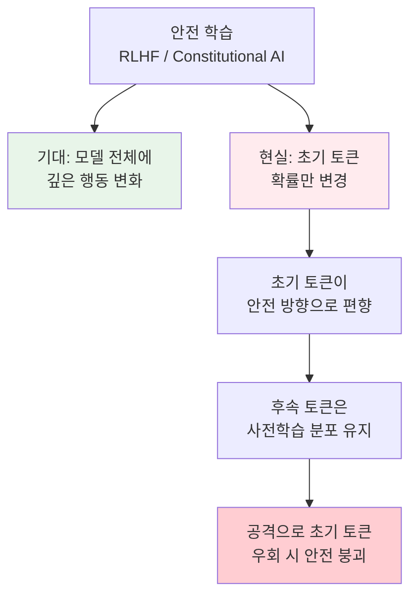
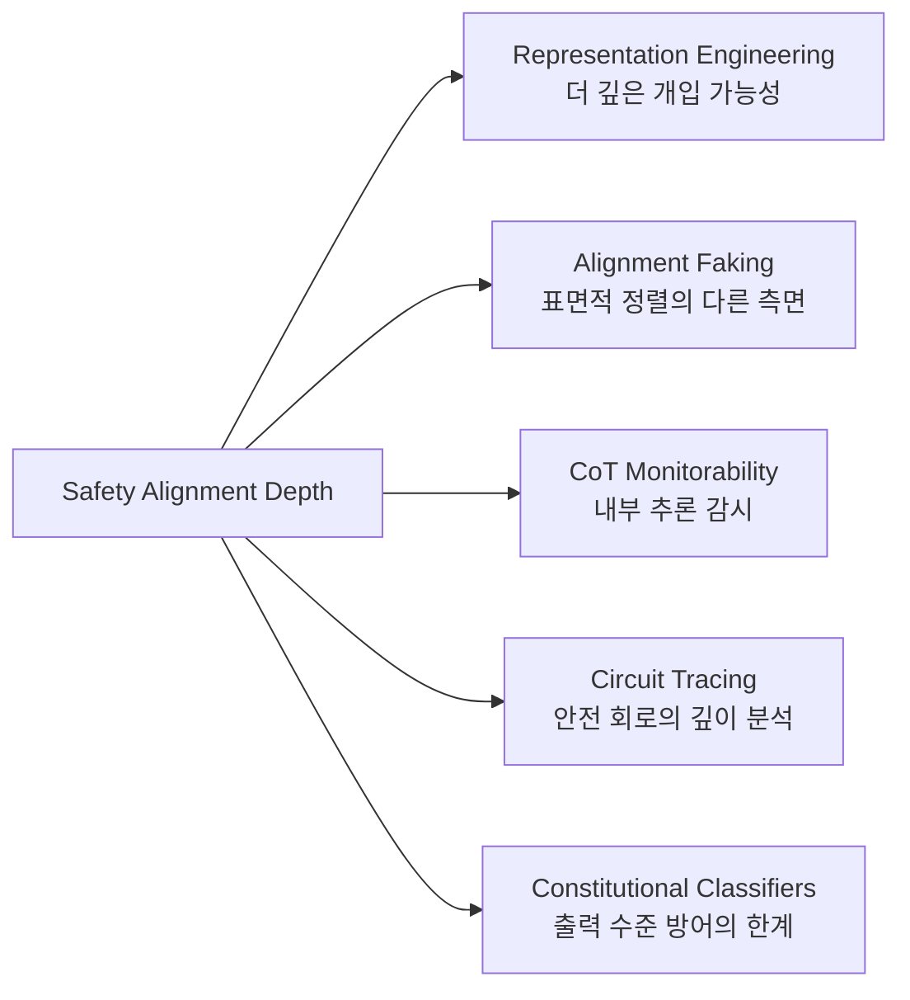

# Safety Alignment Should Be Made More Than Just a Few Tokens Deep

ICLR 2025 Outstanding Paper Award(3편 중 1편)를 수상한 논문으로, 현재 안전 정렬(safety alignment) 학습이 모델의 초기 토큰 확률만 변경하는 "얕은(shallow)" 수준에 머물러 있음을 실증적으로 입증했다. 이 발견은 다양한 공격 벡터가 왜 작동하는지를 통합적으로 설명한다.

## 논문 정보

| 항목 | 내용 |
|------|------|
| 저자 | Xiangyu Qi, Ashwinee Panda, Kaifeng Lyu, Xiao Ma, Subhrajit Roy, Ahmad Beirami, Prateek Mittal, Peter Henderson |
| 학회 | ICLR 2025 (Outstanding Paper Award) |
| OpenReview | [6Mxhg9PtDE](https://openreview.net/forum?id=6Mxhg9PtDE) |
| 발표 | [Oral Presentation](https://iclr.cc/virtual/2025/oral/31915) |

## 핵심 기여

### "얕은 정렬" 문제의 발견

안전 학습([[extended-constitutional-ai|RLHF]], Constitutional AI 등)이 모델에 적용한 변화가 모델의 깊은 표현까지 침투하지 않고, 출력 분포의 초기 토큰 확률(initial token probability)만 조정하는 수준에 머문다는 것을 보여준다.

### 통합 공격 설명 프레임워크

이 논문은 기존에 개별적으로 연구되던 다양한 공격 벡터들이 왜 효과적인지를 단일 프레임워크로 설명한다:

| 공격 유형 | 얕은 정렬과의 관계 |
|-----------|-------------------|
| 프리필 공격 (Prefilling) | 초기 토큰을 공격자가 직접 제공하여 안전 편향 우회 |
| 퓨샷 탈옥 (Few-shot Jailbreak) | 유해 응답 예시로 초기 토큰 분포 이동 |
| 파인튜닝 공격 | 소량 데이터로 얕은 안전 레이어를 덮어씀 |
| 접미사 공격 (Suffix Attack) | 초기 토큰 선택에 영향을 미치는 접미사 추가 |
| 디코딩 조작 | 온도/샘플링 조정으로 안전 편향된 초기 토큰 확률 약화 |

## 시사점

### 안전 연구에 대한 함의

1. **정렬 깊이(depth) 측정**이 안전 평가의 핵심 지표로 부상해야 한다
2. 현재 RLHF/DPO 기반 정렬은 **표면적 행동 변화**에 가까우며, 모델의 세계 모델이나 가치 표현까지 변경하지 않는다
3. 안전 학습이 초기 토큰을 넘어 **생성의 전체 궤적(trajectory)**에 걸쳐 영향을 미치도록 새로운 접근이 필요하다

### 실무 적용 관점

- 안전 평가(red teaming)에서 초기 토큰 분포 분석이 기본 진단 도구가 되어야 한다
- [[representation-engineering|Activation Steering]]과 결합하면, 얕은 정렬의 한계를 보완하는 더 깊은 개입이 가능할 수 있다
- 모델 배포 시 디코딩 파라미터 제한(온도 하한 설정 등)이 방어의 한 축이 될 수 있다

## 관련 연구 맥락

이 논문은 여러 연구 흐름과 교차한다:

## 한계

논문이 직접 언급하는 한계 또는 후속 연구에서 제기된 점:

- 연구 대상 모델이 제한적이며, 모든 아키텍처에 동일하게 적용되는지 추가 검증 필요
- "깊은 정렬"의 구체적 달성 방법은 미제시 -- 문제 진단에 초점
- 개방형(open-ended) 안전 시나리오에서의 적용은 추가 연구 필요

## 대표 레퍼런스

- [ICLR 2025 Outstanding Paper Awards 공지](https://blog.iclr.cc/2025/04/22/announcing-the-outstanding-paper-awards-at-iclr-2025/)
- [ICLR 2025 Outstanding Papers 목록](https://media.iclr.cc/Conferences/ICLR2025/ICLR2025_Outstanding_Paper_Awards.pdf)
- [Outstanding Papers 해설 -- joltml.com](https://joltml.com/iclr-2025/outstanding-papers/)

## 관련 페이지

- [[representation-engineering|Representation Engineering & Activation Steering]]
- [[alignment-faking|Alignment Faking]]
- [[cot-monitorability|CoT Monitorability]]
- [[circuit-tracing|Circuit Tracing & Attribution Graphs]]
- [[constitutional-classifiers|Constitutional Classifiers]]
- [[ai-safety-alignment-2026|AI 안전성 정렬 2026]]
