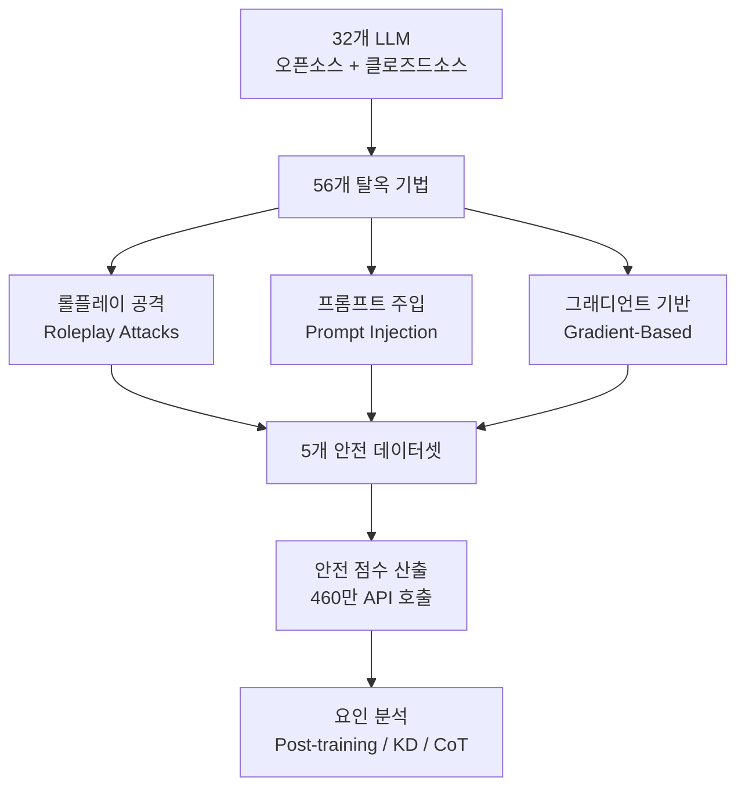

# What Matters For Safety Alignment? (32 Models, 56 Jailbreaks)

## 핵심 기여

32개 LLM과 56개 탈옥(jailbreak) 기법을 교차 실험한 **대규모 실증 연구**. 총 **460만 건의 API 호출**을 통해 안전 정렬에 영향을 미치는 요인을 체계적으로 분석한다. 안전 정렬 연구의 스케일 면에서 현재까지 가장 포괄적인 연구 중 하나이다.

### 3대 핵심 발견

1. **포스트 트레이닝(post-training)이 안전을 약화시킨다**: RLHF, SFT, 지식 증류(Knowledge Distillation) 등 포스트 트레이닝 단계가 기반 모델의 안전 특성을 훼손하는 경향이 관찰됨
2. **CoT(Chain-of-Thought) 공격의 위력**: CoT를 활용한 공격이 표준 탈옥 기법 대비 **3.34배** 높은 성공률을 기록 - 추론 능력 강화와 안전 위험의 트레이드오프 존재
3. **지식 증류(KD) 위험**: 교사 모델에서 학생 모델로 지식을 증류할 때 안전 특성이 충분히 전달되지 않음

## 연구 설계

### 안전 평가 프레임워크

### 데이터셋 구성

5개 안전 데이터셋을 사용하여 평가 커버리지를 확보한다:
- 유해 콘텐츠 생성 요청 데이터셋
- 정치/사회적 편향 유도 데이터셋
- 개인정보 추출 시도 데이터셋
- 사이버보안 악용 시나리오
- 의료/법률 무면허 조언 유도

### 3대 공격 유형 체계

| 공격 유형 | 대표 기법 | 특징 |
|-----------|-----------|------|
| 롤플레이(Roleplay) | DAN, Jailbroken persona | 모델을 다른 캐릭터로 가장하게 유도 |
| 프롬프트 주입(Prompt Injection) | Indirect injection, Context manipulation | 숨겨진 지시를 통해 안전 가드레일 우회 |
| 그래디언트 기반(Gradient-Based) | GCG, AutoDAN | 화이트박스 모델에 최적화된 적대적 접미사 |

## 실험 결과 상세

### 포스트 트레이닝의 역설

| 트레이닝 단계 | 안전 점수 변화 |
|--------------|--------------|
| 기반 모델(Base) | 기준선 |
| SFT 적용 후 | -5~15% 감소 |
| RLHF 적용 후 | -8~20% 감소 (모델마다 상이) |
| 지식 증류 후 | -10~25% 감소 |

포스트 트레이닝이 안전을 강화하는 일반적 가정과 달리, **유용성 최적화 과정에서 안전 경계가 함께 이완**되는 현상이 관찰된다.

### CoT 공격 효과

일반 프롬프트 탈옥과 CoT를 결합한 탈옥의 성공률 차이:
- 표준 탈옥 기법 평균 성공률: `x%`
- CoT 결합 탈옥 성공률: `3.34x%`

추론 단계를 거치면서 모델이 "논리적으로" 요청을 정당화하는 경로를 스스로 생성하기 때문으로 분석된다.

### 모델 계열별 패턴

- **오픈소스 모델**: 클로즈드소스 대비 그래디언트 기반 공격에 더 취약 (화이트박스 접근 허용)
- **소형 모델**: 안전 파인튜닝 데이터가 부족하여 롤플레이 공격에 더 취약
- **최신 모델**: 기본 방어력은 향상되었으나 CoT 공격에는 여전히 취약

## 안전 정렬을 위한 실무 지침

논문이 도출한 권고 사항:

1. **포스트 트레이닝 안전 재점검**: 각 포스트 트레이닝 단계 후 안전 벤치마크를 의무 실행
2. **CoT 모니터링 강화**: CoT 추론 경로에서 유해 패턴을 실시간 감지하는 별도 모니터 필요
3. **지식 증류 안전 프로토콜**: 학생 모델의 안전 특성을 독립적으로 검증하는 절차 도입
4. **다계층 방어**: 단일 방어 레이어 대신 파이프라인 전체에 걸친 다계층 안전 시스템 구축

## 한계

- 화이트박스 접근이 필요한 그래디언트 기반 공격은 클로즈드소스 모델에 적용 불가
- 460만 API 호출에 따른 비용과 재현성 문제
- 안전 점수 측정에 사용된 분류기 자체의 오류율

## 관련 문서

- [[ai-safety-alignment-2026]] - AI 안전 정렬의 현황과 주요 접근법
- [[alignment-faking]] - 정렬 위장과 평가 시점의 행동 변화
- [[reward-hacking]] - 보상 해킹과 과최적화 위험
- [[constitutional-classifiers]] - 헌법적 분류기 기반 안전 정렬
- [[agent-prompt-injection-defense]] - 프롬프트 주입 방어 기법
