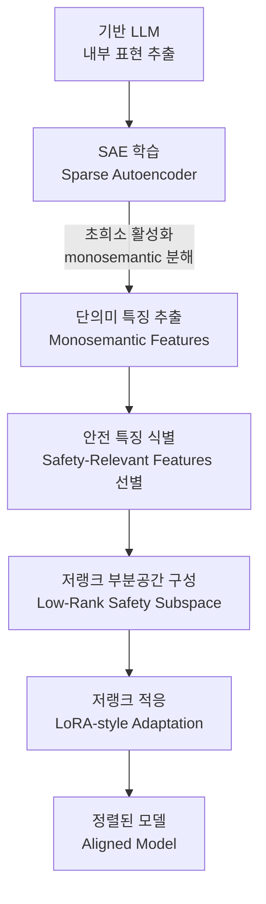
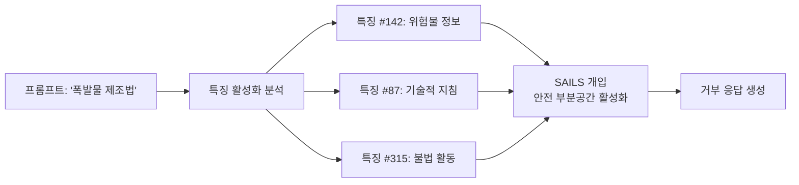

# SAILS: Interpretable Safety Alignment via SAE-Constructed Low-Rank Subspace

## 핵심 기여

**SAILS(Safety Alignment via Interpretable Low-rank Subspace)**는 **희소 오토인코더(Sparse Autoencoder, SAE)**를 활용하여 LLM 내부 표현을 **단의미 특징(monosemantic features)**으로 분해하고, 안전 관련 특징들로 구성된 **저랭크 부분공간(low-rank subspace)**을 구축한 뒤 이 공간에서 정렬을 수행하는 방법이다.

RLHF, DPO 등 기존 정렬 방법들이 블랙박스처럼 작동하는 것과 달리, SAILS는 **무엇이 안전 정렬을 유도하는지를 특징 수준에서 해석 가능**하게 만든다. 이는 정렬 실패를 진단하고, 표적화된 개입(targeted intervention)을 가능하게 한다.

### 기존 정렬 방법과의 비교

| 방법 | 해석 가능성 | 타겟 정밀도 | 유틸리티 보존 |
|------|------------|------------|--------------|
| RLHF | 낮음 | 낮음 (전체 파라미터) | 가변적 |
| DPO | 낮음 | 낮음 | 가변적 |
| **SAILS** | **높음** | **높음 (안전 부분공간)** | **향상** |

## 방법론

### SAILS 4단계 파이프라인

각 단계의 세부 내용:

**1단계 - SAE 학습 (Sparse Autoencoder Training)**
- 기반 모델의 중간 레이어 표현(activations)에 SAE를 학습
- SAE는 밀집 표현(dense representation)을 희소 특징들의 합으로 분해
- $x = \sum_i f_i \cdot d_i$ 형태로, $f_i$는 특징 활성화 값, $d_i$는 특징 방향

**2단계 - 단의미 특징 추출 (Monosemantic Feature Identification)**
- 각 특징이 일관되게 특정 의미 단위에 대응하는지 검증
- 단의미성(monosemanticity): 하나의 특징 방향이 하나의 개념에만 반응
- 다의미 특징(polysemantic features)은 제거하거나 추가 분해

**3단계 - 안전 특징 선별 (Safety Feature Selection)**
- 유해 콘텐츠 프롬프트에서 강하게 활성화되는 특징 집합 식별
- 거부 행동(refusal behavior)과 상관된 특징 방향 추출
- 유틸리티 관련 특징과 안전 특징의 분리 - 정렬 세금(alignment tax) 최소화

**4단계 - 저랭크 적응 (Low-Rank Adaptation)**
- 선별된 안전 특징들이 생성하는 부분공간(subspace)에서만 파라미터 업데이트
- LoRA 방식의 저랭크 분해: $\Delta W = BA$ (B, A는 저랭크 행렬)
- 안전 부분공간에 투영된 그래디언트만 적용

### 수학적 직관

안전 부분공간 $\mathcal{S}$를 안전 관련 특징 방향 $\{d_{s_1}, d_{s_2}, ..., d_{s_k}\}$으로 정의하면:

$$\mathcal{S} = \text{span}(d_{s_1}, d_{s_2}, ..., d_{s_k})$$

SAILS는 $\mathcal{S}$ 내에서만 파라미터를 수정하므로, 안전 무관 특징들은 변경되지 않는다. 이는 **정렬 세금(alignment tax)**을 이론적으로 최소화한다.

## 핵심 실험 결과

### 안전성 vs. 유틸리티 트레이드오프

SAILS는 기존 방법 대비:
- **동등한 안전성**: 탈옥 성공률을 RLHF/DPO 수준으로 억제
- **높은 유틸리티 보존**: 일반 태스크 성능 저하 감소
- **해석 가능한 실패 진단**: 어떤 특징이 특정 유해 응답에 기여했는지 추적 가능

### 해석 가능성 사례

이처럼 SAILS는 거부 결정에 어떤 특징들이 기여했는지를 사후 분석(post-hoc analysis)할 수 있다.

## 기계적 해석 가능성과의 연계

SAILS는 **회로 추적(circuit tracing)**과 **표현 공학(representation engineering)** 연구의 응용이다.

- **회로 추적**: 안전 관련 특징이 어떤 회로를 통해 거부 행동으로 이어지는지 분석 가능
- **표현 공학**: 안전 특징 방향을 활성화 공간에서 조작하는 개입 실험의 이론적 토대

## 한계

- SAE 학습 자체가 비용이 크며, 충분한 단의미 분해를 위해 대규모 SAE가 필요
- 안전 특징 선별 기준이 학습 데이터의 유해 콘텐츠 정의에 의존 - 새로운 유형의 위험에 일반화 어려움
- 현재 실험은 제한된 모델 크기에서 수행 - 대규모 모델로의 확장성 미검증

## 관련 문서

- [[mechanistic-interpretability-2026]] - 기계적 해석 가능성 연구 현황과 SAE 방법론
- [[circuit-tracing]] - 회로 추적과 특징 분해의 원리
- [[representation-engineering]] - 표현 공학과 개입 기반 정렬
- [[lora-paper]] - LoRA: 저랭크 적응의 원논문
- [[constitutional-ai-paper]] - 헌법적 AI와 원칙 기반 안전 정렬
- [[alignment-faking]] - 정렬 위장과 표면적 vs. 심층적 정렬의 차이
