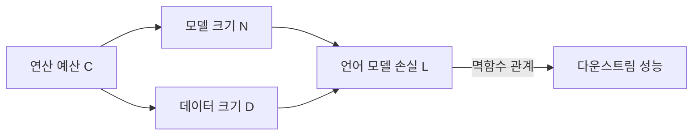

# Scaling Laws for Neural Language Models (Kaplan et al., 2020)

## 핵심 기여

OpenAI의 Jared Kaplan 등이 2020년 발표한 이 논문은 언어 모델의 손실(loss)이 **모델 파라미터 수(N), 학습 데이터 크기(D), 연산 예산(C)과 멱함수(power-law) 관계**를 가진다는 것을 정량화했다. "연산 예산이 주어지면 어떻게 배분하는 것이 최적인가"라는 실용적 질문에 처음으로 체계적인 답을 제공했으며, 이후 대형 언어 모델 설계 전략의 핵심 참고문헌이 되었다.

## 방법

### 주요 변수 정의

- $N$: 비임베딩(non-embedding) 파라미터 수
- $D$: 학습 토큰 수
- $C \approx 6ND$: 학습에 필요한 FLOPs 수 (전방+역방향 패스 기준)

### 스케일링 법칙 핵심 수식

교차 엔트로피 손실과 각 변수의 관계:

$$L(N) \approx \left(\frac{N_c}{N}\right)^{\alpha_N}, \quad L(D) \approx \left(\frac{D_c}{D}\right)^{\alpha_D}$$

실험적으로 확인된 지수:
- $\alpha_N \approx 0.076$ (파라미터 10배 증가 시 손실 약 14% 감소)
- $\alpha_D \approx 0.095$ (데이터 10배 증가 시 손실 약 16% 감소)

### 연산 최적 배분 (Compute-Optimal)

동일 연산 예산 $C$에서 모델 크기와 데이터 크기의 최적 비율이 존재하며, Kaplan et al.의 초기 결론은 "**파라미터 증가 대비 데이터 증가가 덜 효율적**"이라는 것이었다(후에 Chinchilla가 수정).

## 결과 및 영향

- **학습 효율 가이드라인**: 연산 예산이 커질수록 모델 크기와 데이터를 모두 늘려야 하되 모델 크기를 더 빠르게 키워야 한다는 초기 결론 (GPT-3 설계에 반영)
- 아키텍처 세부 사항(레이어 수, 너비, 헤드 수 등)보다 전체 파라미터 수가 더 중요하다는 실용적 통찰
- 스케일링 법칙 예측을 통해 대규모 학습 실험 전 소규모 실험으로 성능을 사전 추정 가능해짐

## 한계

- Chinchilla 논문(Hoffmann et al., 2022)이 이 논문의 데이터 배분 권장값이 지나치게 모델에 편향되어 있다고 반박 - GPT-3가 실제로 연산 최적점에 비해 **과대 파라미터/과소 데이터** 상태였음을 지적
- 다운스트림 태스크 성능과 언어 모델 손실 사이의 관계가 단조적이지 않을 수 있음
- 도메인 특화 데이터나 데이터 품질 변수가 법칙에 포함되지 않음

## 실무 적용 관점

- 새 학습 실험 전 소규모 실험으로 스케일링 법칙을 추정해 대규모 실험 성공률을 높일 것
- **Chinchilla 법칙을 함께 참조**: 2022년 이후에는 Kaplan이 아닌 Chinchilla 기준($N \approx D / 20$)을 데이터 크기 산정의 실용 기준으로 사용
- 추론 비용(inference cost) 최적화를 고려하면 더 작은 모델을 더 많은 데이터로 학습시키는 것이 유리

## 관련 문서
- [[byte-latent-transformer-paper]] -- Byte Latent Transformer: 토크나이저 없이 원시 바이트에서 학습하는 아키텍처

- [[GPT-3 퓨샷 학습]]
- [[Chinchilla 스케일링 법칙]]
- [[Chain-of-Thought 추론]]
- [[emergent-abilities]]
