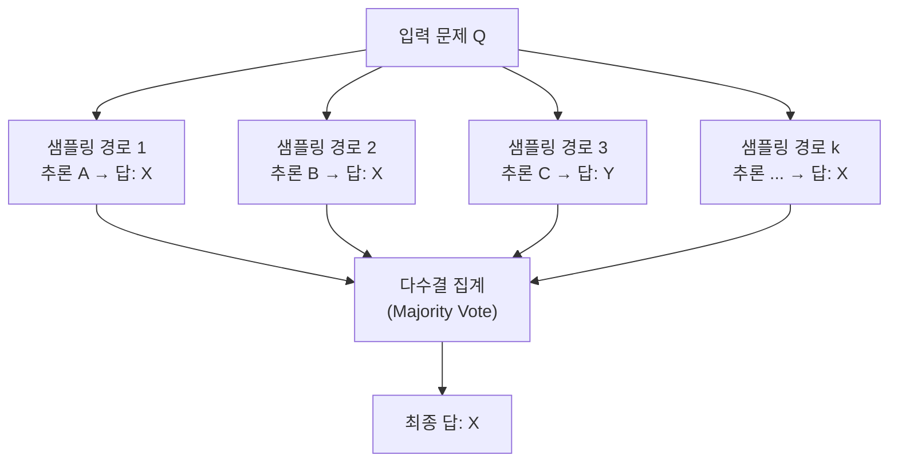

# Self-Consistency Improves Chain of Thought Reasoning in LLMs (Wang et al., 2022)

## 핵심 기여

Google Brain의 Xuezhi Wang 등이 2022년 발표한 논문으로, **동일한 문제에 대해 다양한 추론 경로(reasoning path)를 여러 번 샘플링한 뒤 다수결(majority vote)로 최종 답을 결정**하는 Self-Consistency 기법을 제안했다. 단일 CoT 추론이 그럴듯한 오류 경로를 생성할 수 있다는 취약점을 해결하며, 추가 학습 없이 추론 정확도를 크게 높이는 디코딩 전략이다. 이 논문은 테스트 타임 컴퓨트(test-time compute) 투자가 성능을 높인다는 패러다임의 초기 실증 사례로 꼽힌다.

## 방법

### 핵심 아이디어

고전적 CoT는 greedy decoding으로 단일 추론 경로를 생성한다. Self-Consistency는 이를 확장해 다음 3단계로 동작한다:

1. **다양한 경로 샘플링**: temperature를 높여 동일 질문에 대해 $k$개의 서로 다른 CoT 경로와 답을 생성 (논문에서는 $k=40$ 사용)
2. **답 집합(marginal) 추출**: 각 경로 끝의 최종 답만 추출
3. **다수결 집계**: 가장 많이 등장한 답을 최종 응답으로 채택

### 왜 효과적인가

수학 문제에 여러 풀이 방법이 있듯이, 동일한 답에 도달하는 추론 경로는 여러 개다. 잘못된 경로들은 서로 다른 오류 답으로 흩어지는 반면, 올바른 답은 여러 경로에서 수렴하기 때문에 다수결이 유효하다.

### 평가 태스크

- **산술 추론**: GSM8K, SVAMP, AQuA, MultiArith
- **상식 추론**: CommonsenseQA, StrategyQA
- **기호 추론**: Last Letter Concatenation, Coin Flip

## 결과

- GSM8K 기준 PaLM 540B: CoT greedy 56.9% → Self-Consistency 74.4% (+17.5%p)
- AQuA(대수 문제): 48.3% → 63.9%
- StrategyQA(상식): 76.1% → 83.0%
- 샘플 수 $k$가 늘어날수록 성능이 단조 증가하다 약 $k=20$~$40$ 이후 수렴
- GPT-3, UL2, PaLM 등 다양한 모델 크기에서 일관된 개선 확인

## 한계

- **추론 비용이 $k$배 증가**: 추론 시간·API 비용이 샘플 수에 비례해 선형 증가
- **개방형 생성 태스크에 부적합**: 다수결 집계가 명확한 단답형(closed-form) 태스크에서만 자연스럽게 작동. 요약, 번역, 긴 서술형 응답에는 직접 적용 어려움
- **답 형식 정규화 필요**: "5개", "5", "다섯"처럼 표현이 다른 답을 동일하게 처리하는 정규화 로직 필요
- 극히 어려운 문제에서 다수 경로가 모두 틀리면 다수결도 틀림 (garbage in, garbage out)

## 실무 적용 관점

- 수학 문제 풀이, 코딩 테스트 생성, 복잡한 추론이 필요한 파이프라인에 바로 적용 가능한 plug-in 기법
- 비용이 허용되는 배치(batch) 파이프라인에 적합. 실시간 저지연 서비스에는 부담
- 현대 추론 모델(o1, o3)의 내부 CoT 반복 실행과 개념적으로 동일한 원리 — 외부에서 샘플링으로 구현하느냐 모델이 내재화하느냐의 차이
- 오픈소스 모델 기준 $k=8$~$16$ 정도가 비용 대비 성능 최적점인 경우가 많음
- Universal Self-Consistency(코드 검증 결합)나 Weighted Voting(신뢰도 기반) 변형도 고려 가능

## 관련 문서
- [[prompt-engineering-patterns]] -- 프롬프트 엔지니어링 패턴

- [[chain-of-thought-paper]]
- [[test-time-compute-scaling]]
- [[tree-of-thought-paper]]
- [[ai-reasoning-models|reasoning-models]]
