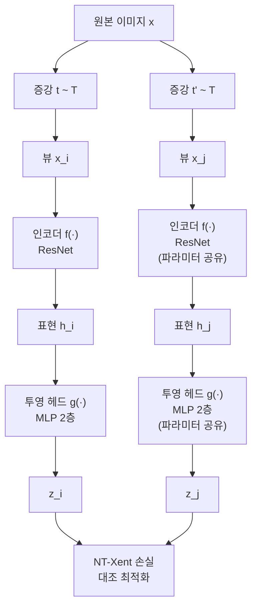
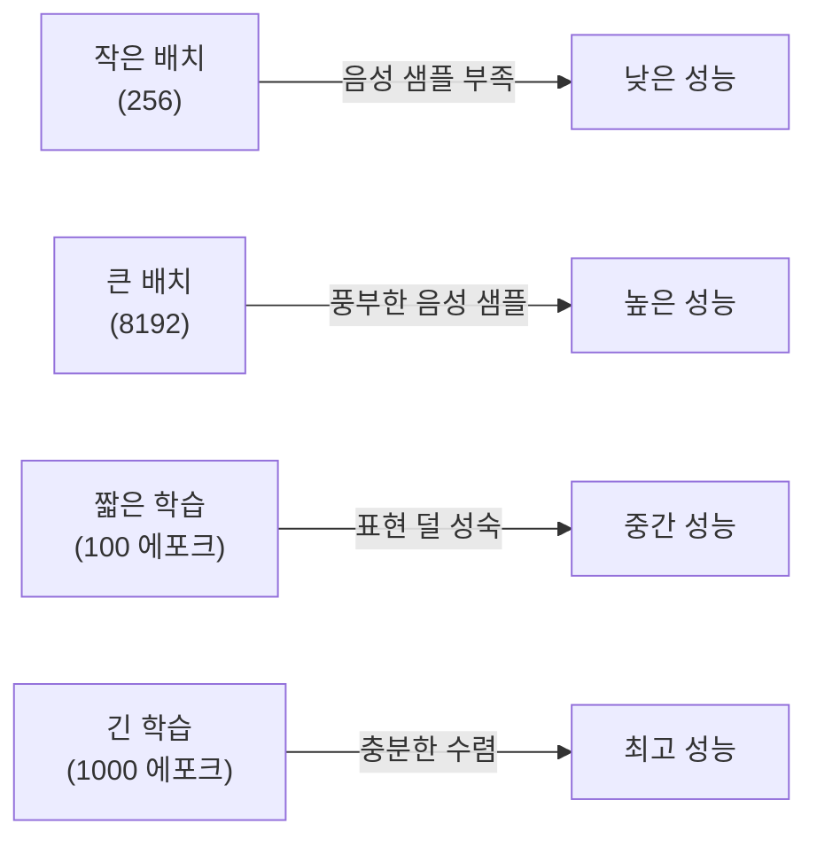

# SimCLR: 대조 학습을 이용한 시각 표현의 단순 프레임워크

## 메타데이터

| 항목 | 내용 |
|------|------|
| 제목 | A Simple Framework for Contrastive Learning of Visual Representations |
| 저자 | Ting Chen, Simon Kornblith, Mohammad Norouzi, Geoffrey Hinton |
| 소속 | Google Research, Brain Team |
| 발표 연도 | 2020 |
| 학회 | ICML 2020 |
| arXiv | [2002.05709](https://arxiv.org/abs/2002.05709) |

## 핵심 기여

- **강한 데이터 증강(data augmentation) 조합**이 대조 학습 표현 품질을 결정하는 핵심 요소임을 체계적으로 증명
- 비선형 투영 헤드(projection head)가 표현 공간(representation space)에서 불필요한 정보를 제거하여 다운스트림 성능을 크게 향상시킴
- **큰 배치 크기(large batch size)**와 표준화된 온도 파라미터(temperature parameter)가 대조 손실(contrastive loss)의 안정성과 효과에 결정적
- 레이블 없이 사전학습된 표현이 소량의 라벨 데이터(1%)만으로도 강력한 성능을 달성
- 자기지도 학습(self-supervised learning) 방식으로 ImageNet 선형 평가(linear evaluation)에서 당시 SOTA 달성

## 배경 및 문제 정의

자기지도 학습은 레이블이 없는 대규모 데이터에서 유용한 표현을 학습하는 방법이다. 기존 접근법은 픽셀 복원, 회전 예측, 퍼즐 풀기 등 다양한 프리텍스트 태스크(pretext task)를 사용했지만, 이들의 한계는 작업 설계에 따라 성능이 크게 달라지고 태스크-특정 표현이 생성된다는 점이었다.

**대조 학습(contrastive learning)**은 같은 이미지의 다른 증강 뷰(view)는 서로 가깝게, 다른 이미지의 뷰는 멀게 학습하는 방식이다. SimCLR 이전에도 대조 학습 연구는 있었지만 메모리 뱅크, 특수 구조, 복잡한 음성 샘플 마이닝 등이 필요했다. SimCLR은 이를 단순하게 정리하여 "무엇이 진짜 중요한가"를 규명하려 했다.

### 풀고자 한 질문

1. 어떤 데이터 증강 조합이 좋은 표현 학습에 효과적인가?
2. 왜 투영 헤드(projection head)가 필요한가?
3. 대조 손실 함수와 배치 크기가 성능에 어떤 영향을 미치는가?

## 방법

### 전체 파이프라인



위 다이어그램은 SimCLR의 학습 파이프라인을 보여준다. 동일한 이미지에서 두 가지 증강 뷰를 생성하고 같은 인코더를 통해 표현을 추출한 뒤, 투영 헤드를 거쳐 대조 손실로 최적화한다.

### 데이터 증강 전략

SimCLR은 다음 증강 기법을 순차 적용하는 조합 $t \sim \mathcal{T}$를 사용한다:

1. **랜덤 크롭 + 리사이즈(random crop and resize)**: 가장 중요한 단일 증강
2. **색상 왜곡(color distortion)**: 명도, 채도, 색조 무작위 변환 + 회색조 변환
3. **가우시안 블러(Gaussian blur)**: 흐림 효과 (ImageNet 크기에서 적용)

색상 왜곡과 크롭의 조합이 특히 강력하다. 색상만으로 이미지를 구분하지 못하게 만들어 모델이 형태·구조적 특성을 학습하도록 강제한다.

### 인코더 아키텍처

표준 ResNet을 인코더 $f(\cdot)$로 사용한다. 전역 평균 풀링(global average pooling) 레이어의 출력 $h = f(x) \in \mathbb{R}^d$이 표현 벡터다.

### 투영 헤드

인코더 출력 위에 2층 MLP 투영 헤드 $g(\cdot)$를 붙인다:

$$z = g(h) = W^{(2)} \sigma(W^{(1)} h)$$

여기서 $\sigma$는 ReLU 활성화 함수다. 다운스트림 태스크에는 투영 헤드를 제거하고 $h$를 표현으로 사용한다. 실험에서 투영 헤드 없이 $z$를 쓰는 것보다 $h$를 쓰는 것이 10%p 이상 성능이 높았다.

**왜 투영 헤드가 도움이 되는가?** 대조 손실 최적화 과정에서 색상, 방향 등 증강으로 제거된 정보는 $z$ 공간에서 사라진다. 투영 헤드가 없으면 이런 불필요한 정보 제거가 표현 $h$ 자체에 일어나버려 다운스트림 태스크에 필요한 정보가 손상된다.

### NT-Xent 손실 함수

Normalized Temperature-scaled Cross Entropy Loss(NT-Xent)를 사용한다. 배치 크기 $N$에 대해 $2N$개의 증강 샘플이 존재하고, 각 샘플 $i$의 긍정 쌍(positive pair)은 같은 이미지의 다른 증강 $j$이다:

$$\ell_{i,j} = -\log \frac{\exp(\text{sim}(z_i, z_j) / \tau)}{\sum_{k=1}^{2N} \mathbf{1}_{[k \neq i]} \exp(\text{sim}(z_i, z_k) / \tau)}$$

전체 손실은 모든 긍정 쌍에 대한 평균이다:

$$\mathcal{L} = \frac{1}{2N} \sum_{k=1}^{N} \left[ \ell(2k-1, 2k) + \ell(2k, 2k-1) \right]$$

여기서 $\text{sim}(u, v) = u^\top v / (\|u\| \|v\|)$은 코사인 유사도이고, $\tau$는 온도 파라미터다. 분모의 합산에서 같은 이미지의 다른 증강(긍정 쌍)을 제외하지 않는 점이 특징으로, 배치 내 나머지 $2(N-1)$개가 모두 음성 샘플(negative sample)이 된다.

### 온도 파라미터의 역할

낮은 온도($\tau \approx 0.07$)는 어려운 음성 샘플에 더 집중하게 만들어 더 세밀한 표현을 학습시킨다. 너무 낮으면 수치적 불안정성이 생기고, 너무 높으면 모든 쌍을 동등하게 취급해 변별력 있는 학습이 어렵다.

## 실험 및 결과

### ImageNet 선형 평가 (Linear Evaluation)

사전학습된 표현을 동결(freeze)하고 선형 분류기만 학습하는 방식:

| 방법 | Top-1 정확도 |
|------|-------------|
| 랜덤 초기화 + 선형 | 21.3% |
| SimCLR (ResNet-50) | 69.3% |
| SimCLR (ResNet-50 2×) | 74.2% |
| SimCLR (ResNet-50 4×) | 76.5% |
| 지도학습 ResNet-50 | 76.5% |

ResNet-50 4× 기준 SimCLR이 지도학습(supervised learning)과 동등한 선형 표현 품질을 달성했다.

### 반지도 학습 (Semi-supervised Learning)

ImageNet에서 1%, 10% 레이블만 사용한 파인튜닝 결과:

| 방법 | 1% 레이블 | 10% 레이블 |
|------|-----------|-----------|
| 이전 SOTA (Pseudo-label) | 51.6% | 65.6% |
| SimCLR (ResNet-50) | 48.3% | 65.6% |
| SimCLR (ResNet-50 2×) | 58.8% | 71.4% |

1% 레이블로 58.8%를 달성한 것은 당시 매우 인상적인 결과였다.

### 전이 학습 (Transfer Learning)

12개 다운스트림 분류 데이터셋에서 자기지도 SimCLR 표현이 ImageNet 지도학습 표현과 동등하거나 우수한 성능을 보였다. 특히 CIFAR-10, Flowers, Pets 등에서 지도학습 표현보다 나은 결과를 보였는데, 이는 SimCLR이 더 일반적인 시각 특성을 학습한다는 증거다.

### 배치 크기와 학습 단계의 영향



배치 크기 4096~8192에서 최적 성능이 관찰됐다. 이는 MoCo와의 핵심 차이로, SimCLR은 메모리 뱅크 없이 현재 배치의 샘플만 음성 샘플로 사용하므로 배치가 클수록 더 많은 대조 정보를 얻는다.

### 증강 기법의 기여도 분석 (Ablation)

단일 증강 적용 시 최고 성능과 비교:

| 증강 구성 | Top-1 |
|----------|-------|
| 크롭만 | 64.7% |
| 색상 왜곡만 | 60.3% |
| 크롭 + 색상 왜곡 | 70.7% |
| 크롭 + 색상 왜곡 + 블러 | 72.8% |

크롭과 색상 왜곡의 시너지가 특히 강력하다. 크롭은 공간적 맥락을 제거하고, 색상 왜곡은 색상 단서를 제거하여 모델이 더 추상적인 구조적 특성을 학습하게 만든다.

## 한계 및 후속 연구

### 한계점

1. **큰 배치 요구**: 배치 크기 4096~8192는 다수의 GPU/TPU를 요구한다. 단일 GPU 환경에서 재현이 어렵다.
2. **긴 학습 시간**: 1000 에포크 학습이 최고 성능을 내는데, 지도학습 대비 훨씬 긴 계산 시간이 필요하다.
3. **음성 쌍 가정**: 배치 내 같은 클래스 이미지를 음성으로 취급하는 false negative 문제가 있다.
4. **도메인 특정성**: 증강 전략이 이미지에 최적화되어 있어 다른 모달리티에 직접 적용이 어렵다.

### 후속 연구로의 연결

- **SimCLR v2**: 큰 모델에서 반지도 학습 활용도 연구
- **[[byol-original-paper]]**: 음성 샘플 없이도 대조 학습이 가능함을 보여줌으로써 SimCLR의 큰 배치 요구 문제를 해결
- **[[moco-original-paper]]**: 모멘텀 인코더와 동적 큐로 배치 크기 문제를 다른 방식으로 해결
- **NNCLR**: 가장 가까운 이웃을 긍정 쌍으로 사용하여 false negative 문제 완화

## 실무 적용 관점

### 언제 SimCLR을 활용하는가

1. **레이블이 없는 대규모 도메인-특정 이미지**: 의료 영상, 위성 이미지, 공장 불량 검사 등에서 레이블 없이 사전학습
2. **소수 레이블 분류**: 1-10% 레이블만으로 강력한 분류기 구성
3. **표현 품질 벤치마크**: 새로운 아키텍처나 증강 기법을 평가할 때 SimCLR 프레임워크로 테스트

### 구현 시 핵심 포인트

```python
import torch
import torch.nn.functional as F

def nt_xent_loss(z_i, z_j, temperature=0.07):
    """NT-Xent 대조 손실 계산"""
    batch_size = z_i.shape[0]
    
    # L2 정규화
    z_i = F.normalize(z_i, dim=1)
    z_j = F.normalize(z_j, dim=1)
    
    # 전체 배치 연결 [2N, d]
    z = torch.cat([z_i, z_j], dim=0)
    
    # 유사도 행렬 [2N, 2N]
    sim = torch.mm(z, z.t()) / temperature
    
    # 자기 자신과의 유사도 제거 (대각선 마스킹)
    mask = torch.eye(2 * batch_size, dtype=torch.bool, device=z.device)
    sim.masked_fill_(mask, float('-inf'))
    
    # 긍정 쌍 인덱스: i번째 샘플의 긍정 쌍은 i+N 또는 i-N
    labels = torch.cat([
        torch.arange(batch_size, 2 * batch_size),
        torch.arange(batch_size)
    ]).to(z.device)
    
    loss = F.cross_entropy(sim, labels)
    return loss
```

### 배치 크기 제약 해결책

제한된 하드웨어 환경에서는:
- **그래디언트 누적(gradient accumulation)**: 작은 미니배치를 여러 번 앞방향 계산 후 한 번 역전파
- **멀티-GPU 동기화**: 각 GPU의 임베딩을 all-gather로 수집하여 전체 배치 크기 효과
- **MoCo 방식 채택**: 메모리 뱅크를 이용한 대규모 음성 샘플 유지 (SimCLR 특유의 배치 의존성 우회)

### 증강 파이프라인 권장 설정

```python
from torchvision import transforms

def get_simclr_augmentation(size=224):
    """SimCLR 논문 권장 증강 파이프라인"""
    color_jitter = transforms.ColorJitter(
        brightness=0.8, contrast=0.8, 
        saturation=0.8, hue=0.2
    )
    return transforms.Compose([
        transforms.RandomResizedCrop(size, scale=(0.08, 1.0)),
        transforms.RandomHorizontalFlip(),
        transforms.RandomApply([color_jitter], p=0.8),
        transforms.RandomGrayscale(p=0.2),
        transforms.GaussianBlur(kernel_size=int(0.1 * size)),
        transforms.ToTensor(),
        transforms.Normalize(mean=[0.485, 0.456, 0.406],
                             std=[0.229, 0.224, 0.225])
    ])
```

## 관련 문서

- [[moco-original-paper]] - 모멘텀 인코더와 동적 큐를 이용한 대조 학습, SimCLR과 설계 철학 비교
- [[byol-original-paper]] - 음성 샘플 없는 자기지도 학습, SimCLR의 대안적 접근
- [[dino-original-paper]] - 자기 증류 방식의 ViT 자기지도 학습
- [[mae-original-paper]] - 마스킹 기반 자기지도 학습, 대조 학습과 다른 패러다임
- [[barlow-twins-redundancy]] - 중복성 제거 관점의 자기지도 학습
