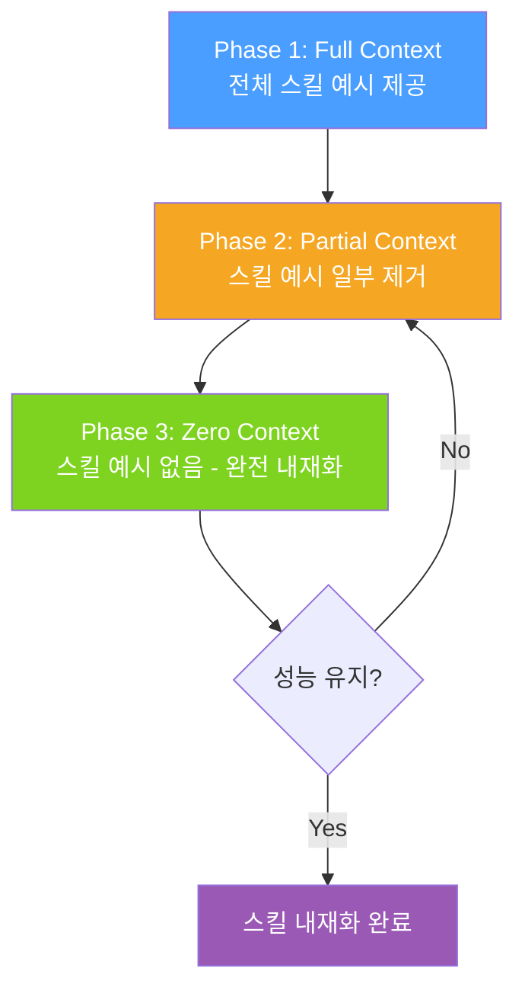

# SKILL0: In-Context Agentic Reinforcement Learning for Skill Internalization

## 핵심 기여

에이전트가 작업을 수행할 때마다 외부 스킬 저장소에서 예시를 검색(retrieval)하는 기존 방식의 한계를 해결한다. SKILL0는 **스킬을 모델 파라미터 자체에 내재화(internalize)**하는 방법론으로, 런타임 검색 없이 에이전트가 직접 스킬을 활용할 수 있게 한다.

핵심 성과:
- ALFWorld 벤치마크: +9.7% 성능 향상
- Search-QA 벤치마크: +6.6% 성능 향상
- 추론 시 외부 스킬 저장소 의존도 0% (zero retrieval at inference)

## 문제 정의

기존 in-context skill learning의 한계:

| 방식 | 문제점 |
|------|--------|
| 런타임 검색 | 매 추론마다 외부 저장소 접근 필요, 레이턴시 증가 |
| 프롬프트 기반 스킬 주입 | 컨텍스트 길이 소비, 분포 이동 취약 |
| 고정 파인튜닝 | 새 스킬 습득 시 재학습 필요 |

SKILL0의 목표: in-context 스킬 의존도를 점진적으로 제거하면서 RL로 스킬을 파라미터에 각인.

## 방법론: Progressive Curriculum

3단계 커리큘럼으로 스킬 의존도를 단계적으로 감소시킨다.



각 단계에서 RL(강화학습) 신호로 정책을 업데이트하며, 컨텍스트 단서가 줄어들어도 동일한 성능을 내도록 유도한다.

### 최적화 목표

$$\mathcal{L}_{SKILL0} = \mathbb{E}_{\tau \sim \pi_\theta} \left[ R(\tau) \cdot \log \pi_\theta(a | s, \mathbf{0}) \right]$$

- $\mathbf{0}$: 스킬 컨텍스트가 제거된 상태
- $R(\tau)$: 태스크 완료 보상
- 목표: 컨텍스트 없이도 높은 $R(\tau)$를 달성하는 $\pi_\theta$ 학습

## 실험 설정

- **환경**: ALFWorld (상호작용 텍스트 게임), Search-QA (다단계 검색 질의응답)
- **베이스라인**: ReAct, Reflexion, 기존 in-context skill 방법
- **평가 기준**: zero-shot 추론 성능 (스킬 예시 없는 조건)

## 결과 분석

```
ALFWorld:
  기존 SOTA        → SKILL0
  +9.7% 절대 향상
  6개 태스크 유형 전체에서 일관된 개선

Search-QA:
  기존 in-context → SKILL0
  +6.6% 절대 향상
  다단계 추론 태스크에서 특히 두드러짐
```

커리큘럼의 Phase 간 전환 시점이 최종 성능에 가장 큰 영향을 미치며, 너무 이른 컨텍스트 제거는 성능 저하를 유발한다.

## 의의 및 한계

**의의**
- 스킬 라이브러리 없이도 도구 활용 능력을 파라미터에 인코딩 가능
- 추론 시 레이턴시 감소 (검색 단계 제거)
- 새로운 스킬 습득 패러다임 제시

**한계**
- 커리큘럼 전환 하이퍼파라미터에 민감
- 매우 복잡한 다단계 스킬에서는 완전 내재화가 어려울 수 있음
- 도메인 외 스킬 일반화 여부 추가 검증 필요

## 실무 적용 관점

에이전트 프로덕션 배포 시 외부 도구 호출 횟수를 줄이고 싶을 때 참고할 수 있다. 특히 반복적이고 정형화된 스킬(파일 조작, API 호출 패턴)을 자주 수행하는 에이전트에 적합하다. 단, 스킬이 자주 변경되는 환경에서는 재학습 비용을 고려해야 한다.

## 관련 문서

- [[long-horizon-rl-training-for-agents]]
- [[agent-memory-systems]]
- [[agentic-rl-survey-paper]]
- [[agentgym-rl-paper]]
