# SkillClaw: 다중 사용자 에이전트 생태계에서의 집단적 스킬 진화

## 핵심 기여

다중 사용자(multi-user) 에이전트 생태계에서 스킬을 **집단적으로 진화**시키는 프레임워크를 제안한다. 기존 에이전트 스킬 학습이 개별 사용자 세션 내에서 완결되던 것과 달리, SkillClaw는 여러 사용자의 상호작용 궤적(trajectory)을 횡단적으로 수집하고 분석하여 시스템 전체의 스킬 품질을 끌어올린다.

핵심 성과:
- WildClawBench에서 Qwen3-Max 기준 **+42.1%** 평균 성능 개선
- 한 사용자 맥락에서 발견된 스킬 개선이 전체 사용자에게 자동 전파
- 사용자의 추가 노력 없이 스킬 자동 갱신

## 문제 정의

기존 에이전트 스킬 관리 방식의 한계:

| 방식 | 문제점 |
|------|--------|
| 개별 세션 학습 | 한 사용자의 개선이 다른 사용자에게 전달되지 않음 |
| 고정 스킬 라이브러리 | 사용 패턴의 변화를 반영하지 못함 |
| 수동 스킬 업데이트 | 관리 비용이 높고 확장성이 떨어짐 |

SkillClaw의 목표: 사용자 간(cross-user) + 시간 경과(over-time) 상호작용 신호를 통해 스킬을 자율적으로 진화시키는 것.

## 방법론

SkillClaw는 자율적 진화기(Agentic Evolver)를 중심으로 세 단계의 파이프라인을 운영한다.

```mermaid
flowchart TD
    U1[사용자 A] --> T[궤적 수집<br/>Trajectory Aggregation]
    U2[사용자 B] --> T
    U3[사용자 C] --> T
    T --> E[Agentic Evolver<br/>반복 패턴 식별]
    E --> R{스킬 업데이트 결정}
    R -- 기존 스킬 개선 --> SR[공유 스킬 저장소<br/>Shared Repository]
    R -- 새 스킬 생성 --> SR
    SR --> S[전체 사용자에게<br/>동기화]
    S --> U1
    S --> U2
    S --> U3
```

위 다이어그램은 다중 사용자 궤적이 Agentic Evolver를 통해 스킬 저장소로 환류(feedback)되는 전체 흐름을 보여준다.

### Agentic Evolver의 동작 방식

1. **궤적 수집(Trajectory Aggregation)**: 모든 사용자의 에이전트 실행 궤적을 지속적으로 수집
2. **패턴 식별(Pattern Recognition)**: 수집된 궤적에서 반복적으로 나타나는 행동 패턴을 자율적으로 분석
3. **스킬 갱신(Skill Update)**: 식별된 패턴을 기존 스킬 개선 또는 새로운 스킬 생성으로 변환
4. **시스템 전파(System-wide Sync)**: 갱신된 스킬을 공유 저장소에 반영하고 전체 사용자에게 동기화

## 실험 결과

- **벤치마크**: WildClawBench (다중 사용자 에이전트 작업 평가)
- **기준 모델**: Qwen3-Max
- **성능 향상**: +42.1% 평균 성능 개선

스킬 진화가 누적될수록 성능 향상 폭이 가속되며, 초기 수집 단계에서는 느리지만 임계점을 넘으면 급격한 개선 곡선을 보인다.

## 한계 및 향후 연구

- 다중 사용자 환경에서 스킬 충돌(conflict) 해결 전략의 상세 분석 부족
- WildClawBench 외 다른 벤치마크에서의 일반화 검증 필요
- 스킬 저장소 크기가 커질 때의 검색/관리 오버헤드 미분석
- 사용자 프라이버시 관점에서 궤적 공유의 리스크 논의 부족

## 실무 관점

- **프로덕션 에이전트 운영**: 여러 사용자가 공유하는 에이전트 플랫폼에서 자동으로 스킬 품질을 개선하는 데 적용 가능
- **[[agent-skills]] 설계 참고**: 스킬을 정적 정의가 아닌 동적 진화 대상으로 보는 패러다임 전환
- **[[agent-memory-systems]]와의 접점**: 궤적 수집-분석 파이프라인은 에이전트 메모리 시스템의 확장으로 볼 수 있음

## 관련 문서

- [[skill0-paper]] - 스킬 내재화(internalization) 접근과 대비되는 외부 스킬 진화 방식
- [[agent-skills]] - 에이전트 스킬 일반 개념
- [[agent-memory-systems]] - 에이전트 메모리 시스템
- [[externalization-llm-agents-paper]] - 외부화 관점에서의 스킬 진화
- [[swe-evo-paper]] - 소프트웨어 엔지니어링 에이전트의 진화적 접근
