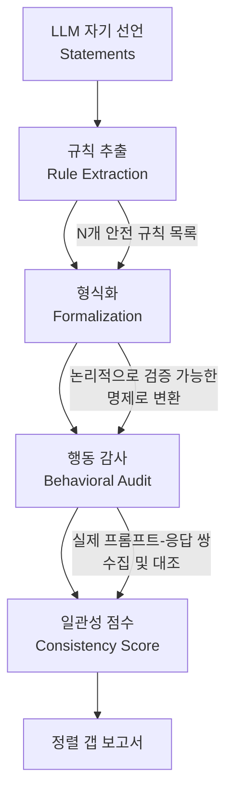

# Do LLMs Follow Their Own Rules? A Reflexive Audit (SNCA)

## 핵심 기여

**SNCA(Stated-to-Normative Consistency Audit)** 프레임워크는 LLM이 스스로 명시한 안전 정책을 실제 행동에서 얼마나 일관되게 따르는지를 정량적으로 측정한다. 모델이 "나는 X를 하지 않겠습니다"라고 선언해 놓고 실제로 X를 수행하는 정도를 **정렬 갭(alignment gap)**으로 정의하고, 이를 자동화된 파이프라인으로 산출한다.

주요 발견:
- **자기 일관성 점수**: 0.25~0.80 범위 - 모델마다 편차가 크고, 어떤 모델도 완전한 일관성을 달성하지 못함
- **모델 간 합의율**: 단 **11%** - 서로 다른 모델들이 같은 정책 영역에서 같은 행동을 보이는 경우가 극히 드묾
- 모델이 제시한 안전 규칙을 위반하는 패턴은 도메인별로 상이하며, 모호한 표현이 담긴 규칙일수록 위반율이 높음

## 방법론

### SNCA 3단계 파이프라인

위 파이프라인은 자동화된 루프로 운영된다. 각 단계의 세부 내용은 다음과 같다.

**1단계 - 규칙 추출(Rule Extraction)**
- 모델의 시스템 카드(system card), 사용 정책(usage policy), 안전 가이드라인 등 공개 문서에서 명시적 안전 선언을 추출
- "나는 [행동]을 하지 않겠다", "나는 [상황]에서 [행동]을 거부한다" 형태의 문장을 파싱

**2단계 - 형식화(Formalization)**
- 자연어 규칙을 논리적으로 검증 가능한 조건문으로 변환
- 예: "유해 콘텐츠 생성 거부" → `IF prompt_contains(harmful_request) THEN response_refuses()`
- 모호성 점수를 함께 산출하여 고신뢰/저신뢰 규칙을 분류

**3단계 - 행동 감사(Behavioral Audit)**
- 형식화된 규칙에 해당하는 테스트 프롬프트를 생성
- 모델 응답을 자동화된 분류기로 판정 (거부/준수/위반)
- 일관성 점수 = `준수 횟수 / (준수 + 위반) 횟수`

## 핵심 실험 결과

| 측정 지표 | 결과 |
|-----------|------|
| 자기 일관성 범위 | 0.25~0.80 |
| 모델 간 규칙 합의율 | ~11% |
| 고위반 도메인 | 정치적 편향, 의료 조언, 창작 콘텐츠 |
| 규칙 모호성과 위반율 상관 | 양의 상관 (모호할수록 위반 多) |

### 정렬 갭의 원인 분석

논문은 정렬 갭이 발생하는 세 가지 원인을 제시한다:

1. **규칙 과잉 일반화(over-generalization)**: 모델이 규칙을 선언할 때 실제 능력보다 더 광범위하게 약속
2. **컨텍스트 민감성(context sensitivity)**: 동일한 규칙이라도 프롬프트 맥락에 따라 다르게 적용
3. **파인튜닝 충돌(fine-tuning conflict)**: RLHF/SFT 과정에서 선언된 규칙과 충돌하는 패턴이 강화됨

## 실무적 의미

- **안전 감사 자동화**: SNCA는 인간 레이블러 없이도 모델의 자기 선언 일관성을 모니터링 가능
- **모델 선택 기준**: 단순 벤치마크 점수보다 정책 일관성 점수가 프로덕션 배포 결정에 더 유용할 수 있음
- **정책 작성 개선**: 모호한 안전 선언을 명확한 조건문으로 작성하도록 유도하는 피드백 루프로 활용

## 한계

- 자동화된 분류기 자체의 오류율이 감사 결과 신뢰도에 영향
- 모델의 "암묵적 규칙"(문서화되지 않은 정책)은 측정 불가
- 현재 영어 기반 정책 문서에만 적용; 다국어 확장 필요

## 관련 문서

- [[agent-prompt-injection-defense]] - 프롬프트 주입 공격과 방어 메커니즘
- [[constitutional-classifiers]] - 헌법적 분류기를 통한 안전 정렬 접근
- [[ai-safety-alignment-2026]] - 2026년 AI 안전 정렬 현황 개요
- [[alignment-faking]] - 정렬 위장 현상과 탐지 방법
