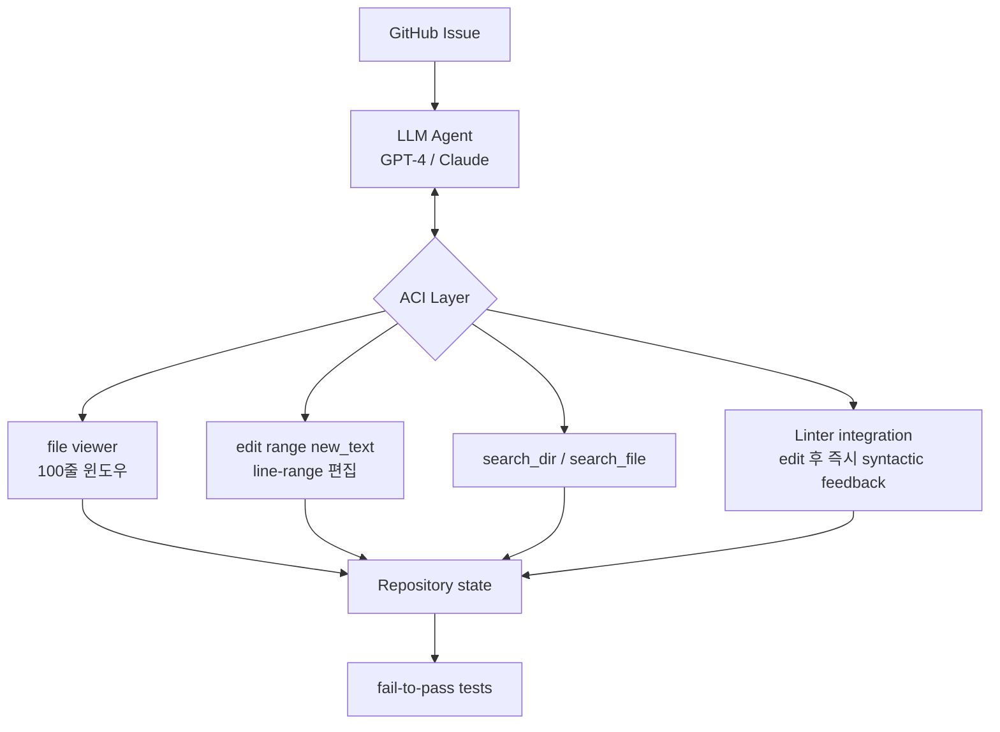

# SWE-agent: Agent-Computer Interfaces Enable Automated Software Engineering (Yang et al., 2024)

## TL;DR

SWE-agent는 **Agent-Computer Interface(ACI)** 개념을 정립한 논문이다. 핵심 주장은 **LM 에이전트가 새로운 형태의 end user**이며, 인간 친화적 UI(bash shell 그대로)가 아닌 **LM 친화적 인터페이스**가 따로 필요하다는 것. 파일 viewer (100줄 윈도우), `edit <range> <new_text>` 같은 specialized commands, 정제된 structured feedback, linter 통합 등 ACI 디자인으로 SWE-bench에서 비대화형 SOTA 1.96% 대비 **12.5% pass@1** (6배 이상), HumanEvalFix **87.7%**를 달성했다. "tool engineering이 model size 증가만큼 중요하다"는 관점을 입증한 대표 사례.

## 핵심 기여

1. **Agent-Computer Interface(ACI) 개념 정립** — LM 에이전트가 새로운 end user임을 주장하며 LM 친화적 인터페이스 디자인 원칙 제시
2. **SWE-bench 12.5% pass@1** — 비대화형 LM 이전 SOTA(Claude 2 1.96%)를 6배 이상 상회
3. **HumanEvalFix 87.7% pass@1** — 코드 수정 벤치마크에서도 SOTA
4. **ACI 디자인 ablation 분석** — 명령어 설계, 피드백 포맷이 성능에 직접 영향
5. **오픈소스 공개** — `swe-agent.com` 코드/데이터/데모

## 방법론

- **Custom ACI**:
  - 파일 viewer (윈도우 기반, 100줄 단위)
  - file_editor (line-range 편집)
  - search_dir / search_file
  - LM이 한번에 처리하기 쉬운 출력 형식의 도구를 직접 설계
- **Specialized commands**: shell 명령어 그대로 노출 대신 에이전트의 추론 패턴에 맞춘 고수준 명령
- **Feedback formatting**: 에러 메시지·환경 응답을 LM 해석 친화적 구조로 가공
- **Linter integration**: 편집 후 즉시 syntactic feedback → 에이전트 self-correction

## 실험/결과

- **SWE-bench**: **12.5% pass@1** (이전 비대화형 SOTA Claude 2의 1.96% 대비 6배+)
- **HumanEvalFix**: **87.7% pass@1** (GPT-4 기반 SWE-agent)
- **Ablation**: ACI 디자인 요소(파일 viewer 윈도우 크기, edit 명령 형태, linter 피드백)를 제거하면 성능이 유의미하게 저하

## 하네스 엔지니어링 관점

- **에이전트 전용 인터페이스의 중요성** — bash/shell을 그대로 LM에게 노출하지 말고 LM이 효과적으로 다룰 수 있는 추상층(ACI)을 둬야 함 ([[agent-as-tool-pattern]])
- **출력 길이 제한**: 파일 viewer 100줄 윈도우로 컨텍스트 효율 극대화 ([[agent-context-management]])
- **structured feedback**: 에러 trace를 그대로 dump하지 말고 LM이 actionable하게 사용할 수 있도록 정제
- **간결한 명령어 세트**: `edit`, `goto`, `search_dir` 등 6-7개 핵심 명령으로 한정 — 너무 많은 도구는 오히려 성능 저하 ([[function-calling-tool-use]])
- **본 논문의 슬로건** — "tool engineering이 model size 증가만큼 중요할 수 있다"

## 한계 / 후속 연구

- **단일 에이전트 단일 세션 가정** — 멀티 에이전트 협력은 다루지 않음
- 12.5%는 SOTA였으나 절대 성능은 낮음 → 후속 연구(Agentless, AutoCodeRover, [[openhands-paper]])에서 확장
- ACI 디자인은 Python 중심 → 다른 언어/생태계 일반화는 future work
- 후속: SWE-agent Multimodal, EnIGMA (cybersecurity SWE-agent)

## 관련 자료

- 공식: swe-agent.com
- GitHub: princeton-nlp/SWE-agent
- [[swe-bench-paper]] — 평가 대상 벤치마크
- [[openhands-paper]] — EventStream 기반 후속 플랫폼
- [[react-paper]] — agent loop 기반 패턴
- [[anthropic-harness-design]] — 비교: Claude의 harness 디자인 원칙
- [[swe-bench-ecosystem-2026]]
- [[function-calling-tool-use]]
