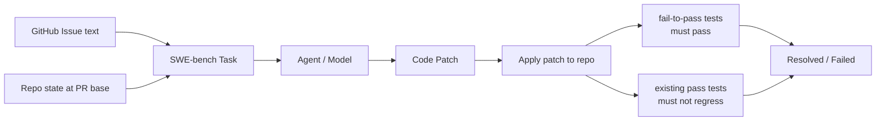

# SWE-bench: Can Language Models Resolve Real-World GitHub Issues? (Jimenez et al., 2023)

## TL;DR

SWE-bench는 **실제 GitHub 이슈 + 패치 + 테스트 트리플** 2,294개를 12개 인기 Python 레포지토리에서 수집한 벤치마크로, (issue text, repo state) → (code patch) 형식의 task를 정의한다. PR이 수정한 fail-to-pass 테스트 + 기존 pass 테스트 회귀 검증으로 자동 평가하며, 발표 시점 SOTA Claude 2의 1.96%로 시작해 2024-2025년 SWE-agent 12.5% → OpenHands 50%+ → 70%+로 발전을 견인했다. 현대 코딩 에이전트 harness의 표준 벤치마크.

## 핵심 기여

1. **2,294개 실제 GitHub 이슈 기반 벤치마크** — 12개 인기 Python 레포지토리
2. **다중 파일/클래스/함수 변경 요구** — 단순 코드 생성을 넘는 software engineering reasoning
3. **PR-based 자동 평가** — 원본 PR의 패치 + 테스트로 자동 검증
4. **SWE-Llama 13B/7B 공개** — 코드 수정 특화 fine-tuning 모델
5. **벤치마크 동기 부여** — Claude 2 1.96% → 2024-2025 50%+ 까지 발전 추동

## 방법론

- **Task formulation**: (issue text, repo state at PR base) → (code patch)
- **Evaluation**: 패치 적용 후 (1) PR이 수정한 fail-to-pass 테스트, (2) 기존 pass 테스트 회귀 없음
- **Repositories**: django, flask, sympy, sphinx, scikit-learn, matplotlib, pytest, requests, pylint, astropy, xarray, seaborn
- **Variants**:
  - SWE-bench (full): 2,294 task
  - **SWE-bench Lite**: 300 task (단순 단일 파일 위주)
  - **SWE-bench Verified**: 500 task (사람이 검수한 안정 평가셋, OpenAI 발표)

## 실험/결과

- **초기 Baseline (2023)**:
  - Claude 2: **1.96%**
  - GPT-4: 1.74%
  - SWE-Llama 13B: 0.70%
- **이후 발전**:
  - [[swe-agent-paper]] (2024.05): **12.5%**
  - [[openhands-paper]] + Claude 3.5: **50%+** (Lite)
  - 2025년: **70%+** 보고

## 하네스 엔지니어링 관점

- **현대 코딩 에이전트 harness의 표준 벤치마크** — 평가 인프라가 reproducibility의 기반 ([[swe-bench-ecosystem-2026]])
- **Long-context + multi-file editing** 요구로 ACI 디자인의 중요성을 부각 → [[swe-agent-paper]]의 ACI 개념으로 직결
- **Test-driven evaluation** — fail-to-pass 테스트가 PR 정답을 정의 → harness가 테스트 실행 환경을 안전하게 제공해야 함
- **Docker 기반 평가 환경** — 각 task는 특정 Python 버전/의존성 요구. SWE-bench harness는 Docker로 reproducible 환경 제공
- **Verified subset의 가치** — 노이즈 task(애매한 이슈, flaky test)를 걸러내 Verified가 신뢰도 높은 평가 표준 ([[benchmark-contamination]] 회피)
- agent harness 개발 시 SWE-bench Verified를 primary metric으로 사용, contamination 회피 위해 dev split을 별도 관리하는 패턴 권장

## 한계 / 후속 연구

- **Python 한정** — 다른 언어/생태계 일반화 제한
- **Test 의존성** — 일부 task는 fail-to-pass 테스트가 약하거나 ambiguous
- **Contamination 위험** — 학습 데이터에 GitHub 패치 포함 모델은 부정확 평가
- 후속: SWE-bench Multimodal, SWE-bench Multilingual, SWE-Lancer (freelance task), [[swe-agent-paper]]

## 관련 자료

- 공식: swebench.com
- GitHub: princeton-nlp/SWE-bench
- [[swe-agent-paper]] — 동일 그룹 agent harness
- [[openhands-paper]] — SWE-bench를 1차 평가 대상으로 사용하는 플랫폼
- [[swe-bench-ecosystem-2026]] — 2026년 시점 생태계 분석
- [[agent-evaluation-framework]]
- [[long-horizon-agent-benchmarks]]
- [[benchmark-contamination]]
