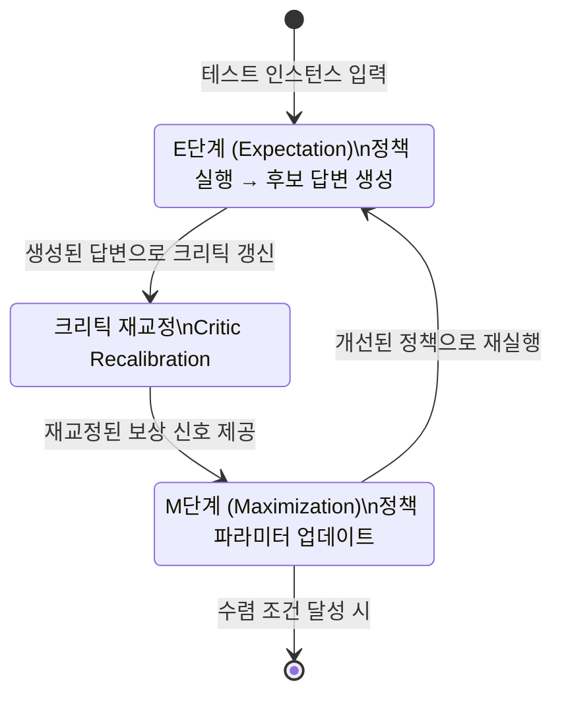

# TEMPO: EM 프레임워크로 대형 추론 모델의 테스트 시간 훈련 스케일링

## 논문 메타데이터

| 항목 | 내용 |
|------|------|
| arXiv ID | 2604.19295 |
| 저자 | Qingyang Zhang, Xinke Kong, Haitao Wu, Qinghua Hu, Minghao Wu, Baosong Yang, Yu Cheng, Yun Luo, Ganqu Cui, Changqing Zhang |
| 연도 | 2026 |
| 분야 | 추론 최적화 / 테스트 시간 계산 |

## 핵심 기여

[[test-time-compute-scaling|테스트 시간 훈련(Test-Time Training, TTT)]]의 성능 정체(performance plateau) 문제를 해결하기 위해, **기댓값 최대화(Expectation-Maximization, EM)** 프레임워크를 기반으로 하는 TEMPO를 제안한다. 레이블 없는 테스트 인스턴스에서 **정책 개선(Policy Refinement)** 과 **크리틱 재교정(Critic Recalibration)** 을 교차 수행해 AIME 2024 등 추론 벤치마크에서 기존 TTT 방법 대비 유의미한 성능 향상을 달성한다.

## 배경: TTT의 정체 문제

기존 TTT 방법들은 테스트 인스턴스에 대해 모델을 업데이트하며 적응하지만, 일정 스텝 이후 성능 향상이 멈추는 **정체(plateau)** 현상이 나타난다. 주요 원인:

1. 자기 생성 신호(self-generated signal)의 품질 저하
2. 보상/크리틱 신호가 고착되어 정책 개선 방향을 잃음
3. 출력 다양성 소실 — 동일한 답만 반복 생성

## 방법

### E단계 (Expectation)
- 현재 정책(policy)으로 테스트 인스턴스에 대한 여러 후보 답변 샘플링
- 크리틱(critic)으로 각 후보 평가 → 고품질 답변 선택

### M단계 (Maximization)
- 선택된 고품질 답변으로 정책 파라미터 업데이트
- 기울기 기반 또는 선호 최적화(preference optimization) 적용

### 크리틱 재교정 (Critic Recalibration)
- EM 반복마다 크리틱을 최신 정책 출력으로 주기적 재훈련
- 크리틱이 낡은 기준으로 평가하는 문제 방지
- 출력 다양성 보존을 위한 정규화 적용

## 실험 결과

| 벤치마크 | 결과 |
|----------|------|
| AIME 2024 | 기존 TTT 방법 대비 유의미한 향상 |
| 수학 추론 | 다양성 보존하면서 정확도 향상 |

- 레이블 없는 테스트 환경에서 순수 자기 개선
- 정체 없이 더 많은 TTT 스텝에서도 지속 향상

## 한계

- EM 반복마다 다수의 샘플링과 크리틱 평가가 필요 → 컴퓨트 오버헤드 존재
- 크리틱 재교정 빈도 하이퍼파라미터 튜닝 필요
- 매우 긴 추론 체인에서의 다양성-품질 트레이드오프 검증 필요

## 실무 적용 관점

수학 올림피아드나 코딩 대회처럼 **정답이 검증 가능한 고난이도 추론 태스크**에서, 테스트 시간에 모델을 지속적으로 개선하는 TEMPO 방식을 적용하면 고정 모델 대비 유의미한 성능 향상을 얻을 수 있다. [[overthinking-test-time-compute]]에서 지적하는 과사고(overthinking) 문제를 주의하면서, 적절한 스텝 수를 설정하는 것이 중요하다.

## 관련 문서

- [[test-time-compute-scaling]] - 테스트 시간 계산 스케일링 개념
- [[overthinking-test-time-compute]] - 과사고: 추론 길이 증가가 오히려 성능 저하 (2604.10739)
- [[reasoning-llm]] - 추론 LLM 일반 개념
