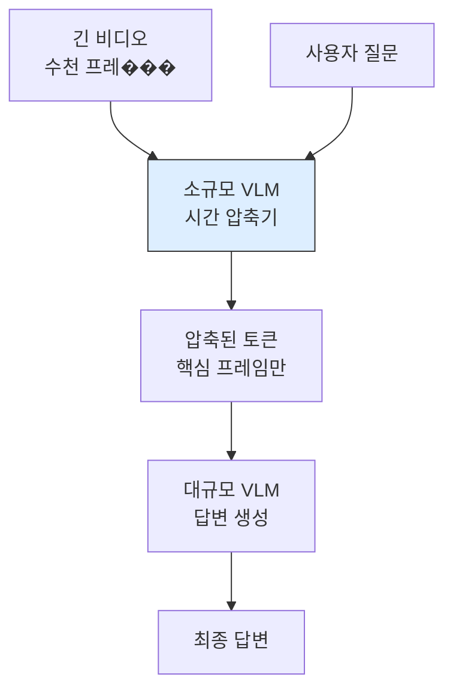

# Tempo: 소규모 VLM을 비디오 시간 압축기로 활용

## 핵심 기여

긴 비디오 이해에서 소규모 Vision-Language Model(VLM)을 **쿼리 인식 로컬 시간 압축기(query-aware local temporal compressor)**로 활용하는 Tempo 프레임워크를 제안한다. 대규모 VLM을 전체 비디오에 직접 적용하는 대신, 소규모 VLM이 질문에 맞춰 비디오 토큰을 효율적으로 압축한다.

핵심 성과:
- 소규모 VLM의 새로운 역할: 생성 모델이 아닌 **압축/필터링 에이전트**
- 쿼리 인식 압축으로 관련 없는 프레임의 토큰을 제거
- 긴 비디오에서 대규모 VLM의 토큰 예산을 대폭 절감

## 문제 정의

긴 비디오 이해의 계산 병목:

| 문제 | 원인 |
|------|------|
| 토큰 폭발 | 프레임당 수백 토큰 x 수천 프레임 |
| 관련 없는 프레임 | 대부분의 프레임이 질문과 무관 |
| 컨텍스트 윈도우 초과 | 대규모 VLM도 전체 비디오를 수용 불가 |
| 균일 샘플링의 ��계 | 핵심 장면을 놓칠 위험 |

## 방법론: 2단계 압축 파이프라인

Tempo는 소규모 VLM이 질문을 인식하여 핵심 프레임만 골라 토큰을 압축하고, 대규모 VLM은 압축된 토큰만으로 답변을 생성하는 2단계 파이프라인이다.

### 1단계: 소규모 VLM의 쿼리 인식 압축

- 질문과 각 프레임 구간의 관련성을 소��모 VLM이 평가
- 관련성이 높은 시간 구간의 토큰을 우선 보존
- 관련성이 낮은 구간은 극도로 압축하거나 제거
- **쿼리 인식(query-aware)**: 동일 비디오라도 질문에 따라 다른 압축 결과

### 2단계: 대규모 VLM의 답변 생성

- 압축된 토큰만 입력으로 수신
- 컨텍스트 윈도우 내에서 효율적으로 처리
- 전체 비디오를 넣는 것 대비 대폭 절감된 비용

## 설계 철학: 소규모 모델의 역할 재정의

기존에 소규모 VLM은 "성능이 낮은 대안"으로만 인식되었다. Tempo는 소규모 모델에 **압축/필터링이라는 전혀 다른 역할**을 부여한다:

| ���할 | 기존 관점 | Tempo 관점 |
|------|-----------|-----------|
| 소규모 VLM | 저비용 대안 | 전문 압축기 |
| 대규모 VLM | 만능 처리기 | 압축된 입력의 추론기 |

## 실무 적용 관점

- **비디오 QA**: 시간 단위 비디오에서 효율적으로 질문에 답변
- **비디오 검색**: 쿼리에 맞는 핵심 장면을 소규모 모델이 사전 필터링
- **Edge + Cloud 하이브리드**: 소규모 VLM은 Edge에서, 대규모 VLM은 Cloud에서 실행

## 관련 문서

- [[VLM 서베이]] -- Vision-Language Model 전반
- [[멀티모달 벤치마크]] -- 멀티모달 모델 평가 체계
- [[KV 캐시 추론 최적화]] -- 토큰 수 절감 관련 기법
