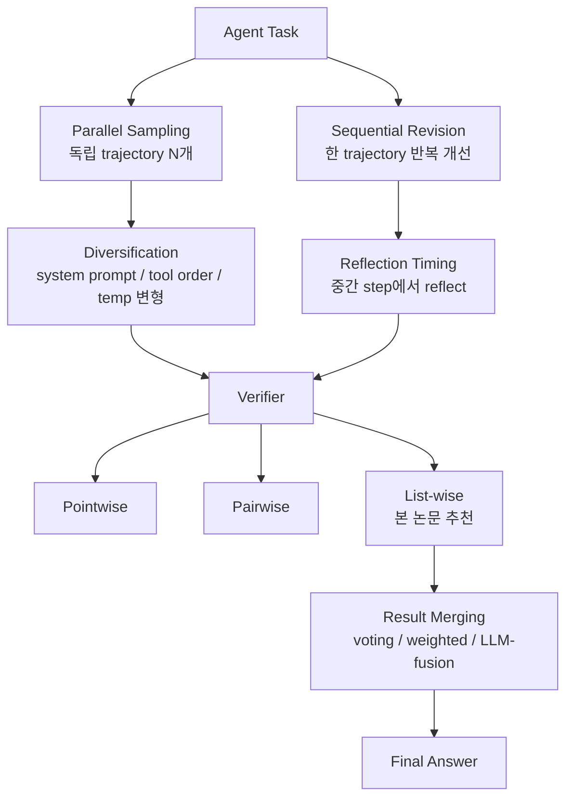

# Scaling Test-time Compute for LLM Agents (Zhu et al., 2025)

## TL;DR

**에이전트 도메인에서 test-time compute scaling의 첫 systematic 연구**. (1) parallel sampling, (2) sequential revision, (3) verifier + merging, (4) diversification rollout의 4축으로 분석한 결과 핵심 결론은 다음과 같다. (1) Test-time scaling이 에이전트 성능을 향상시킨다. (2) **언제 reflect할지가 중요**하다 — 너무 일찍/늦으면 효과 저하. (3) **List-wise verification > pairwise/pointwise**. (4) **Diversified rollouts**(다양한 system prompt, tool order, temperature)가 일관된 향상. [[test-time-scaling-paper]]의 reasoning 위주 결과를 agent 도메인에 매핑한 청사진.

## 핵심 기여

1. **에이전트 도메인 test-time compute scaling의 첫 systematic 연구**
2. **4축 분석** — parallel sampling / sequential revision / verifier+merging / diversified rollout
3. **List-wise verification 우월성** — pairwise/pointwise 대비 효과적
4. **Reflection timing의 중요성** — 언제 reflect할지가 결과에 결정적
5. **Diversification이 일관되게 도움** — 다양성 확보가 에이전트 성공률 향상

## 방법론

- **Parallel sampling**: 여러 trajectory를 독립 생성, 결과를 aggregate
- **Sequential revision**: 한 trajectory를 받아 revision/reflection
- **Verifier types**:
  - Pointwise: 각 trajectory를 개별 점수
  - Pairwise: 두 trajectory를 비교
  - **List-wise**: 여러 trajectory를 한번에 ranking ← 본 논문 추천
- **Merging methods**: 다중 trajectory에서 최종 답 추출 — voting, weighted, LLM-fusion
- **Diversification**: temperature, system prompt, tool-use strategy 변형

## 실험/결과

- **Test-time scaling이 에이전트 성능 향상** — Snell et al. (수학 추론) 결과를 에이전트 도메인으로 확장 검증
- **List-wise verifier > pairwise/pointwise** — 다중 후보 비교가 더 정확한 선택
- **Reflection timing**: 너무 일찍 reflect하면 정보 부족, 너무 늦으면 회복 어려움. **중간 단계가 최적**
- **Diverse rollouts** — 동일 prompt 반복보다 다양한 prompt/temperature 조합이 효과적

## 하네스 엔지니어링 관점

- **에이전트 harness에 test-time scaling을 직접 적용 가능한 청사진** — Snell 논문의 reasoning 위주 결과를 agent에 매핑
- **List-wise verifier 채택 권장** — harness의 후처리 단계에 다중 후보 비교 LLM call 도입 ([[verifier-critic-models]])
- **Reflection scheduler** — 매 step reflect는 비효율, mid-trajectory checkpoint에서 reflect하는 패턴이 우수 ([[reflexion-paper]])
- **Rollout diversity 전략**:
  - 다른 system prompt
  - 다른 tool ordering
  - 다른 temperature
- **Compute budget 분배** — parallel rollout N개와 revision depth D를 task 난이도에 따라 조정 ([[agent-cost-optimization]])
- **Production harness 패턴**: 짧은 task는 single rollout, 긴 task는 N=4-8 parallel + list-wise verifier

## 한계 / 후속 연구

- 평가 task 범위 제한 — 코드/QA 위주
- Verifier 자체의 학습 비용은 별도 — 본 논문은 LLM-as-judge 사용
- Compute cost 정량화는 부분적
- 후속:
  - "The Art of Scaling Test-Time Compute" (arXiv:2512.02008)
  - "Inference-Time Scaling for Complex Tasks" (arXiv:2504.00294)

## 관련 자료

- [[test-time-scaling-paper]] — Snell et al. 선행 연구 (reasoning 도메인)
- [[inference-scaling-laws-paper]] — algorithm space 분석
- [[reflexion-paper]] — verbal RL reflection
- [[verifier-critic-models]]
- [[overthinking-test-time-compute]]
- [[inference-time-scaling]]
- [[agent-cost-optimization]]
