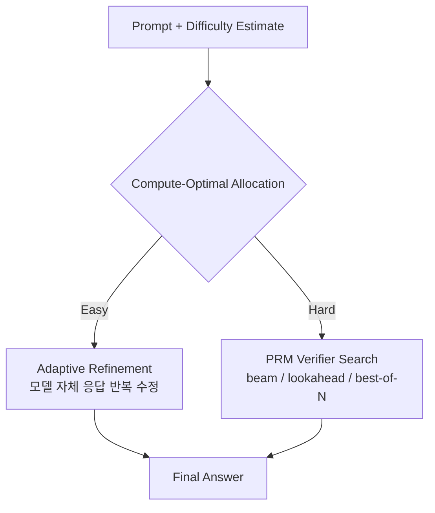

# Scaling LLM Test-Time Compute Optimally (Snell et al., 2024)

## TL;DR

Google DeepMind / UC Berkeley의 Snell 등이 **test-time compute scaling의 systematic 분석**을 처음으로 정립한 논문. 두 가지 메커니즘 (1) **PRM(Process Reward Model) 기반 verifier search** (2) **adaptive distribution refinement** 을 비교하고, 둘 다 **prompt difficulty에 따라 최적 전략이 다름**을 실증했다. **Compute-optimal allocation**(쉬운 문제는 적은 sample, 어려운 문제는 깊은 search)으로 best-of-N 대비 4x+ 효율을 달성했고, FLOPs-matched 비교에서 **14B + test-time compute > 200B single-shot**(특정 난이도 대역)로 pre-training과 inference compute의 trade-off를 정립했다.

## 핵심 기여

1. **Test-time compute scaling의 systematic 분석** — 처음으로 test-time compute scaling law를 정량화
2. **두 가지 메커니즘 비교** — PRM 기반 search vs adaptive distribution update (refinement)
3. **Difficulty-adaptive allocation** — 난이도에 따라 best 전략이 다름을 실증
4. **Compute-optimal strategy** — Best-of-N 대비 4x+ 효율
5. **14x 더 큰 모델을 작은 모델 + test-time compute로 능가** — pre-training과 inference compute trade-off 정립

## 방법론

- **두 축**:
  - **Verifier search**: PRM(Process Reward Model) 또는 ORM(Outcome RM)으로 후보 응답 평가, beam/lookahead/best-of-N
  - **Refinement / Adaptive**: 모델이 자체 응답을 반복적으로 수정 (revision)
- **MATH benchmark**에서 다양한 difficulty level별 측정
- **Compute-optimal allocation**: 쉬운 문제는 적은 sample, 어려운 문제는 더 깊은 search
- **FLOPs-matched 비교**: 같은 총 연산량에서 (작은 모델 + test-time scaling) vs (큰 모델 single inference)

## 실험/결과

- **MATH**:
  - PaLM 2-S* + best-of-N=64: baseline
  - + compute-optimal allocation: **4x 효율**
- **Difficulty bins**: 쉬운 문제 → revision 우세, 어려운 문제 → PRM search 우세
- **FLOPs-matched**: 14B 모델 + test-time compute > 200B 모델 single shot (특정 난이도 대역)
- **한계**: 매우 어려운 문제에서는 어떤 test-time scaling도 한계

## 하네스 엔지니어링 관점

- **에이전트 harness에서 inference budget 조절** — 단순 best-of-N이 아닌 difficulty-aware 분배
- **Verifier 도입** — PRM/ORM을 harness에 통합하면 sampling 효율 극대화. agent 도메인에서는 environment success가 verifier 역할 ([[verifier-critic-models]])
- **Refinement vs Search trade-off** — 도메인에 따라 적절한 메커니즘 선택. 코드 수정은 환경 피드백(refinement) 유리, 수학 reasoning은 PRM search 유리
- **Compute budget를 task spec에 포함** — agent harness가 task difficulty estimator를 가지고 budget을 동적 분배 ([[agent-cost-optimization]])
- **Scaling law 시사점**: 작은 모델 + 정교한 harness가 큰 모델 + 단순 호출을 이길 수 있음 → harness engineering의 ROI

## 한계 / 후속 연구

- **PRM 학습 비용** — process reward model 자체가 별도 학습 필요
- **General domain 일반화** — MATH 위주, code/agent 도메인 검증 필요
- 후속:
  - [[test-time-compute-agents-paper]] (arXiv:2506.12928) — agent 특화
  - [[inference-scaling-laws-paper]] (arXiv:2408.00724)
  - "The Art of Scaling Test-Time Compute" (arXiv:2512.02008)

## 관련 자료

- [[inference-scaling-laws-paper]] — 동시기 CMU 연구 (algorithm space 중심)
- [[test-time-compute-agents-paper]] — agent 도메인 후속
- [[verifier-critic-models]]
- [[overthinking-test-time-compute]]
- [[inference-time-scaling]]
- o1 system card, DeepSeek-R1 ([[deepseek-r1-paper]])
