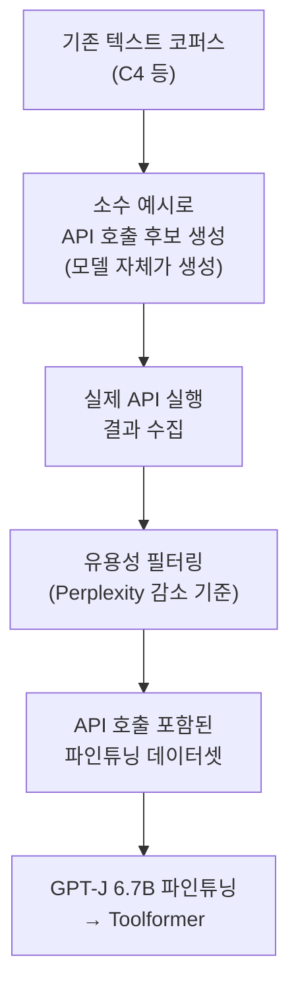

# Toolformer: Language Models Can Teach Themselves to Use Tools (Schick et al., 2023)

## 핵심 기여

Meta AI의 Timo Schick 등이 2023년 발표한 Toolformer는 **LLM이 자기지도(self-supervised) 방식으로 외부 도구(API) 호출 시점과 방법을 스스로 학습**하는 프레임워크를 제안했다. 소수의 인간 작성 예시만으로 방대한 API 호출 데이터를 자동 생성하고, 퍼플렉시티(perplexity) 감소 기준으로 유용한 호출만 필터링한다. 에이전트 도구 사용 패턴의 이론적 기반을 제공했다.

## 방법

### 자동 도구 호출 데이터 생성 파이프라인



### 지원 도구 5종

| 도구 | 설명 |
|------|------|
| 계산기(Calculator) | 수식 계산 |
| 위키피디아 검색(Wikipedia Search) | 사실 조회 |
| 기계 번역(MT) | 언어 번역 |
| 캘린더(Calendar) | 날짜 계산 |
| QA 시스템(Question Answering) | 질문 답변 |

### 도구 호출 형식 (Tokenization)

텍스트 내에 인라인으로 API 호출 삽입:

```
"파리는 [QA(프랑스의 수도는?) → 프랑스] 의 수도다."
"2025년 [Calendar(오늘 날짜?) → 4월 15일] 기준..."
```

모델이 일반 다음 토큰 예측(next-token prediction) 방식으로 호출 시점을 학습.

### 유용성 필터링

$L_i(z)$: 위치 $i$ 이후 텍스트의 평균 로그우도(log-likelihood)

API 결과 포함 시 vs. 미포함 시의 퍼플렉시티 차이가 임계값 이상일 때만 학습 데이터로 채택. 즉, **실제로 도움이 되는 API 호출만 학습**.

## 결과 및 영향

- GPT-J 6.7B 기반 Toolformer가 수학, QA, 시간 계산 등에서 175B GPT-3을 초과
- 특정 태스크 파인튜닝 없이(task-agnostic) 다양한 도구를 유연하게 사용
- **에이전트 도구 사용 연구의 기반**: 이후 ReAct, ToolLLM, AgentBench 등 에이전트 프레임워크에 영향
- 도구 호출 학습이 인간 어노테이션 없이 가능하다는 것을 실증

## 한계

- 한 번에 하나의 도구 호출만 가능 - 다단계 도구 체이닝(chaining) 불가
- 도구 호출 여부를 결정하는 임계값 설정에 민감
- 지원 도구 수가 제한적이며 새 도구 추가 시 재학습 필요
- 동적으로 도구를 선택하거나 도구를 생성하는 능력 없음
- API 결과가 잘못된 경우에도 무조건 신뢰 (검증 메커니즘 없음)

## 실무 적용 관점

- 현대 에이전트 프레임워크(LangChain, LlamaIndex 등)에서 도구 호출은 주로 함수 호출(function calling) API로 구현되나, 도구 유용성 판단 원리는 Toolformer에서 기원
- 도구 호출 데이터 자동 생성 방식은 커스텀 도구 학습 데이터 생성에 참고 가능
- 퍼플렉시티 필터링 아이디어는 RAG 컨텍스트 유용성 평가에도 응용 가능
- LLM이 도구를 언제 쓸지 판단하는 능력 자체가 에이전트 성능의 핵심 - 이 문제를 명시적으로 학습한 최초 사례

## 관련 문서

- [[tool-use-optimization]]
- [[agent-prompt-patterns]]
- [[ReAct: 추론과 행동 결합]]
- [[RAG 원논문 (Lewis et al.)]]
