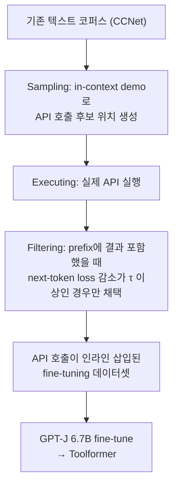

# Toolformer: Language Models Can Teach Themselves to Use Tools (Schick et al., 2023)

## TL;DR

Meta AI의 Toolformer는 **LLM이 자기지도(self-supervised) 방식으로 외부 도구(API) 호출 시점·인자·결과 활용을 스스로 학습**하는 프레임워크다. 사람 라벨 없이 소수 demonstration만으로 API 호출 후보를 LM이 직접 생성하고, **next-token prediction loss 감소(임계값 $\tau$ 이상)** 을 기준으로 유용한 호출만 필터링해 학습 데이터로 채택한다. 결과적으로 GPT-J 6.7B가 수학·QA·시간 계산에서 GPT-3 175B를 능가하며, 일반 언어 모델링 능력은 보존됐다.

## 핵심 기여

1. **자기지도 도구 학습 (self-supervised tool learning)** — 사람 라벨 없이 LM 스스로 API 호출 데이터 생성·필터
2. **5개 도구 통합** — Calculator, Q&A (Atlas), Search (Wikipedia), Translation (NLLB), Calendar
3. **Loss-based filtering** — API 결과를 prefix에 포함했을 때 next-token loss 감소 정도로 유용성 판정
4. **GPT-J 6.7B vs GPT-3 175B** — 도구 사용으로 작은 모델이 거대 모델 추월
5. **일반 LM 능력 유지** — 도구 학습 후에도 perplexity 보존, counterfactual benchmark 성능 유지
6. **에이전트 도구 사용 연구의 기반** — 이후 [[react-paper]], ToolLLM, Gorilla, AgentBench의 학습 기반 공통 reference

## 방법론

### 자동 도구 호출 데이터 생성 파이프라인



### 4-step 학습 파이프라인

- **Step 1: Sampling** — 각 API에 대해 in-context demonstration을 주고 본문에 API 호출 후보 위치를 LM이 직접 표시
- **Step 2: Executing** — API를 실제로 호출
- **Step 3: Filtering** — API 응답을 prefix에 포함했을 때 next-token loss가 줄어드는 후보만 채택 (임계값 $\tau$)
- **Step 4: Fine-tuning** — 채택된 데이터로 LM을 standard LM loss로 fine-tune

### 도구 호출 토큰화

추론 시 모델이 자연스럽게 인라인 API 호출을 생성:

```
"파리는 [QA(프랑스의 수도는?) → 프랑스] 의 수도다."
"2025년 [Calendar() → 4월 15일] 기준..."
```

### 지원 도구 5종

| 도구 | 용도 |
|------|------|
| Calculator | 수식 계산 (산술 정확도 강화) |
| Wikipedia Search | 사실 조회 (LAMA-style factual QA) |
| Machine Translation (NLLB) | 다국어 번역 (MLQA) |
| Calendar | 날짜·시간 계산 (TempLama) |
| Question Answering (Atlas) | 별도 QA 시스템 위임 |

## 실험/결과

- **LAMA (factual QA)**: Toolformer **53.5** vs GPT-J 17.6 (Wikipedia 도구 활용)
- **Math benchmarks**: ASDiv, SVAMP, MAWPS에서 큰 폭 개선 (Calculator 활용)
- **TempLama**: Calendar 도구로 시간 의존 fact 정확도 향상
- **MLQA**: Translation 도구로 다국어 QA 향상
- **Counterfactuals**: 도구 학습 후에도 일반 LM perplexity 보존

## 하네스 엔지니어링 관점

- **Prompt-only vs 학습 기반 도구 사용** — [[react-paper]]는 prompt-only, Toolformer는 학습 내재화의 양극단
- **Loss-reduction filtering의 묘미** — "이 tool call이 task를 진전시켰는가"를 자동 판정. 현대 [[agent-evaluation-framework]] 평가 단계에 응용 가능
- **단일 시점 호출 한계** — Toolformer는 한번 결과를 받으면 컨텍스트에 통합하고 끝. 멀티 스텝 도구 사용은 ReAct/SWE-agent류 prompt loop에 의존
- **Tool 정의 비용** — 각 도구마다 demonstration + filtering pipeline 설계 필요
- **현대 function calling과의 관계** — OpenAI/Anthropic의 prompt-time function calling은 prompt-only 방식. Toolformer 같은 학습 기반은 LLaMA-tool, Gorilla 등 도메인 특화 모델에서 활용
- **퍼플렉시티 필터 응용** — RAG 컨텍스트 유용성 평가, 자동 학습 데이터 정제에도 활용 가능

## 한계 / 후속 연구

- **도구 간 chaining 불가** — 한 단계 도구 호출만 학습. 멀티 스텝 추론은 prompt loop에 의존
- **Loss filter 임계값 민감도** — $\tau$ 선택이 데이터 품질에 영향
- **새 도구 추가 시 재학습** — prompt-only 접근 대비 유연성 부족
- **API 결과 무조건 신뢰** — 검증 메커니즘 없음
- 후속: [[react-paper]] (prompt-time tool reasoning), Tool-LLaMA, Gorilla, ChatGPT plugins, GPT-4 function calling

## 관련 자료

- [[react-paper]] — prompt-only tool reasoning의 대표 사례
- [[reflexion-paper]] — 도구 사용 trajectory의 verbal RL 개선
- [[function-calling-tool-use]]
- [[emergent-tool-use]]
- [[agent-prompt-patterns]]
- [[agent-evaluation-framework]]
