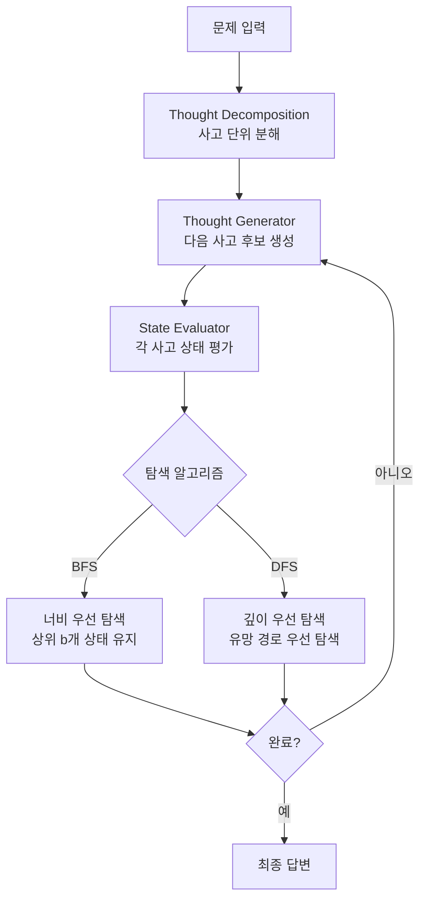

# Tree of Thoughts: Deliberate Problem Solving with Large Language Models (Yao et al., NeurIPS 2023)

## 핵심 기여

Princeton 대학교의 Shunyu Yao 등이 NeurIPS 2023에 발표한 이 논문은 LLM의 추론 방식을 **선형적 사고에서 트리 탐색으로** 확장한 방법론이다. [[chain-of-thought-paper]]의 CoT가 단일 경로를 따라 좌에서 우로 토큰을 생성하는 것과 달리, Tree of Thoughts(ToT)는 **여러 중간 사고 단계("thoughts")를 생성하고 평가하며, 가장 유망한 경로를 탐색(BFS/DFS)**하는 인간의 심사숙고(deliberate thinking)를 모사한다.

[[tree-of-thought]] 개념의 공식 논문으로, 자기 평가(self-evaluation)와 체계적 탐색을 결합하여 수학적 퍼즐, 창의적 글쓰기, 체스 등 복잡한 추론 과제에서 CoT 대비 월등한 성능을 보였다.

## 방법

### ToT의 네 가지 구성 요소



### 사고 단위(Thought) 분해

문제 유형에 따라 "사고"의 단위가 달라진다:

| 문제 유형 | 사고 단위 | 예시 |
|-----------|----------|------|
| Game of 24 | 하나의 수식 조작 | "12 + 4 = 16" |
| 창의적 글쓰기 | 문단 계획 | "도입 → 반전 → 결말" |
| 체스 퍼즐 | 한 수(move) | "Rook to e4" |

### 사고 생성기 (Thought Generator)

두 가지 전략:
1. **Sample**: LLM에서 독립적으로 k개 사고를 샘플링 (다양성 확보)
2. **Propose**: 하나의 프롬프트에서 여러 후보를 동시에 제안 (일관성 확보)

### 상태 평가기 (State Evaluator)

**핵심 혁신**: LLM이 각 중간 상태를 **스스로 평가**하여 탐색 방향을 결정한다.

두 가지 평가 방식:
- **Value**: 각 상태에 1~10 점수를 매기는 직접 평가
- **Vote**: 여러 상태를 비교하여 "가장 유망한 것" 투표

프롬프트 예시 (Game of 24):
```
현재 숫자: [4, 4, 5]
목표: 24 만들기
이 상태의 해결 가능성을 sure/likely/impossible로 평가하라.
```

### 탐색 전략

- **BFS**: 각 단계에서 상위 $b$개 상태만 유지. 탐색 깊이가 얕고 품질이 중요한 문제에 적합.
- **DFS**: 상태 값이 임계값을 넘으면 계속 탐색, 그렇지 않으면 백트래킹. 탐색 공간이 크거나 단계가 많은 문제에 적합.

```mermaid
flowchart LR
    subgraph BFS b=3
        A[초기] --> B1[사고1]
        A --> B2[사고2]
        A --> B3[사고3]
        B1 --> C1[상위3 유지]
        B2 --> C1
        B3 --> C1
    end
    subgraph DFS
        D[초기] --> E[유망 경로]
        E --> F[계속 탐색]
        F -->|행막힘| G[백트래킹]
        G --> D
    end
```

## 결과

### Game of 24 (수학 퍼즐)

4개의 숫자로 24를 만드는 퍼즐 - GPT-4 기준:

| 방법 | 성공률 |
|------|--------|
| IO Prompting | 7.3% |
| Chain-of-Thought | 4.0% |
| CoT + Self-Consistency | 9.0% |
| **Tree of Thoughts (BFS)** | **74.0%** |

CoT 대비 **약 10배** 성능 향상. 자기 평가와 탐색의 결합이 결정적이었다.

### 창의적 글쓰기 (Coherent Writing)

주어진 5개 무작위 단어를 포함하는 짧은 소설 작성:
- ToT의 계획 단계 출력을 GPT-4가 평가 시 73% 선호 (CoT 대비)
- 인간 평가자도 유사한 선호 경향 확인

### 미니 체스 (Mini Crossword)

5x5 크로스워드 퍼즐:
- ToT: 단어 수준 정확도 60%, 게임 수준 성공률 20%
- IO: 16% / 0%

## 한계

- **LLM 호출 비용**: 하나의 질문에 수십~수백 회 LLM을 호출하므로, 실시간 응용에 비용과 지연이 크다.
- **평가기 품질 의존**: 자기 평가가 부정확하면 탐색 방향이 잘못된다. LLM의 자기 평가 능력이 문제 유형에 따라 크게 다르다.
- **사고 단위 설계 필요**: Thought granularity(사고 단위의 크기)를 문제마다 수동 설계해야 한다. 자동화가 어렵다.
- **도메인 일반화**: Game of 24, 체스처럼 명확한 정답이 있는 문제에서 효과적이지만, 오픈엔디드 태스크에서의 평가기 설계가 어렵다.

## 실무 관점

ToT의 아이디어는 LLM 에이전트 시스템에 깊은 영향을 미쳤다:

- **에이전트 계획 수립**: 다단계 계획이 필요한 에이전트 작업(코딩, 연구, 분석)에서 ToT 방식의 분기 탐색이 활용된다. [[chain-of-thought-paper]]의 선형 CoT만으로는 복잡한 계획이 어렵다는 문제를 해결했다.
- **자기 반성(Self-Reflection) 통합**: 현재 많은 에이전트 프레임워크가 ToT에서 파생된 "생성 → 자기평가 → 선택" 패턴을 사용한다.
- **o1/o3 계열의 선구자**: OpenAI의 o1은 ToT와 유사한 내부적 사고 트리 탐색을 강화학습으로 학습한 것으로 알려져 있다. ToT는 이 흐름의 초기 공식화다.
- **비용 대비 효과**: 복잡도가 높은 한 번짜리 태스크(예: 중요한 코드 디버깅, 법률 분석)에서는 추가 비용을 감수하고 ToT를 적용할 가치가 있다. 반복적인 일상 태스크에는 CoT로 충분하다.

## 관련 문서

- [[tree-of-thought]] - ToT 개념 문서, 다양한 구현 변형과 파생 기법 정리
- [[chain-of-thought-paper]] - ToT가 기반으로 하고 확장한 선형 추론 방법론
- [[mamba-original-paper]] - 추론과 달리 아키텍처 측면에서 Transformer를 대체하려는 상보적 연구
