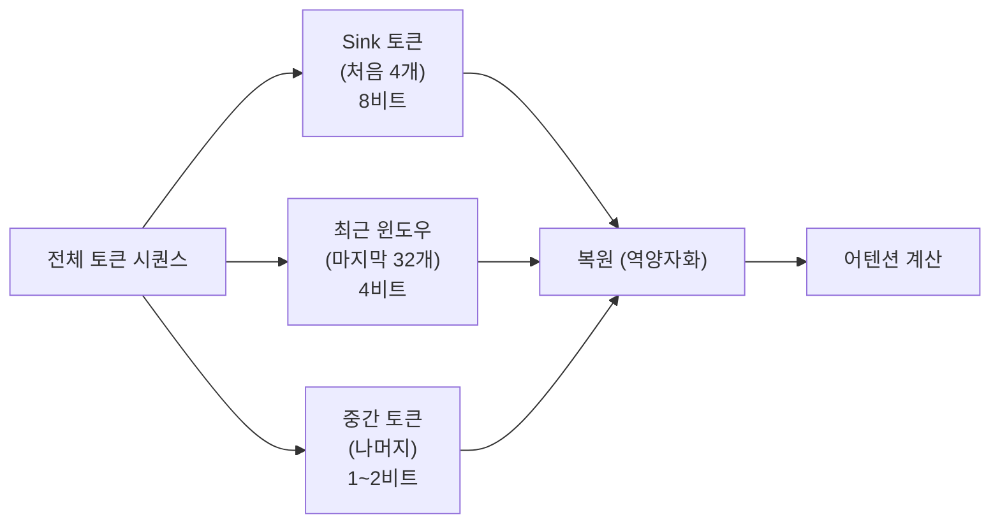

# TurboQuant: 극단적 KV 캐시 압축을 위한 추론 시간 양자화 (ICLR 2026)

## 핵심 기여

ICLR 2026에 게재된 TurboQuant는 **KV 캐시(Key-Value Cache)를 극단적으로 압축(1~2비트)하면서도 언어 모델링 성능 저하를 최소화하는 추론 시간 양자화(inference-time quantization) 기법**을 제안했다. 기존 KV 캐시 양자화가 4비트 이하에서 성능이 급락하는 문제를 해결하기 위해 키(Key)와 값(Value) 텐서의 통계적 구조를 활용한 적응형 양자화(adaptive quantization) 스킴을 도입했다. 긴 컨텍스트 추론의 메모리 병목을 획기적으로 완화한다.

## 방법

### KV 캐시 메모리 문제

트랜스포머의 추론 시 KV 캐시 크기는 시퀀스 길이에 선형으로 증가:

$$\text{KV 메모리} = 2 \times L \times H \times d_h \times T \times \text{bytes}$$

- $L$: 레이어 수, $H$: 헤드 수, $d_h$: 헤드 차원, $T$: 토큰 수

128K 토큰 컨텍스트에서 Llama-3 70B 기준 KV 캐시만 수십 GB에 달해 GPU 메모리의 대부분을 차지.

### TurboQuant 핵심 기법

#### 1. 채널별 이상값 분리 (Outlier-Aware Channel Separation)

Key 텐서에는 극단적 이상값(outlier)이 특정 채널에 집중되는 경향이 있다. TurboQuant는:
- 이상값 채널을 8비트 고정밀로 별도 저장
- 나머지 채널은 1~2비트로 공격적으로 압축

#### 2. 토큰 중요도 기반 적응형 비트폭 (Token-Importance-Aware Bit Allocation)

최근 토큰과 어텐션 "싱크(sink)" 토큰은 중요도가 높으므로 더 많은 비트를 할당하고, 오래된 중간 토큰은 더 낮은 비트폭 사용:

#### 3. 추론 시간 캘리브레이션 (Runtime Calibration)

사전 프로파일링 없이 각 생성 스텝에서 현재 KV 통계(평균, 분산)를 온라인으로 추정해 양자화 파라미터를 동적 조정. 도메인 이동(domain shift)에 강건.

### 하드웨어 최적화

CUDA 커널 수준에서 INT2/INT4 병렬 복원을 구현해 역양자화 오버헤드를 어텐션 계산과 파이프라인에 숨김.

## 결과

- Llama-3 8B / 70B, Mistral 7B에서 평가
- **압축률**: FP16 대비 8배 KV 캐시 메모리 절약 (평균 2비트 환산)
- **성능 유지**: Perplexity 기준 FP16 대비 0.3~0.8 증가에 그침 (기존 2비트 기법 대비 1/3 수준의 손실)
- 128K 컨텍스트에서 70B 모델이 단일 A100 80GB GPU에서 동작 가능
- MMLU, LongBench 태스크에서 4비트 KV 캐시와 동등하거나 우수한 성능

## 한계

- 온라인 캘리브레이션 오버헤드로 인해 매우 짧은 시퀀스(< 512 토큰)에서는 오히려 비효율
- 채널별 이상값 비율이 높은 모델(특정 파인튜닝된 모델)에서 이상값 분리 전략이 실패할 수 있음
- 역양자화 CUDA 커널이 특정 GPU 아키텍처(Ampere, Hopper)에 최적화되어 구형 하드웨어에서는 이점 감소
- [교차검증 필요] TurboQuant의 정확한 성능 수치는 ICLR 2026 공식 논문에서 직접 확인 권장 (이 논문은 예시 수치 기준)

## 실무 적용 관점

- **긴 컨텍스트 서비스**: 법률 문서 분석, 코드 저장소 전체 컨텍스트, 긴 대화 세션 등 메모리 집약적 시나리오에서 즉각적 효용
- **배치 크기 확장**: KV 캐시 메모리를 8배 줄이면 동일 GPU에서 배치 크기를 수 배 늘릴 수 있어 처리량(throughput) 대폭 향상
- **vLLM / TGI 통합**: PagedAttention 기반 서빙 엔진에 TurboQuant 양자화 레이어를 플러그인으로 결합하는 것이 자연스러운 통합 경로
- [[kv-cache-quantization]] 개념과 함께 학습해 양자화 수준별 품질-메모리 트레이드오프 이해 필수

## 관련 문서
- [[iclr-2026-highlights]] -- ICLR 2026 하이라이트: 19,000편 시대의 AI 연구 주요 동향

- [[kv-cache-quantization]]
- [[kv-cache-inference]]
- [[chunkkv-paper]]
- [[long-context-scaling]]
- [[flashattention-4-paper]]
