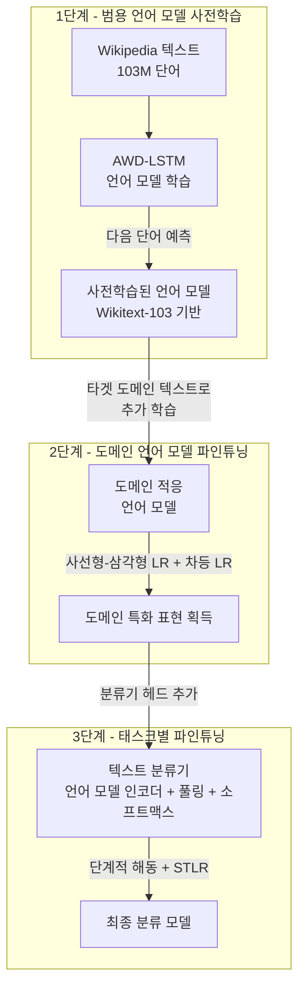
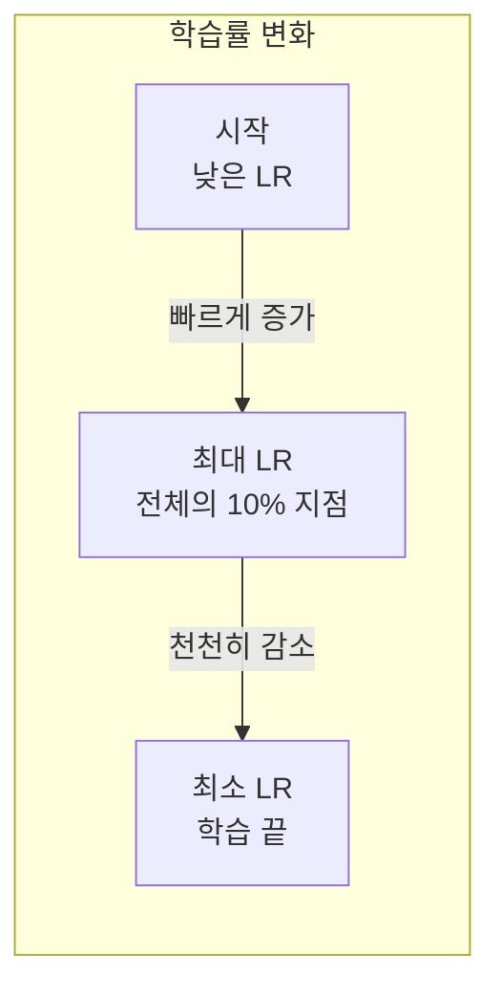
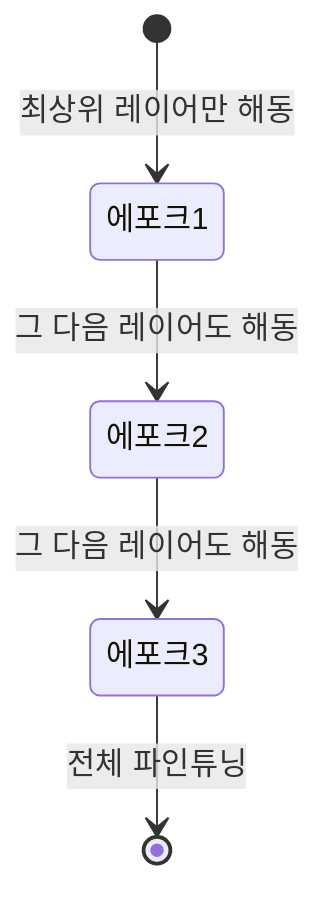
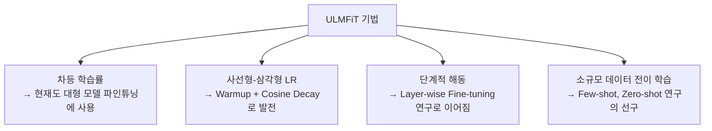

# ULMFiT: Universal Language Model Fine-tuning for Text Classification (Howard & Ruder, 2018)

## 메타데이터

| 항목 | 내용 |
|------|------|
| 저자 | Jeremy Howard (fast.ai), Sebastian Ruder (Insight Centre for Data Analytics, NUI Galway) |
| 연도 | 2018 |
| 학회/저널 | ACL 2018 |
| arXiv | 1801.06146 |
| 코드 | https://github.com/fastai/fastai (fast.ai 라이브러리 통합) |

## 핵심 기여

- **NLP 전이 학습(transfer learning)의 ImageNet 모먼트**: 컴퓨터 비전에서 ImageNet 사전학습이 혁명을 일으켰듯, 언어 모델 사전학습이 NLP의 범용 전이 학습 시대를 열었음을 최초로 설득력 있게 시연
- **3단계 파인튜닝 프레임워크**: (1) 범용 언어 모델 사전학습, (2) 도메인 적응, (3) 태스크별 파인튜닝의 체계적 방법론 확립
- **차등 학습률(Discriminative Fine-tuning)**: 레이어마다 다른 학습률을 적용해 낮은 레이어의 범용 표현을 보존하면서 상위 레이어만 집중 학습
- **사선형-삼각형 학습률 스케줄(Slanted Triangular Learning Rates)**: 초반에 빠르게 학습률을 높였다가 천천히 낮추는 스케줄로 안정적이고 빠른 파인튜닝
- **단계적 레이어 해동(Gradual Unfreezing)**: 상위 레이어부터 점진적으로 파인튜닝하여 파국적 망각(catastrophic forgetting) 방지

## 배경과 문제 정의

### 2018년 NLP의 상황

2018년 이전 NLP는 대부분 **태스크별 처음부터 학습(from scratch)** 방식이었다:
- 감성 분석 모델은 감성 데이터로 처음부터 학습
- 텍스트 분류 모델은 분류 데이터로 처음부터 학습
- 전이 학습은 Word2Vec/GloVe 임베딩 초기화에만 제한적으로 사용

반면 컴퓨터 비전은 이미 2014-2016년에 ImageNet 사전학습 → 파인튜닝 패러다임이 표준이었다.

### NLP 전이 학습이 어려웠던 이유

1. **태스크 이질성**: 분류, 기계번역, NLI, QA 등 각 태스크가 너무 달라 범용 표현 어렵다는 인식
2. **파국적 망각**: 새 태스크 파인튜닝 시 사전학습 지식이 빠르게 손실
3. **데이터 부족 vs. 과다**: 소규모 분류 태스크에 대규모 언어 모델을 어떻게 적용할지 불명확
4. **학습 불안정성**: 사전학습 모델에 높은 학습률 적용 시 급격한 성능 저하

ULMFiT는 이 모든 문제를 세심한 파인튜닝 기법으로 해결했다.

## 방법

### 3단계 학습 파이프라인



### AWD-LSTM 아키텍처

ULMFiT는 트랜스포머 이전 시대의 최강 언어 모델인 AWD-LSTM(ASGD Weight-Dropped LSTM)을 사용한다:

- 3층 LSTM
- DropConnect (가중치 드롭아웃)
- 다양한 드롭아웃 기법 (입력, 임베딩, 은닉 레이어)
- 임베딩 차원: 400, 은닉 유닛: 1150

### 핵심 기법 1: 차등 학습률 (Discriminative Fine-tuning)

서로 다른 레이어는 서로 다른 종류의 정보를 포함한다:
- **하위 레이어**: 기본 문법, 구문 구조 (범용, 보존 필요)
- **중간 레이어**: 의미적 정보 (중간 수준 업데이트)
- **상위 레이어**: 태스크 특화 표현 (적극 업데이트)

각 레이어에 다른 학습률 적용:

$$\eta^l = \eta^L / 2.6^{(L-l)}$$

여기서 $\eta^L$은 최상위 레이어 학습률, $L$은 전체 레이어 수, $l$은 현재 레이어 번호.

예: 3층 LSTM에서 최상위 레이어 $\eta = 0.01$이면:
- 3층 (최상위): $0.01$
- 2층: $0.01 / 2.6 \approx 0.0038$
- 1층 (최하위): $0.01 / 2.6^2 \approx 0.0015$

### 핵심 기법 2: 사선형-삼각형 학습률 스케줄 (STLR)



$$\eta_t = \eta_{max} \cdot \begin{cases} t / (T \cdot \text{cut\_frac}) & t < T \cdot \text{cut\_frac} \\ 1 - (t - T \cdot \text{cut\_frac}) / (T \cdot (1 - \text{cut\_frac})) \cdot (1 - \text{ratio}^{-1}) & t \geq T \cdot \text{cut\_frac} \end{cases}$$

파라미터: $\text{cut\_frac} = 0.1$ (전체의 10%에서 최대치), $\text{ratio} = 32$ (최소/최대 비율).

**직관**: 초반에는 빠르게 좋은 영역으로 이동, 후반에는 세밀하게 수렴.

### 핵심 기법 3: 단계적 레이어 해동 (Gradual Unfreezing)



**1에포크**: 분류기 헤드 + LSTM 최상층만 학습
**2에포크**: 분류기 헤드 + LSTM 최상 2층 학습
**3에포크**: 전체 모델 학습 (차등 학습률 적용)

**이유**: 갑자기 전체 모델을 파인튜닝하면 하위 레이어의 범용 표현이 파괴됨. 단계적으로 해동하면 이미 잘 맞춰진 상위 레이어가 안내자 역할.

### 분류기 헤드 설계

언어 모델 인코더(LSTM) 위에 분류기 추가:

```python
# ULMFiT 분류기 헤드 개념적 구현
class ULMFiTClassifier(nn.Module):
    def __init__(self, encoder, n_classes, n_hidden):
        super().__init__()
        self.encoder = encoder  # 사전학습된 LSTM 인코더
        # 풀링: 마지막 은닉 상태 + 평균 풀링 + 최대 풀링 연결
        self.pool = ConcatPooling()  # [h_T, mean(h), max(h)]
        self.layers = nn.Sequential(
            nn.BatchNorm1d(3 * n_hidden),
            nn.Dropout(p=0.4),
            nn.Linear(3 * n_hidden, n_hidden),
            nn.ReLU(),
            nn.BatchNorm1d(n_hidden),
            nn.Dropout(p=0.1),
            nn.Linear(n_hidden, n_classes)
        )
```

**ConcatPooling**: 마지막 타임스텝 은닉 상태 $h_T$, 모든 타임스텝 평균, 최댓값을 연결. 시퀀스의 다양한 측면을 포착.

## 실험 및 결과

### 텍스트 분류 벤치마크

**오류율 비교 (낮을수록 좋음)**

| 데이터셋 | 기존 SOTA | ULMFiT | 개선 |
|---------|---------|--------|------|
| TREC-6 (질문 분류) | 6.42% | **3.02%** | -3.40% |
| IMDb (감성 분석) | 4.60% | **4.00%** | -0.60% |
| Yelp-bi (이진 감성) | 2.16% | **1.62%** | -0.54% |
| Yelp-full (5등급) | 29.98% | **29.39%** | -0.59% |
| AG (뉴스 분류) | 5.01% | **4.72%** | -0.29% |
| DBpedia (온톨로지 분류) | 0.64% | **0.55%** | -0.09% |

6개 데이터셋 모두에서 새 SOTA 달성.

### 소규모 데이터에서의 강점

**IMDb 감성 분석, 학습 데이터 크기별 성능**

| 학습 데이터 크기 | 기존 방법 오류율 | ULMFiT 오류율 |
|--------------|-------------|------------|
| 100 | 14.0% | **7.7%** |
| 500 | 10.3% | **5.4%** |
| 2,000 | 7.2% | **4.8%** |
| 전체 (25,000) | 4.6% | **4.0%** |

**소규모 데이터에서 격차가 더 큼**: 100개 학습 데이터만으로 기존 방법의 2,000개 데이터 성능에 필적. 전이 학습의 진정한 가치.

### 절제 실험 (각 기법의 기여도)

**TREC-6 오류율**

| 구성 | 오류율 |
|------|-------|
| 기본 (사전학습 없음) | 6.0% |
| + 사전학습 | 5.2% |
| + 차등 LR | 4.8% |
| + 사선형-삼각형 LR | 4.2% |
| + 단계적 해동 | **3.0%** |

각 기법이 누적적으로 기여하며, 단계적 해동의 효과가 특히 크다.

## 전이 학습 패러다임으로서의 ULMFiT

### ImageNet 모먼트의 의미

Jeremy Howard는 ULMFiT를 발표하면서 "NLP의 ImageNet 모먼트"라는 개념을 제안했다. 컴퓨터 비전에서:

```mermaid
flowchart LR
    subgraph 비전 ImageNet 패러다임 - 2012~
        ImageNet[ImageNet\n1.4M 레이블 이미지] --> VGG[AlexNet/VGG/ResNet\n사전학습]
        VGG --> |파인튜닝| AnyVision[모든 비전 태스크\n의료, 위성, 산업검사...]
    end

    subgraph NLP ULMFiT 패러다임 - 2018~
        Wiki[Wikipedia\n103M 단어] --> AWD2[AWD-LSTM\n언어 모델 사전학습]
        AWD2 --> |3단계 파인튜닝| AnyNLP[모든 NLP 태스크\n분류, 감성, QA...]
    end
```

이 비유는 2018년 말~2019년 BERT, GPT의 등장으로 완성되었다. ULMFiT는 그 예언이자 증명이었다.

### BERT/GPT로의 이어짐

ULMFiT의 프레임워크는 이후 BERT, GPT-2/3, RoBERTa 등 모든 현대 사전학습-파인튜닝 모델의 개념적 선구자다:

| 개념 | ULMFiT | BERT/GPT 시대 |
|------|--------|-------------|
| 사전학습 목표 | 언어 모델링 (LM) | MLM/CLM |
| 기반 아키텍처 | LSTM | 트랜스포머 |
| 사전학습 데이터 | Wikipedia (103M) | Wikipedia + BooksCorpus + 이상 |
| 차등 학습률 | 명시적 | 암묵적 (AdamW 내 레이어별 LR 적용) |
| 단계적 해동 | 명시적 | 일반적으로 전체 파인튜닝 |
| 파인튜닝 기법 | 3단계 | 1-2단계 (더 단순화) |

## 한계 및 후속 연구

### 한계

- **LSTM 기반**: 트랜스포머 대비 병렬화 어려움, 긴 의존성 포착 한계
- **단방향 언어 모델**: 오른쪽 문맥을 활용하지 못함 (BERT의 양방향 vs. ULMFiT의 단방향)
- **텍스트 분류 특화**: QA, NLI, 생성 태스크로의 확장이 간단하지 않음
- **영어 중심**: 다국어 적용을 위해서는 별도 실험 필요

### 후속 연구: BERT, GPT 패러다임

ULMFiT의 직접적 후계자들:
- **ELMo** (Peters et al., 2018): 양방향 LSTM 언어 모델, 문맥 임베딩
- **GPT** (Radford et al., 2018): 트랜스포머 단방향 언어 모델 사전학습
- **BERT** (Devlin et al., 2018): 트랜스포머 양방향 마스크드 언어 모델 → [[bert-paper]]
- **fast.ai 라이브러리**: ULMFiT 기법들을 표준화해 실용적 NLP 파인튜닝 도구로 제공

## 실무 적용 관점

### 현재 실무에서의 위치

2024년 기준, ULMFiT를 직접 사용하는 경우는 드물다. BERT, RoBERTa, DeBERTa 등이 더 강력하다. 하지만 ULMFiT의 기법들은 현재도 유효하다:



### 파인튜닝 기법의 현재 표준

ULMFiT에서 발전한 현재 모범 사례:

```python
from transformers import AutoModelForSequenceClassification, get_linear_schedule_with_warmup
import torch

# 1. 사전학습 모델 로드
model = AutoModelForSequenceClassification.from_pretrained("klue/bert-base")

# 2. 레이어별 차등 학습률 (ULMFiT 아이디어 계승)
optimizer_grouped_parameters = [
    {
        "params": [p for n, p in model.named_parameters() if "encoder.layer.0" in n],
        "lr": 1e-5  # 하위 레이어: 낮은 학습률
    },
    {
        "params": [p for n, p in model.named_parameters() if "encoder.layer.11" in n],
        "lr": 5e-5  # 상위 레이어: 높은 학습률
    },
    {
        "params": [p for n, p in model.named_parameters() if "classifier" in n],
        "lr": 1e-4  # 분류기 헤드: 가장 높은 학습률
    },
]

optimizer = torch.optim.AdamW(optimizer_grouped_parameters)

# 3. 사선형-삼각형 LR에 해당하는 현대 스케줄
scheduler = get_linear_schedule_with_warmup(
    optimizer,
    num_warmup_steps=total_steps // 10,  # 10% warmup
    num_training_steps=total_steps
)
```

### 소규모 데이터 시나리오에서의 전이 학습

ULMFiT의 핵심 교훈: **레이블 없는 도메인 텍스트로 언어 모델을 먼저 파인튜닝하면 소규모 레이블 데이터로도 강력한 분류기를 만들 수 있다.**

현재도 도메인 특화 언어 모델(의료, 법률, 금융 등)을 만들 때 이 원리가 적용된다:
1. 일반 사전학습 모델 (BERT, RoBERTa 등)
2. 도메인 텍스트(논문, 계약서, 리포트 등)로 추가 사전학습
3. 소규모 레이블 데이터로 파인튜닝

## 관련 문서

- [[bert-paper]] - ULMFiT의 직접적 후계자, 양방향 언어 모델
- [[transfer-learning]] - 전이 학습 개념 전반
- [[fine-tuning]] - 파인튜닝 기법 개요
- [[discriminative-learning-rates]] - 차등 학습률 개념
- [[attention-is-all-you-need-paper]] - 트랜스포머 아키텍처 (ULMFiT가 사용하는 LSTM의 후계자)
