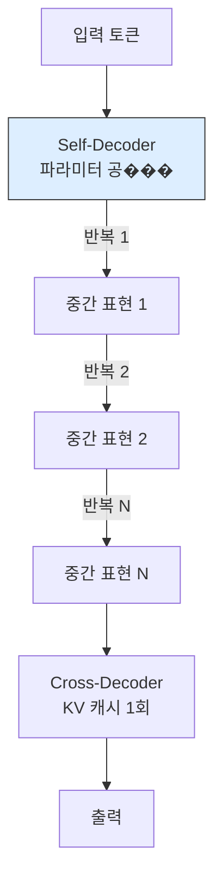

# Universal YOCO: 재귀 계산으로 효율적 깊이 스케일링

## 핵심 기여

YOCO(You Only Cache Once) 디코더-디코더 아키텍처에 **재귀적 계산(recursive computation)**을 결합하여, 파라미터 공유 기반의 다중 반복이 가능한 **Universal Self-Decoder**를 구현한다. 추론 시점에서 계산량을 효율적으로 스케일링하는 문제를 해결한다.

핵심 성과:
- YOCO의 캐시 1회 장점 유지 + 깊이 방향 표현력 확장
- 파라미터 수 증가 없이 재귀 반복으로 모델 깊이를 동적 조절
- 추론 시점 compute scaling의 새로운 축 제시

## 문제 정의

표준 Transformer의 추론 시점 스케일링 한계:
- **깊이 스케일링**: 레이어를 추가하면 파라미터와 메모리가 선형 증가
- **KV 캐시 비용**: 각 레이어가 별도 KV 캐시를 유지해야 함
- **Test-time compute**: 추론 시 더 많은 연산을 투입하더라도 기존 아키텍처에서는 경로가 제한적

### YOCO 배경

YOCO(You Only Cache Once)는 디코더-디코더 구조에서 **KV 캐시를 한 번만 생성**하는 효율적 아키텍처:
- Self-Decoder: 쿼리 생성 담당 (캐시 없음)
- Cross-Decoder: KV 캐시를 한 번만 계산하고 공유

## 방법론: Universal Self-Decoder

Universal YOCO는 Self-Decoder에 파라미터 공유를 적용하여 동일 레이어를 N번 재귀 반복한다. 이로써 파라미터 수 증가 없이 실질적 깊이를 N배로 확장한다.

핵심 설계:
- **파라미터 공유**: Self-Decoder의 레이어가 동일 파라미터를 N회 재사용
- **캐시 효율**: Cross-Decoder의 KV 캐시는 여전히 1회만 계산
- **동적 깊이**: 추론 시 반복 횟수 N을 조절하여 정확도-지연 트레이��오프 제어

## 기존 연구와의 관계

| 접근법 | 깊이 확장 | 캐시 비용 | 파라미터 증가 |
|--------|-----------|-----------|---------------|
| 표준 Transformer | 레이어 추가 | 레이어당 비례 | 비례 |
| YOCO | 고정 | 1회 | 고정 |
| **Universal YOCO** | 재귀 반복 | 1회 | 없음 |
| Universal Transformer | 재귀 반복 | 레이어당 비례 | 없음 |

## 실무 적용 관점

- **추론 효율**: 메모리/파라미터 증가 없이 모델의 실질적 깊이를 확장
- **Test-time compute**: 추론 시 반복 횟수를 늘려 정확도를 향상시키는 새로운 스케일링 축
- **Edge 배포**: 파라미터가 적은 모델로도 깊은 처리가 가능

## 관련 문서

- [[KV 캐시 추론 최적화]] -- KV 캐시 효율화 기법 전반
- [[ChunkKV]] -- 의미 청크 기반 KV 캐시 압축
- [[TurboQuant]] -- 극단적 KV 캐시 양자화
