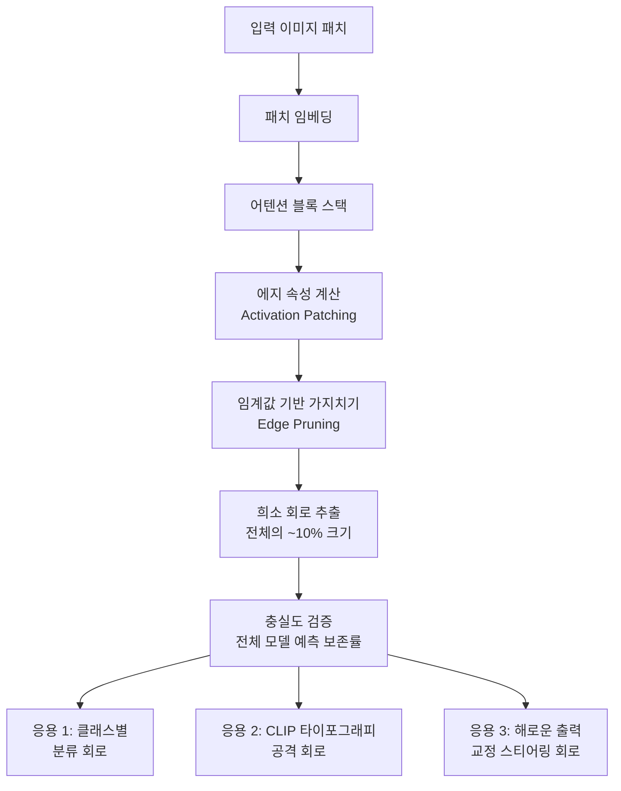

# Vi-CD: 비전 트랜스포머의 충실한 기계적 해석가능성

## 개요

Vi-CD(Visual Circuit Discovery)는 비전 트랜스포머(Vision Transformer, ViT)에 대한 자동 회로 발견 프레임워크다. 기존 언어 모델 중심의 기계적 해석가능성(mechanistic interpretability) 연구를 시각 도메인으로 확장하며, 에지 기반(edge-based) 회로 표현을 통해 기존 방법 대비 10배 희소한 회로를 추출한다. 저자: Zukowska, Stammer, Schiele, Fischer.

## 배경: 왜 비전 트랜스포머인가

기계적 해석가능성 연구는 대부분 GPT류 언어 모델에 집중되어 있었다. 언어 모델에서는 주의(attention) 헤드와 MLP 레이어가 특정 문법 구조나 사실 정보를 담당한다는 "회로(circuit)" 개념이 검증되었다. 그러나 이미지 분류, 다중 모달 임베딩 등 시각 과제를 처리하는 ViT에는 동등한 수준의 회로 분석 방법론이 없었다.

Vi-CD는 이 공백을 메운다. ViT의 패치 임베딩(patch embedding), 위치 인코딩, 어텐션 헤드, 피드포워드 블록으로 이루어진 연산 그래프를 에지 단위로 분석해, 특정 결정에 인과적으로 기여하는 최소 회로를 자동으로 식별한다.

## 핵심 기법: 에지 기반 회로 발견

기존 회로 발견 방법은 노드(node) 단위로 작동했다 - 즉, 어느 어텐션 헤드가 중요한가만 판별했다. Vi-CD는 **에지 단위**로 내려가 "어느 헤드의 출력이 어느 다음 레이어 입력에 얼마나 기여하는가"까지 추적한다.

결과로 나오는 회로는 기존 방법의 1/10 수준의 크기(희소성)를 가지면서도 동등한 충실도(faithfulness)를 보인다. 충실도는 "회로만 남겼을 때 전체 모델의 예측이 얼마나 보존되는가"로 측정한다.

위 파이프라인은 입력에서 최종 회로 추출까지의 흐름을 보여준다. 에지 속성 계산에는 활성화 패칭(activation patching) 기법이 사용된다.

## 세 가지 응용 사례

### 1. 클래스별 분류 회로 (Class-Specific Classification Circuits)

ImageNet 등 분류 과제에서 "고양이" 또는 "자동차"와 같은 특정 클래스에 대한 예측을 담당하는 서브그래프를 추출한다. 회로 수준에서 클래스 간 공유 구조와 클래스 고유 구조를 분리할 수 있어, 전이 학습과 파인튜닝 전략 설계에 통찰을 제공한다.

### 2. CLIP 타이포그래피 공격 회로 (Typographic Attack Circuits)

CLIP(Contrastive Language-Image Pretraining)의 알려진 취약점 중 하나는 타이포그래피 공격(typographic attack)이다. 이미지에 텍스트를 겹쳐 쓰면 모델이 시각 내용보다 텍스트를 우선하는 현상이다. Vi-CD는 이 공격이 어느 어텐션 헤드 경로를 통해 작동하는지 회로로 특정한다.

이 분석은 단순한 현상 기술을 넘어서 **공격의 내부 메커니즘**을 밝힌다는 점에서 의미가 크다.

### 3. 해로운 출력 교정을 위한 스티어링 회로 (Steering Circuits for Harm Correction)

모델이 편향되거나 바람직하지 않은 시각적 연관성을 학습한 경우, 해당 회로를 식별해 개입(intervention) 또는 억제(suppression)하는 방향으로 응용한다. 이는 비전-언어 모델의 안전성(safety) 강화와 직결되는 응용이다.

## 기존 방법과의 비교

| 항목 | 기존 노드 기반 방법 | Vi-CD (에지 기반) |
|------|-----------------|----------------|
| 회로 단위 | 어텐션 헤드 (노드) | 헤드 간 연결 (에지) |
| 회로 크기 | 전체의 ~30-50% | 전체의 ~3-5% |
| 충실도 | 중간 | 동등 이상 |
| 적용 도메인 | 주로 언어 모델 | 비전 트랜스포머 |
| 자동화 여부 | 부분 수동 | 완전 자동 |

## 실무 관점

**왜 중요한가?** 대규모 비전-언어 모델(VLM)의 신뢰성과 안전성 보장 수요가 커지는 상황에서, Vi-CD는 모델 내부에서 "무엇이 어디서 어떻게 처리되는가"를 가시화하는 핵심 도구가 된다.

**한계**: 에지 속성 계산 비용이 노드 방법보다 높다. 매우 깊은 ViT(예: ViT-H)에서 확장성이 검증되지 않았다. 또한 회로의 "의미" 해석은 여전히 인간의 판단에 의존한다.

**실무 적용**: 의료 영상 진단, 자율주행 인지 등 고위험 비전 시스템의 감사(audit)에 Vi-CD를 적용해 특정 예측이 어떤 시각 특징 경로를 통해 나왔는지 추적할 수 있다.

## 핵심 기여 요약

1. 비전 트랜스포머 전용 자동 회로 발견 프레임워크 최초 제시
2. 에지 기반 표현으로 10배 희소한 고충실도 회로 달성
3. 분류, 다중 모달 취약점 분석, 해로움 교정 세 가지 응용 검증
4. 기계적 해석가능성 연구 영역을 언어 모델에서 시각 모델로 확장

## 관련 문서

- [[회로 추적]] - 기계적 해석가능성에서의 회로 분석 일반 개념
- [[비전 트랜스포머]] - ViT 아키텍처 기초
- [[CLIP]] - OpenAI CLIP 모델 및 타이포그래피 공격 배경
- [[기계적 해석가능성]] - Anthropic 등의 해석가능성 연구 흐름
- [[MCircKE: 회로 기반 지식 편집으로 추론 간극 해소]] - 회로 분석을 지식 편집에 연결한 후속 연구
