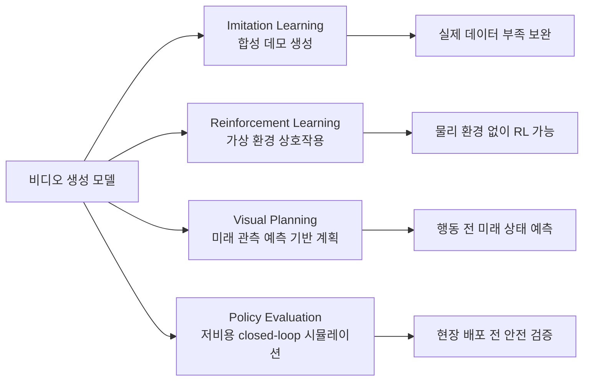

## 논문 정보

- **arXiv ID**: 2601.07823
- **제목**: Video Generation Models in Robotics -- Applications, Research Challenges, Future Directions
- **제출일**: 2026-01-12
- **저자**: Zhiting Mei, Tenny Yin, Ola Shorinwa, Apurva Badithela, Zhonghe Zheng, Joseph Bruno, Madison Bland, Lihan Zha, Asher Hancock, Jaime Fernandez Fisac, Philip Dames, Anirudha Majumdar

## 핵심 기여

이 서베이는 **비디오 생성 모델을 로봇공학의 월드 모델(world model)**로 활용하는 연구 지형을 체계적으로 정리한다. Photorealistic 시뮬레이션을 제약 가정 없이 생성할 수 있다는 특성이 전통적 physics simulator의 한계를 어떻게 극복하는지를 4개 응용 축으로 분류해 분석한다.

**전통 시뮬레이터의 한계 vs 비디오 모델의 강점**:

| 차원 | 전통 Physics Simulator | 비디오 생성 모델 |
|------|----------------------|----------------|
| 물체 유형 | Rigid body 중심 | Deformable body 포함 |
| 접촉 모델링 | 수작업 규칙 필요 | 데이터 기반 자연 학습 |
| 시각적 사실성 | 렌더링 갭 존재 | Photorealistic |
| 도메인 일반화 | 좁은 분포 | 광범위한 일반화 가능 |

## 4대 응용 분야

### 1. Imitation Learning (모방 학습)

비디오 생성 모델로 합성 데모를 생성해 학습 데이터를 확장한다. 로봇 조작 시나리오에서 실제 수집 비용이 높은 데모 데이터를 대체·보완할 수 있다.

### 2. Reinforcement Learning (강화 학습)

에이전트가 가상 환경에서 생성된 비디오 프레임 시퀀스와 상호작용하며 정책을 학습한다. 실제 로봇 파손 없이 위험 탐색을 허용한다.

### 3. Visual Planning (시각적 계획)

미래 관측 예측을 기반으로 행동 계획을 수립한다. 언어 추상화만 사용하는 플래너보다 더 표현력 있는 세계 표현(world representation)을 제공한다.

### 4. Policy Evaluation (정책 평가)

저비용 closed-loop 시뮬레이션으로 정책을 평가한다. 현장 배포 전 다양한 시나리오에서 안전성과 성능을 검증하는 용도다.

## Video-as-World-Model 관점

이 논문의 핵심 프레임은 비디오 생성 모델을 **물리 세계의 고충실도 모델**로 보는 것이다:

- Photorealistic + physically consistent deformable-body 시뮬레이션
- Language-only 추상화보다 더 풍부한 월드 표현
- Cost-effective 데이터 생성, action prediction, dynamics modeling, reward modeling 활성화

NVIDIA Cosmos 같은 Physical AI foundation model이 이 방향의 현재 구현체다.

## 핵심 도전 과제

| 범주 | 구체적 문제 |
|------|------------|
| **신뢰성** | Instruction following 불량, 물리 법칙 위반(hallucination), unsafe 콘텐츠 생성 |
| **계산 비용** | 훈련과 추론 모두 막대한 연산 자원 필요 |
| **데이터 큐레이션** | 로봇공학 특화 고품질 비디오 데이터셋 부족 |
| **Safety-critical 적용** | 자율주행, 의료 로봇 같은 영역에서 검증 프레임워크 미비 |

## 미래 방향

1. **Physics 위반 감지·보정 내장**: 생성 시 물리 법칙 위반을 실시간으로 감지하고 보정하는 내장 모듈
2. **효율적 아키텍처**: Edge deployment가 가능한 수준의 경량화
3. **Sim-to-real gap 완화**: Domain randomization 개선으로 시뮬레이션-현실 전이 격차 축소
4. **Trustworthiness 인증 프레임워크**: Safety-critical 응용에서 비디오 모델을 신뢰할 수 있는 인증 체계

## 실무 시사점

- Sim2Real / Real2Real 변환이 로봇 RL의 핵심 병목을 완화하는 방향으로 비디오 모델 활용이 증가한다
- AR/VR용으로 개발된 기존 비디오 생성 모델을 로봇 정책 평가용으로 재활용하는 트렌드가 형성되고 있다
- NVIDIA Cosmos 같은 물리 AI 파운데이션 모델이 이 연구 방향의 산업계 구현체로 자리 잡고 있다

## 관련 문서

- [[world-model]] - 월드 모델 개념 전반
- [[embodied-ai]] - 물리 세계와 상호작용하는 AI 에이전트
- [[ai-robotics-physical-ai]] - 로봇공학과 Physical AI 응용 동향
