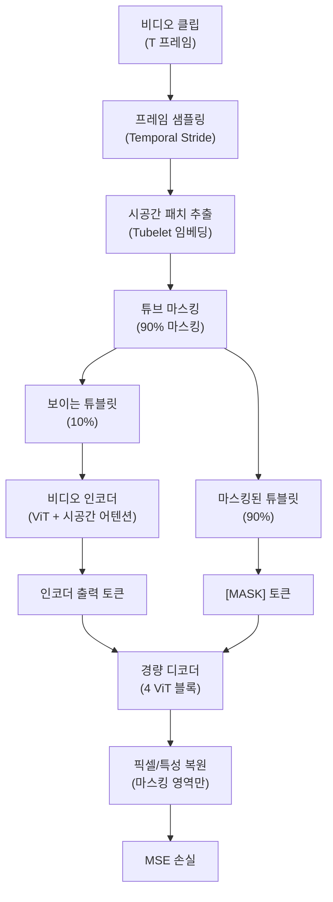

# VideoMAE: 마스킹된 오토인코더는 데이터 효율적인 비디오 학습기다

## 메타데이터

| 항목 | 내용 |
|------|------|
| 제목 | VideoMAE: Masked Autoencoders are Data-Efficient Learners for Self-Supervised Video Pre-Training |
| 저자 | Zhan Tong, Yibing Song, Jue Wang, Limin Wang |
| 소속 | Nanjing University, Tencent AI Lab |
| 발표 연도 | 2022 |
| 학회 | NeurIPS 2022 |
| arXiv | [2203.12602](https://arxiv.org/abs/2203.12602) |

## 핵심 기여

- **90% 마스킹 비율**: 이미지 MAE(75%)보다 훨씬 높은 비율로, 비디오의 시간적 중복성이 더 강한 마스킹을 요구함을 발견
- **시공간 튜브 마스킹(spatiotemporal tube masking)**: 시간 축으로 연속된 패치들을 하나의 튜브로 마스킹하여 단순한 시간적 보간 방지
- 소규모 도메인 특정 데이터(3.5k~6.5k 비디오)에서도 강력한 전이 성능 - 데이터 효율성 증명
- Kinetics-400에서 80.0% (ViT-B), Kinetics-600에서 83.9% (ViT-H) 달성으로 당시 자기지도 비디오 SOTA
- 완전 지도학습 방법에 필적하는 성능을 훨씬 작은 레이블 데이터로 달성

## 배경 및 문제 정의

[[mae-original-paper]]이 이미지에서 성공을 거두면서 "비디오에도 같은 원리가 통하는가?"가 자연스러운 후속 질문이 됐다. 그러나 비디오는 이미지와 근본적으로 다른 특성을 갖는다.

### 비디오 데이터의 특성

1. **시간적 중복성(temporal redundancy)**: 인접 프레임이 매우 유사. 마스킹된 패치를 인접 프레임에서 직접 복사할 수 있다면 의미 있는 학습이 안 됨
2. **시공간 상관관계**: 공간적(한 프레임 내)이자 시간적(프레임 간) 상관관계가 동시에 존재
3. **데이터 부족**: 이미지 데이터(수백만~수십억)에 비해 레이블된 비디오 데이터는 훨씬 적음

### 핵심 통찰

> "비디오의 높은 시간적 중복성을 극복하려면 이미지(75%)보다 훨씬 높은 마스킹 비율이 필요하다. 그리고 시간 축에서 연속된 튜브 형태로 마스킹해야 단순한 프레임 보간을 막을 수 있다."

## 방법

### 전체 파이프라인



VideoMAE는 이미지 MAE의 구조를 비디오로 확장하되, 시간적 중복성을 극복하기 위한 두 가지 핵심 설계를 추가한다.

### 시공간 튜블릿 임베딩 (Spatiotemporal Tubelet Embedding)

Video ViT처럼 비디오를 시공간 패치(튜블릿, tubelet)로 분할한다:
- 공간: $P \times P$ 픽셀 패치 (보통 $P = 16$)
- 시간: $t$ 연속 프레임 (보통 $t = 2$)

각 튜블릿은 $P \times P \times t$ 크기의 시공간 단위다. 이를 선형 투영으로 임베딩한다.

### 튜브 마스킹 전략


핵심: 한 프레임에서 마스킹할 위치를 결정하고, 그 패턴을 **모든 시간 프레임에 동일하게 적용**한다. 이렇게 하면:
- 마스킹된 위치의 패치는 모든 프레임에서 보이지 않음
- 인접 프레임에서 복사하여 복원하는 단축키 방지
- 모델이 보이는 위치의 시공간 맥락을 활용해야만 복원 가능

**왜 90% 마스킹이 필요한가?**

비디오는 이미지보다 정보 중복이 훨씬 심하다. 인접 프레임 간 유사도가 높으므로 낮은 마스킹 비율에서는 시간적 보간으로 쉽게 복원 가능하다. 90%는 이 중복성을 차단하고 모델이 진정한 시공간 이해를 하도록 강제한다.

### 인코더 아키텍처

표준 ViT에 시공간 어텐션을 통합한다. 분할 공간-시간 어텐션(factorized space-time attention) 대신 **조인트(joint) 시공간 어텐션**을 사용한다. 모든 패치(공간+시간)가 서로 어텐션을 교환하므로 더 풍부한 시공간 상관관계를 학습한다.

위치 임베딩은 시공간 위치를 분리하여 더한다:
$$\text{pos\_emb}(t, h, w) = \text{temporal\_emb}(t) + \text{spatial\_emb}(h, w)$$

## 실험 및 결과

### Kinetics-400 액션 인식

| 방법 | 사전학습 데이터 | 아키텍처 | Top-1 |
|------|--------------|---------|-------|
| 지도학습 MViT | K400 | MViT-B | 78.4% |
| TimeSformer | ImageNet-21K | ViT-L | 80.7% |
| Video Swin | K400 | Swin-B | 80.6% |
| VideoMAE | K400 | ViT-B | 80.0% |
| VideoMAE | K400 | ViT-L | 85.2% |
| VideoMAE | K400 | ViT-H | 86.6% |

ViT-B만으로도 완전 지도학습 방법과 경쟁하며, 큰 모델에서 86.6%로 당시 SOTA를 달성했다.

### Kinetics-600 및 기타 데이터셋

| 방법 | K600 Top-1 | UCF-101 | HMDB-51 |
|------|-----------|---------|---------|
| VideoMAE (ViT-B, K400 PT) | - | 96.1% | 73.3% |
| VideoMAE (ViT-L, K400 PT) | - | 97.6% | 80.4% |
| VideoMAE (ViT-H, K600 PT) | 83.9% | 97.8% | 84.7% |

Kinetics에서 사전학습 후 UCF-101, HMDB-51로 전이 학습에서도 강력한 성능.

### 데이터 효율성 (핵심 기여)

VideoMAE의 가장 인상적인 결과는 **소규모 데이터셋에서의 강건성**이다:

| 사전학습 데이터 | 크기 | K400 파인튜닝 Top-1 |
|--------------|------|-------------------|
| K400 완전 지도학습 | 240k 비디오 | 78.4% (MViT-B) |
| SSv2 (VideoMAE PT) | 220k 비디오 | 75.3% (ViT-B) |
| UCF-101 (VideoMAE PT) | 9.5k 비디오 | 77.2% (ViT-B) |

3.5k~10k 비디오로 사전학습해도 수십만 개의 레이블 데이터로 지도학습한 방법과 경쟁할 수 있다.

### 마스킹 비율 분석

| 마스킹 비율 | K400 Top-1 (ViT-B) |
|-----------|-------------------|
| 75% | 79.3% |
| 80% | 79.6% |
| **90%** | **80.0%** |
| 95% | 79.2% |

비디오에서 90%가 최적임을 확인. 이미지(75%)보다 높은 비율이 요구된다.

### 튜브 마스킹 vs 다른 마스킹 전략

| 마스킹 전략 | K400 Top-1 |
|-----------|-----------|
| 랜덤(시공간 독립) | 78.8% |
| 프레임별 독립 | 79.2% |
| **시공간 튜브** | **80.0%** |
| 프레임-레벨 마스킹 | 79.5% |

시공간 튜브 마스킹이 가장 효과적으로, 시간적 중복성을 적절히 차단하는 것이 중요함을 확인.

## 한계 및 후속 연구

### 한계점

1. **높은 계산 비용**: 90% 마스킹으로 학습 효율은 높지만, 비디오 자체가 이미지보다 훨씬 많은 계산을 요구
2. **짧은 클립 처리**: 일반적으로 16~32 프레임의 짧은 클립을 처리하므로, 장기 시간 의존성 학습에 한계
3. **도메인 갭**: 자연 비디오에서 학습한 사전학습 모델이 의료 내시경 비디오, 위성 비디오 등에 전이 시 성능 저하
4. **복원 목표의 한계**: 픽셀 복원이 낮은 수준의 시각 특성에 집중할 가능성

### VideoMAE v2

VideoMAE v2 (Wang et al. 2023):
- 이중 마스킹(dual masking): 교사-학생 프레임워크에 두 단계의 마스킹 적용
- ViT-g 스케일로 확장: 1B 파라미터
- Kinetics-400 90.0%, Kinetics-600 91.6% 달성

### 후속 연구 및 응용

- **VideoMAE + 언어**: 비디오-텍스트 멀티모달 학습에 VideoMAE 인코더 활용
- **InternVideo**: VideoMAE와 CLIP을 결합한 대규모 비디오-언어 모델
- **EVA-CLIP**: 이미지 MAE의 확장으로 비디오 이해
- **의료 비디오**: 내시경 영상, 수술 비디오 분석에 VideoMAE 사전학습 적용 연구

## 실무 적용 관점

### 비디오 태스크별 활용 방안

| 태스크 | VideoMAE 활용 방식 |
|--------|------------------|
| 액션 인식 | 전체 파인튜닝, Kinetics 사전학습 모델 시작 |
| 이상 탐지 | 소규모 도메인 데이터로 사전학습, 단일 클래스 분류 |
| 장면 이해 | 시공간 특성 추출 후 하류 태스크 |
| 비디오 검색 | 동결 인코더 특성으로 유사도 검색 |

### HuggingFace 사전학습 모델 활용

```python
from transformers import VideoMAEModel, VideoMAEFeatureExtractor
import torch

# 사전학습된 VideoMAE 인코더 로드
model = VideoMAEModel.from_pretrained("MCG-NJU/videomae-base")
feature_extractor = VideoMAEFeatureExtractor.from_pretrained(
    "MCG-NJU/videomae-base"
)

def extract_video_features(video_frames):
    """
    video_frames: (T, H, W, C) numpy array, T=16 프레임
    반환: (1, num_patches, hidden_size) 특성 텐서
    """
    inputs = feature_extractor(list(video_frames), return_tensors="pt")
    
    with torch.no_grad():
        outputs = model(**inputs)
    
    # 시퀀스 출력: [1, T*H*W / patch_size^2, hidden_size]
    return outputs.last_hidden_state
```

### 파인튜닝 파이프라인

```python
from transformers import VideoMAEForVideoClassification

# 사전학습 모델 로드 + 분류 헤드 추가
model = VideoMAEForVideoClassification.from_pretrained(
    "MCG-NJU/videomae-base-finetuned-kinetics",
    num_labels=num_action_classes,
    ignore_mismatched_sizes=True  # 분류 헤드 재초기화
)

# 파인튜닝 설정 (선택적으로 인코더 일부 동결)
for name, param in model.named_parameters():
    if 'classifier' not in name:  # 분류 헤드만 학습하려면
        param.requires_grad = False
```

### 도메인 특정 사전학습

VideoMAE의 데이터 효율성은 도메인 특정 사전학습에서 특히 강점을 발휘한다:

```python
# 커스텀 데이터셋으로 VideoMAE 사전학습
from videomae import VideoMAE

model = VideoMAE(
    image_size=224,
    patch_size=16,
    num_frames=16,
    tubelet_size=2,
    mask_ratio=0.90,      # 비디오: 90% 마스킹
    encoder_dim=768,       # ViT-Base
    decoder_dim=512,
    decoder_depth=4
)

# 도메인 데이터 (수천 개 비디오도 충분)
# 사전학습 후 파인튜닝 시 강력한 전이 성능 기대
```

## 관련 문서

- [[mae-original-paper]] - VideoMAE의 직접적 원류, 이미지 마스킹 오토인코더
- [[point-mae-paper]] - MAE 원리를 3D 포인트 클라우드로 확장한 병행 연구
- [[dino-original-paper]] - 대조 학습 기반 비전 자기지도 학습 비교
- [[transformer-architecture]] - ViT 기반 비디오 인코더의 기반 구조
- [[masked-image-modeling]] - 마스킹 기반 이미지/비디오 모델링 개념
