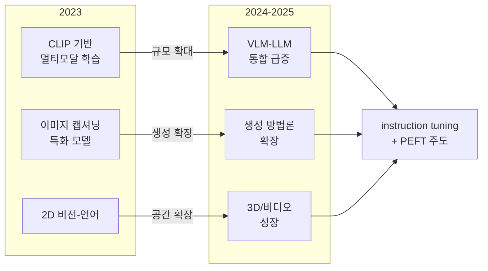
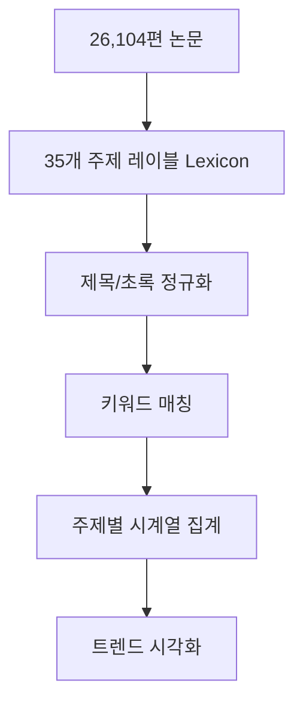

# Vision Language Models: A Survey of 26K Papers

## 핵심 기여

CVPR, ICLR, NeurIPS 등 주요 AI 컨퍼런스에 발표된 **26,104편의 비전-언어 모델(VLM) 관련 논문**을 자동화된 파이프라인으로 분석한 대규모 메타 연구(meta-survey)다. 개별 논문을 읽는 대신 **연구 트렌드 자체를 데이터로 분석**하는 접근법을 취한다.

### 3대 매크로 트렌드 (2023~2025)

**트렌드 1: VLM-LLM 통합 급증**
- 독립된 VLM에서 LLM의 시각 확장으로 연구 중심 이동
- GPT-4V, LLaVA, Gemini 계열의 등장이 이 전환을 주도
- 언어 모델의 지시 따르기(instruction following) 능력을 시각 도메인으로 이식하는 연구가 폭발적으로 증가

**트렌드 2: 생성 방법론의 다변화**
- 판별적(discriminative) VLM에서 생성적(generative) VLM으로 무게 중심 이동
- 텍스트-이미지 생성을 넘어 이미지 편집, 비디오 생성, 3D 생성으로 확장
- 디퓨전(diffusion), AR(autoregressive), 하이브리드 방법론 경쟁

**트렌드 3: 3D/비디오 이해의 급성장**
- 2023년 대비 3D 장면 이해 연구 논문 수 3배 이상 증가
- 비디오-언어 모델(Video-LM)이 독립된 서브 분야로 성숙
- 자율주행, 로봇 조작 등 현실 세계 응용과의 연결 강화

## 방법론: 26K 논문 자동 분석 파이프라인

### 주제 분류 체계

**35개 주제 레이블 렉시콘(lexicon)** 을 구성하고 각 논문의 제목과 초록을 정규화하여 매칭한다. 주요 레이블:
- VLM Architecture, Contrastive Learning, Cross-Modal Attention
- Image Generation, Text-to-Image, Video Generation
- Visual Question Answering (VQA), Image Captioning
- 3D Scene Understanding, Point Cloud Language
- Instruction Tuning, Parameter-Efficient Fine-Tuning (PEFT)
- Benchmark, Evaluation, Safety

### 분석 신뢰도

- 렉시콘 매칭 방식은 복잡한 의미론적 분류보다 재현성이 높음
- 단, 신조어나 우회적 표현이 담긴 논문은 분류 누락 가능
- 연도별 비교 시 각 컨퍼런스의 수용 편향(acceptance bias)을 보정

## 핵심 발견 상세

### 학습 방식의 패러다임 전환

| 시기 | 주도 학습 방식 | 특징 |
|------|--------------|------|
| 2021~2022 | 대조 학습(Contrastive Learning) | CLIP이 표준 수립 |
| 2023 | 지시 튜닝(Instruction Tuning) | LLaVA, MiniGPT-4 등장 |
| 2024~2025 | PEFT + 지시 튜닝 결합 | LoRA, QLoRA가 표준으로 정착 |

### VQA vs. 생성 비율 변화

- 2022: 판별 태스크(VQA, 분류) 논문 비율 약 65%
- 2025: 생성 태스크(이미지/비디오/3D 생성) 논문 비율 약 55%로 역전

## 실무적 의미

1. **연구 방향 선택**: 2025년 이후 VLM 연구는 비디오/3D 이해와 PEFT 효율화가 높은 impact를 가질 가능성
2. **모델 선택 기준**: instruction tuning 기반 모델이 실용적 태스크에서 표준
3. **미개척 영역**: 오디오-비전-언어 통합, 저자원 언어 VLM은 논문 수 기준으로 여전히 희소

## 한계

- 컨퍼런스 논문만 분석 (arXiv 프리프린트, 저널 제외)
- 렉시콘 기반 분류의 의미론적 한계 - 맥락 없는 키워드 매칭
- 중국어/한국어 논문의 제목 영역이 영어로 번역된 경우에만 집계

## 관련 문서

- [[multimodal-foundation-models]] - VLM 아키텍처와 대표 모델들의 개요
- [[lora-paper]] - PEFT의 핵심 방법론 LoRA 원논문
- [[constitutional-ai-paper]] - 안전성이 VLM 연구 트렌드에 미치는 영향
