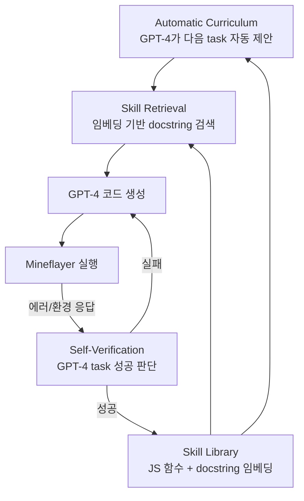

# Voyager: An Open-Ended Embodied Agent with Large Language Models (Wang et al., 2023)

## TL;DR

Voyager는 **첫 LLM 기반 Minecraft 평생학습 에이전트**로, 사람 개입 없이 무한 탐험과 기술 습득을 수행한다. **Automatic Curriculum / Skill Library / Iterative Prompting** 3-component 구조이며, 핵심은 **skill을 텍스트가 아닌 실행가능 JavaScript 코드(Mineflayer API)로 라이브러리에 저장**해 재사용·합성이 가능하게 한 점이다. GPT-4 blackbox 호출만으로 prior SOTA 대비 unique items 3.3x, 이동 거리 2.3x, Diamond Tool 도달 15.3x 가속을 달성했다.

## 핵심 기여

1. **첫 LLM 기반 Minecraft 평생학습 에이전트** — 사람 개입 없이 무한 탐험·기술 습득
2. **3-component 구조** — Automatic Curriculum / Skill Library / Iterative Prompting
3. **Skill Library = 실행 가능 코드 저장소** — 텍스트가 아닌 JS 함수로 기술 저장 → 재사용·합성
4. **Iterative prompting** — 실행 에러, 환경 피드백, self-verification을 한 사이클에 통합
5. **3.3x more unique items, 2.3x distance, 15.3x faster tech tree** — prior SOTA 대비
6. **Skill library의 일반화** — 새 Minecraft 월드에서도 기존 기술 재사용

## 방법론

- **Automatic Curriculum**: GPT-4가 현재 상태·inventory를 보고 다음 학습 task를 자동 제안
- **Skill Library**:
  - 각 skill은 JavaScript 함수 (Mineflayer API 사용)
  - docstring을 임베딩으로 저장
  - 새 task 시 유사 skill을 retrieval 후 LLM이 합성
- **Iterative Prompting**:
  1. GPT-4가 코드 생성
  2. Mineflayer로 실행 → 에러/환경 응답 수집
  3. Self-verification: GPT-4가 task 성공 판단
  4. 실패 시 피드백 + 코드를 다음 prompt에 포함, 재생성
- **Blackbox API only** — 파라미터 학습 없음

## 실험/결과

- **Tech tree milestones**: Wooden Tool, Stone Tool, Iron Tool, Diamond Tool 4단계 모두 달성
- **Diamond Tool**: prior SOTA 대비 **15.3x 빠르게** 도달
- **Unique items**: 3.3x, 이동 거리: 2.3x
- **신규 월드 일반화**: 기존 skill library만으로 새 월드 task 해결 (다른 baseline은 generalize 실패)
- **Ablation**: Skill library 제거 → 새 task 학습 불가, Curriculum 제거 → 다양성 저하

## 하네스 엔지니어링 관점

- **Skill을 코드로 저장하는 패턴** — 텍스트 plan보다 **실행가능 함수가 재사용·합성에 압도적 유리**. [[reflexion-paper]]의 verbal reflection과 대비되는 디자인 철학
- **Retrieval-augmented agent** — 새 task 시 임베딩 검색으로 관련 skill을 컨텍스트에 주입 → 컨텍스트 효율
- **Self-verification loop** — 환경에서 명시적 보상이 없을 때 LLM judge로 대체 ([[verifier-critic-models]])
- **Curriculum의 자율성** — 사람이 task list를 미리 만들지 않고 LLM이 동적 결정
- **Episodic memory와 skill memory 분리** — long-horizon agent에서 검증된 디자인 패턴
- harness 적용: [[swe-agent-paper]]에서 "성공한 코드 수정 함수를 라이브러리에 저장"하는 ablation 시도 가능
- [[agent-memory-systems]] 관점: skill library는 procedural memory에 해당

## 한계 / 후속 연구

- **결정적 환경 의존** — Minecraft가 비교적 결정적
- **환경 종속성** — Skill 함수가 Mineflayer API에 강하게 결합 → 다른 도메인 전이 비자명
- **Self-verification false positive** — 실패를 성공으로 오판하면 잘못된 skill이 누적
- 후속: GITM, Plan4MC, JARVIS-1

## 관련 자료

- 프로젝트 페이지: voyager.minedojo.org
- GitHub: MineDojo/Voyager
- [[reflexion-paper]] — 비교 대상 (verbal vs code skill)
- [[react-paper]] — agent loop 기본 패턴
- [[agent-memory-systems]]
- [[long-horizon-agent-benchmarks]]
