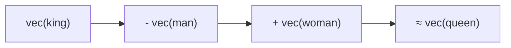

# Word2Vec 원논문 (Mikolov et al., 2013)

## 메타데이터

| 항목 | 내용 |
|------|------|
| 제목 | Efficient Estimation of Word Representations in Vector Space |
| 저자 | Tomas Mikolov, Kai Chen, Greg Corrado, Jeffrey Dean |
| 연도 | 2013 |
| arXiv | 1301.3781 |
| 학회 | ICLR 2013 워크샵 |
| 관련 논문 | "Distributed Representations of Words and Phrases..." (Mikolov et al., 2013b, arXiv: 1310.4546) - 음성 샘플링/하위 샘플링 등 개선 |

---

## 핵심 기여

- **단어 임베딩 학습의 실용화**: 신경망 기반 언어 모델에서 임베딩 레이어를 독립 목표로 분리하여 대규모 코퍼스에서 수억 단어를 수시간 내에 처리 가능하도록 효율화
- **두 가지 경량 아키텍처 제안**: CBOW(Continuous Bag-of-Words)와 Skip-gram이라는 단순하면서도 강력한 두 모델 구조 제시
- **의미론적 산술 벡터 공간**: "king - man + woman = queen" 같은 벡터 연산으로 단어 의미 관계를 수치로 조작할 수 있음을 증명
- **음성 샘플링(Negative Sampling)**: 계층적 소프트맥스(Hierarchical Softmax)와 음성 샘플링으로 출력층 계산 비용 $O(V)$를 $O(k)$ (k는 음성 샘플 수)로 감축
- **NLP 패러다임 전환**: 사전 학습된 밀집 벡터(dense vector)를 다운스트림 태스크에 활용하는 전이 학습 패러다임의 선구자

---

## 배경 및 문제 정의

### 기존 언어 모델의 한계

2013년 이전 신경망 기반 언어 모델(Neural Network Language Model, NNLM)은 이미 존재했으나 두 가지 문제가 있었다:

1. **계산 비용**: Bengio et al. (2003)의 NNLM은 입력-은닉-출력 세 레이어를 거치는 전방향 신경망으로, 어휘 크기 $V$에 비례하는 출력층 계산이 병목
2. **불필요한 복잡성**: 비선형 은닉층이 언어 모델링에는 필요하지만, 단어 벡터 학습 자체에는 과잉

### Word2Vec의 핵심 가정: 분산 가설

> "단어의 의미는 그 주변에 등장하는 단어들로부터 알 수 있다."
> (You shall know a word by the company it keeps - Firth, 1957)

Word2Vec은 이 분산 가설을 최대화하는 방향으로 벡터를 학습한다.

---

## 방법

### 두 모델 아키텍처


| 모델 | 입력 | 출력 | 특성 |
|------|------|------|------|
| CBOW | 주변 단어 (문맥) | 중심 단어 | 빠른 학습, 빈번 단어에 유리 |
| Skip-gram | 중심 단어 | 주변 단어 | 느리지만 희귀 단어/구문 표현 우수 |

### CBOW 목적함수

윈도우 크기 $c$, 훈련 단어 수 $T$에 대해:

$$\mathcal{J} = \frac{1}{T} \sum_{t=1}^{T} \log P(w_t | w_{t-c}, \ldots, w_{t-1}, w_{t+1}, \ldots, w_{t+c})$$

### Skip-gram 목적함수

$$\mathcal{J} = \frac{1}{T} \sum_{t=1}^{T} \sum_{\substack{-c \le j \le c \\ j \ne 0}} \log P(w_{t+j} | w_t)$$

조건부 확률 $P(w_O | w_I)$는 소프트맥스로 정의:

$$P(w_O | w_I) = \frac{\exp(v_{w_O}' \cdot v_{w_I})}{\sum_{w=1}^{V} \exp(v_w' \cdot v_{w_I})}$$

여기서 $v_w$는 입력 임베딩, $v_w'$는 출력 임베딩이다.

### 계산 최적화: 음성 샘플링 (Negative Sampling)

전체 어휘 소프트맥스 대신 실제 단어 1개 + 무작위 음성 단어 $k$개만 비교:

$$\mathcal{J}_{NS} = \log \sigma(v_{w_O}' \cdot v_{w_I}) + \sum_{i=1}^{k} \mathbb{E}_{w_i \sim P_n(w)} [\log \sigma(-v_{w_i}' \cdot v_{w_I})]$$

음성 단어 샘플링 분포는 단어 빈도의 3/4승:

$$P_n(w) = \frac{f(w)^{3/4}}{\sum_j f(w_j)^{3/4}}$$

이 분포는 빈번한 단어의 영향을 완화하면서도 빈도 기반 샘플링을 유지한다.

### 계층적 소프트맥스 (Hierarchical Softmax)

허프만 트리(Huffman Tree)를 사용해 단어를 이진 트리 리프로 배치. 어휘 크기 $V$에서의 소프트맥스를 $\log_2 V$ 이진 분류로 대체:

$$P(w | w_I) = \prod_{j=1}^{L(w)-1} \sigma\left([\![n(w,j+1) = \text{ch}(n(w,j))]\!] \cdot v_{n(w,j)}' \cdot v_{w_I}\right)$$

빈번한 단어일수록 트리에서 얕은 위치에 배치되어 평균 계산 비용 감소.

---

## 단어 벡터의 의미론적 성질

### 벡터 산술 (Vector Arithmetic)



이 관계가 성립하는 이유: Skip-gram이 단어 공동출현(co-occurrence) 패턴을 선형 공간에서 인코딩하기 때문에 유사한 문맥 패턴을 가진 단어들이 인접하게 배치됨.

### 평가 태스크: 단어 유추 (Word Analogy)

"a는 b이다. c는 무엇인가?" 형태의 유추 문제:

- 의미 유추: Paris:France = Berlin:Germany
- 통사 유추: walking:walked = swimming:swam

논문에서 제시한 평가 데이터셋: 8,869 의미 + 10,675 통사 유추 문제

---

## 실험 및 결과

### 아키텍처 비교

| 모델 | 의미 유추 정확도 | 통사 유추 정확도 | 학습 시간 |
|------|--------------|--------------|---------|
| NNLM (Bengio et al.) | 36.1% | 52.7% | 수일 |
| RNNLM | 39.6% | 43.1% | 수일 |
| CBOW | 50.9% | 63.6% | ~1시간 |
| **Skip-gram** | **53.3%** | **59.2%** | **~수시간** |

### 데이터 크기 효과

10억 단어 코퍼스(Google News)에서 학습:
- 300차원 Skip-gram 벡터가 이전 모든 모델을 능가
- 단어 벡터 차원과 데이터 크기 모두 성능에 기여

### 구문 표현 성능

단어 구(Phrase) 처리를 위해 "New York Times" 같은 다중어 표현을 단일 토큰으로 처리하는 전략 추가 시 성능 추가 향상.

---

## 한계 및 후속 연구

### 원논문의 한계

- **문맥 무관 임베딩**: 동음이의어 처리 불가. "bank(은행)"와 "bank(강둑)"이 동일 벡터를 공유
- **서브워드 정보 부재**: "running"과 "run"의 형태론적 관계를 학습하지 못함
- **양방향 문맥 제한**: Skip-gram이 좌우 대칭 문맥을 사용하지만 순서 정보는 무시
- **장거리 의존성 처리 불가**: 윈도우 크기 내 근거리 문맥만 사용

### 주요 후속 연구

| 연구 | 핵심 개선 |
|------|---------|
| GloVe (Pennington et al., 2014) | 전역 공동출현 행렬 분해로 Word2Vec 보완 |
| FastText (Bojanowski et al., 2017) | 서브워드(subword) 문자 n-gram으로 미등록어 처리 |
| ELMo (Peters et al., 2018) | BiLSTM으로 문맥 의존 임베딩 생성 |
| BERT (Devlin et al., 2018) | Transformer로 양방향 문맥 임베딩 |
| GPT 계열 | 자기회귀 Transformer로 생성적 언어 모델 |

Word2Vec은 정적 임베딩(static embedding)의 완성형이며, ELMo부터 시작된 문맥 임베딩(contextual embedding)으로의 진화가 BERT에서 완성되었다.

---

## 실무 적용 관점

### 현재 사용되는 상황

Word2Vec 자체는 현대 LLM 파이프라인에서 직접 사용되지 않지만:

- **경량 임베딩 서비스**: 의미 검색(semantic search)에서 컴퓨팅 제약이 있을 때
- **도메인 특화 벡터**: 특정 도메인 코퍼스(의학, 법률)에서 빠른 도메인 임베딩 학습
- **교육/연구용**: 임베딩 개념 학습의 교과서

### gensim으로 Word2Vec 학습

```python
from gensim.models import Word2Vec
from gensim.models.callbacks import CallbackAny2Vec

# 코퍼스는 문장 리스트의 리스트
sentences = [["나는", "사과를", "먹었다"], ["그는", "배를", "먹었다"]]

model = Word2Vec(
    sentences=sentences,
    vector_size=300,     # 임베딩 차원
    window=5,            # 문맥 윈도우 크기
    min_count=5,         # 최소 빈도 (희귀 단어 제거)
    workers=4,           # 병렬 처리 스레드
    sg=1,                # 1=Skip-gram, 0=CBOW
    negative=10,         # 음성 샘플링 k값
    epochs=10,
)

# 유사 단어 검색
similar = model.wv.most_similar("사과", topn=5)

# 단어 유추
result = model.wv.most_similar(
    positive=["king", "woman"],
    negative=["man"],
    topn=1,
)
```

### 사전 학습 임베딩 활용

```python
import gensim.downloader as api

# 사전 학습된 Google News 300차원 벡터 로드
wv = api.load("word2vec-google-news-300")

# 벡터 추출
vec_king = wv["king"]    # shape: (300,)

# 코사인 유사도
similarity = wv.similarity("apple", "orange")
```

---

## 관련 문서

- [[word-embeddings]] - 단어 임베딩 전반 개요 (Word2Vec, GloVe, FastText, ELMo, BERT 비교)
- [[skip-gram]] - Skip-gram 모델 상세 개념
- [[glove]] - GloVe: Word2Vec의 전역 통계 기반 대안
- [[bert-paper]] - Word2Vec에서 시작된 사전 학습 패러다임의 완성
- [[fasttext]] - 서브워드 정보를 추가한 Word2Vec 확장
- [[negative-sampling]] - 음성 샘플링 기법 상세
- [[representation-learning]] - 표현 학습 일반 개념
