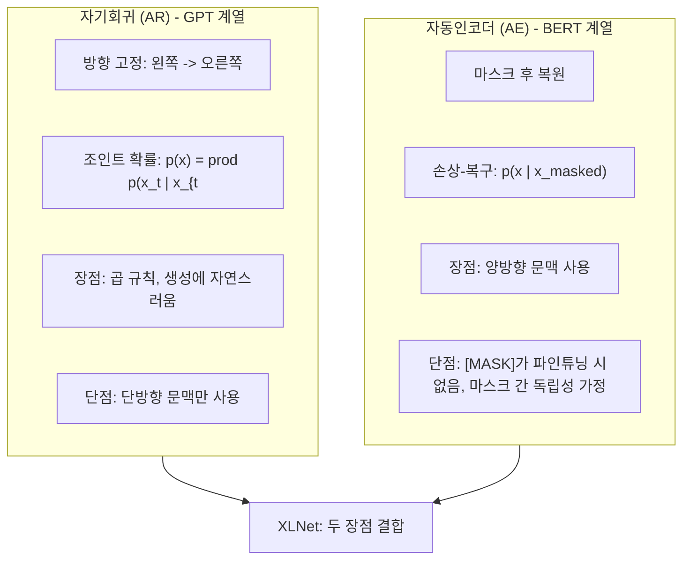
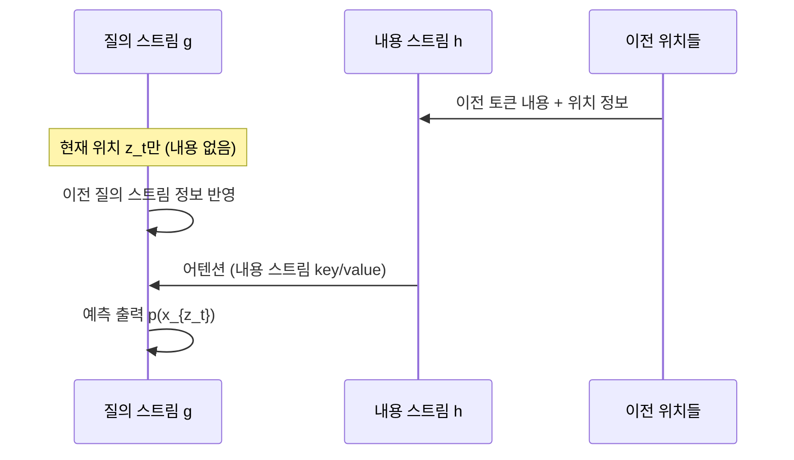

# XLNet 원논문 (Yang et al., 2019)

## 메타데이터

| 항목 | 내용 |
|------|------|
| 제목 | XLNet: Generalized Autoregressive Pretraining for Language Understanding |
| 저자 | Zhilin Yang, Zihang Dai, Yiming Yang, Jaime Carbonell, Russ Salakhutdinov, Quoc V. Le |
| 소속 | Carnegie Mellon University, Google Brain |
| 연도 | 2019 |
| arXiv | 1906.08237 |
| 학회 | NeurIPS 2019 |

---

## 핵심 기여

- **순열 언어 모델링(Permutation Language Modeling)**: 입력 시퀀스의 무작위 순열에 대한 자기회귀 언어 모델 학습으로 AR(Autoregressive)의 단방향 제약과 AE(AutoEncoding)의 독립성 가정을 동시에 극복
- **AR + AE 장점 결합**: 자기회귀 모델(GPT)의 곱 규칙(product rule) 기반 조인트 확률 모델링 + BERT의 양방향 문맥 포착
- **두 스트림 어텐션(Two-Stream Attention)**: 위치 정보와 내용 정보를 분리한 두 개의 은닉 상태 스트림으로 순열 언어 모델링의 구현 문제 해결
- **Transformer-XL 통합**: 세그먼트 재귀(Segment Recurrence)와 상대적 위치 인코딩으로 긴 문맥 의존성 처리
- **20개 NLP 태스크 SOTA**: 발표 당시 BERT를 포함한 모든 이전 모델을 20개 태스크에서 능가

---

## 배경 및 문제 정의

### AR vs AE 패러다임 비교



### BERT의 두 가지 문제

1. **사전학습-파인튜닝 불일치**: `[MASK]` 토큰이 사전학습에만 등장하고 파인튜닝 데이터에는 없어서 도메인 불일치 발생
2. **마스크 간 독립성 가정**: 다중 마스크 예측에서 마스크된 토큰들이 서로 독립적으로 예측됨. 예를 들어 "New [MASK] [MASK]"에서 "York City"를 맞출 때 "York"와 "City"의 상관관계를 학습하지 못함

---

## 방법

### 순열 언어 모델링 (PLM)

길이 $T$인 시퀀스 $\mathbf{x} = [x_1, \ldots, x_T]$에 대해 모든 가능한 순열 $\mathcal{Z}_T$의 집합을 정의. 목적함수:

$$\max_\theta \quad \mathbb{E}_{\mathbf{z} \sim \mathcal{Z}_T} \left[ \sum_{t=1}^{T} \log p_\theta(x_{z_t} | \mathbf{x}_{\mathbf{z}_{<t}}) \right]$$

**핵심**: 파라미터 $\theta$는 **순열들 간에 공유**된다. 원본 시퀀스 순서는 위치 인코딩으로 보존.

예시: $\mathbf{x} = [x_1, x_2, x_3, x_4]$, 순열 $\mathbf{z} = [3, 2, 4, 1]$이면:

$$p(x_3) \cdot p(x_2 | x_3) \cdot p(x_4 | x_3, x_2) \cdot p(x_1 | x_3, x_2, x_4)$$

$x_4$를 예측할 때 $x_3$과 $x_2$ 모두 볼 수 있어 양방향 문맥이 포착된다.

### 두 스트림 어텐션 (Two-Stream Self-Attention)

순열 LM에서 단일 은닉 상태로는 다음 문제가 발생한다:
- 위치 $z_t$의 토큰 $x_{z_t}$를 예측할 때: 이전 토큰들 $x_{z_{<t}}$의 내용은 알아야 하지만, $z_t$ 위치 자체(어디를 예측하는가)만 알아야 하고 $x_{z_t}$의 실제 값은 몰라야 한다

이를 해결하기 위해 두 종류의 은닉 상태:

| 스트림 | 접근 정보 | 역할 |
|--------|---------|------|
| 내용 스트림 $h_{z_t}$ | 위치 $z_t$ 포함 이전 모든 토큰의 내용 | 어텐션 계산 시 key/value 역할 |
| 질의 스트림 $g_{z_t}$ | 위치 정보 $z_t$만 (내용 $x_{z_t}$ 제외) | 예측 시 query 역할 |



### Transformer-XL 세그먼트 재귀

긴 문서 처리를 위해 이전 세그먼트의 은닉 상태를 캐시로 유지:

$$\tilde{h}_{t-1}^{n} = \text{stop-grad}(\tilde{h}_{t-2}^n \circ h_{t-1}^n)$$

이를 통해 메모리 없이도 더 긴 유효 문맥 길이 달성.

### 부분 예측 (Partial Prediction)

전체 순열의 모든 토큰을 예측하면 최적화가 어렵다(초기 토큰 예측 시 문맥이 거의 없음). 시퀀스 끝부분 토큰만 예측 목표로 사용:

- 파라미터 $K$를 정해 마지막 $1/K$ 비율의 토큰만 예측
- 논문에서 $K=6$ 사용 (전체의 약 1/6 예측)

---

## 실험 및 결과

### RACE 독해 이해

| 모델 | 정확도 |
|------|--------|
| BERT-Large | 72.0% |
| RoBERTa-Large | 86.8% |
| **XLNet-Large** | **89.8%** |

### SQuAD v1.1

| 모델 | F1 | EM |
|------|----|----|
| BERT-Large | 93.2 | 87.4 |
| **XLNet-Large** | **95.1** | **89.9** |

### GLUE 벤치마크

| 모델 | GLUE 평균 |
|------|----------|
| BERT-Large | 80.5 |
| RoBERTa-Large | 88.5 |
| **XLNet-Large** | **88.4** |

### 텍스트 분류

| 데이터셋 | BERT-Large | XLNet-Large |
|---------|----------|-----------|
| IMDB | 4.51% 에러 | **3.79% 에러** |
| Yelp-5 | 29.32% 에러 | **27.80% 에러** |
| DBpedia | 0.54% 에러 | **0.40% 에러** |

---

## 한계 및 후속 연구

### 원논문의 한계

- **복잡한 구현**: 두 스트림 어텐션과 순열 샘플링으로 인해 BERT 대비 구현 복잡도가 크게 증가
- **학습 속도**: 두 스트림으로 인해 계산량이 BERT 대비 약 2배 증가
- **순열 샘플링 분산**: 각 배치에서 다른 순열을 사용하므로 학습 기울기 분산이 높음
- **사전 생성 불가**: 자기회귀 방식이지만 순열로 인해 표준 좌우 생성에 직접 적용하기 어려움

### 주요 후속 연구

| 연구 | XLNet과의 관계 |
|------|-------------|
| UniLM (Dong et al., 2019) | 단일 모델로 AR+AE 통합을 다른 방식으로 달성 |
| MPNet (Song et al., 2020) | 순열 LM + 위치 정보 개선으로 XLNet 능가 |
| DeBERTa (He et al., 2020) | 분리된 어텐션으로 XLNet의 복잡성 없이 우수한 성능 |

---

## 실무 적용 관점

### 현재 사용 맥락

XLNet은 연구적으로 중요하지만 RoBERTa, ELECTRA, DeBERTa 대비 실무 채택률이 낮다. 이유:

1. 구현 복잡성 대비 성능 차이가 크지 않음
2. Hugging Face를 통해 사용은 쉽지만 학습/재현이 어려움
3. 이후 DeBERTa가 더 높은 성능을 더 단순한 방식으로 달성

### Hugging Face로 XLNet 사용

```python
from transformers import XLNetTokenizer, XLNetForSequenceClassification
import torch

tokenizer = XLNetTokenizer.from_pretrained("xlnet-large-cased")
model = XLNetForSequenceClassification.from_pretrained(
    "xlnet-large-cased",
    num_labels=2,
)

# XLNet은 좌->우가 아닌 우->좌 패딩 사용
inputs = tokenizer(
    "XLNet은 순열 언어 모델을 사용한다.",
    return_tensors="pt",
    padding="max_length",
    max_length=128,
    truncation=True,
)

with torch.no_grad():
    outputs = model(**inputs)
    predicted = outputs.logits.argmax(dim=-1)
```

---

## 관련 문서

- [[bert-paper]] - XLNet이 극복 대상으로 분석한 AE 계열 모델
- [[autoregressive-models]] - XLNet의 AR 측면 - GPT 계열과의 비교
- [[transformer-xl]] - XLNet의 기반 아키텍처 - 세그먼트 재귀와 상대적 위치 인코딩
- [[roberta-paper]] - 비슷한 시기 BERT 개선 접근법
- [[electra-paper]] - RTD로 더 효율적인 BERT 대안
- [[albert-paper]] - 파라미터 효율화 관점의 BERT 개선
- [[permutation-language-model]] - 순열 LM 개념 상세
