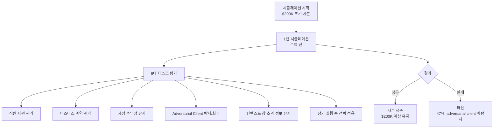
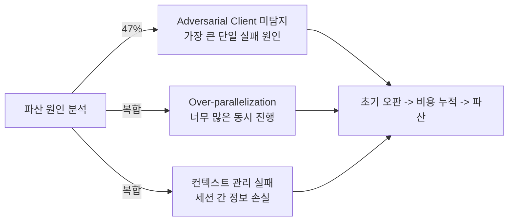

# YC-Bench: 장기 계획 및 지속 실행 에이전트 벤치마크

- arXiv: 2604.01212
- 발표: 2026-04-01
- 저자: Muyu He, Adit Jain, Anand Kumar, Vincent Tu, Soumyadeep Bakshi, Sachin Patro, Nazneen Rajani

## 개요

YC-Bench는 **1년 기간, 수백 턴의 startup 시뮬레이션** 환경에서 에이전트의 장기 계획(long-horizon planning) 및 지속 실행(consistent execution) 능력을 평가하는 벤치마크다. 직원 관리, 계약 선택, 재정 지속성을 다루며, **adversarial client(적대적 고객)** 와 payroll 인플레이션이 초기 판단 오류를 증폭시키는 구조다.

기존 벤치마크가 독립된(isolated) 단위 태스크 위주였다면, YC-Bench는 **지속적 전략 일관성(sustained strategic coherence)** 을 측정하는 것이 핵심 차별점이다.

## 벤치마크 아키텍처

6대 태스크가 시뮬레이션 전반에 걸쳐 동시에 작동하며, 태스크 간 상호작용과 오류 전파가 핵심 난이도 요소다.

## 6대 태스크

| 태스크 | 설명 | 주요 도전 |
|--------|------|-----------|
| 직원 자원 관리 (Employee Resource Management) | 팀 구성 및 채용/해고 결정 | 비용 효율과 역량 균형 |
| 비즈니스 계약 평가 (Business Contract Evaluation) | 수익성/위험 기반 계약 선택 | 장기 영향 예측 |
| 재정 수익성 유지 (Financial Profitability) | 수입/지출 균형 유지 | 복합 비용 구조 |
| Adversarial Client 탐지 | 사기성 고객 식별·회피 | 부분 관찰 환경에서 신호 포착 |
| 컨텍스트 창 초과 정보 유지 | 세션 간 중요 정보 보존 | 컨텍스트 절단(truncation) 극복 |
| 전략 적응 (Strategic Adaptation) | 환경 변화에 따른 전략 수정 | 지연 피드백, 오류 전파 |

## 평가 결과 (12개 모델)

| 모델 | 평균 최종 자본 | 비고 |
|------|---------------|------|
| Claude Opus 4.6 | **$1.27M** | 최고 자본 달성 |
| GLM-5 | $1.21M | 11배 저비용으로 유사 성능 |
| 나머지 9개 모델 | $200K 미만 | 초기 자본도 보존 실패 |

3개 랜덤 시드로 통계적 안정성을 확보했다. 전체 12개 모델 중 **9개(75%)가 시작 자본 $200K도 지키지 못했다** 는 점이 장기 실행 에이전트의 현 수준을 단적으로 보여준다.

## 주요 실패 패턴

### Scratchpad 사용의 결정적 역할

**Scratchpad 사용이 성공의 최강 예측 변수**다. 컨텍스트 절단(context truncation) 너머까지 정보를 명시적으로 보존하는 에이전트가 압도적으로 높은 생존율을 보였다. 이는 [[context-folding|Context Folding]] 및 [[agent-memory-systems|Agent Memory Systems]] 연구와 직결되는 발견이다.

> scratchpad를 적극적으로 활용하는 에이전트가 장기 시뮬레이션에서 일관되게 우수한 성과를 냈다. 이는 외부 메모리 전략이 LLM의 컨텍스트 한계를 보완하는 핵심 메커니즘임을 실증한다.

## 벤치마크 설계 특징

- **부분 관찰(partial observability)**: 에이전트가 전체 상태를 볼 수 없음
- **지연 피드백(delayed feedback)**: 결정의 결과가 즉각 나타나지 않음
- **오류 전파(error propagation)**: 초기 오판이 누적되어 증폭
- **오픈소스·재현 가능·설정 가능**: 커뮤니티 사용 가능

## 실무 관점

- SWE-Bench 같은 단위 태스크 성능이 높아도, YC-Bench 류의 장기 시뮬레이션에서는 전혀 다른 결과가 나올 수 있음
- Adversarial client 탐지 능력은 프로덕션 에이전트 시스템에서 '사기 감지' 유즈케이스와 직결
- Scratchpad/외부 메모리 전략을 에이전트 설계 초기부터 고려해야 함
- GLM-5의 비용 효율성은 성능 대비 비용 최적화 관점에서 중요한 참고점

## 관련 문서

- [[long-horizon-agent-benchmarks]] -- 장기 실행 에이전트 벤치마크 생태계 전반
- [[context-folding]] -- Context Folding: 컨텍스트 절단 극복 전략
- [[agent-memory-systems]] -- Agent Memory Systems: 세션 간 기억 유지
- [[omnicode-swe-benchmark-paper]] -- OmniCode: 코딩 에이전트 평가 벤치마크 비교
