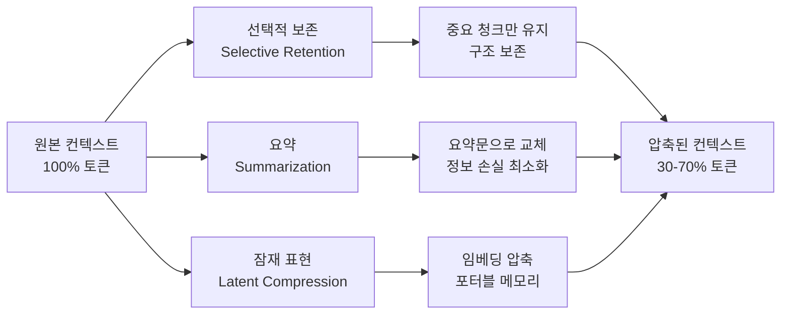
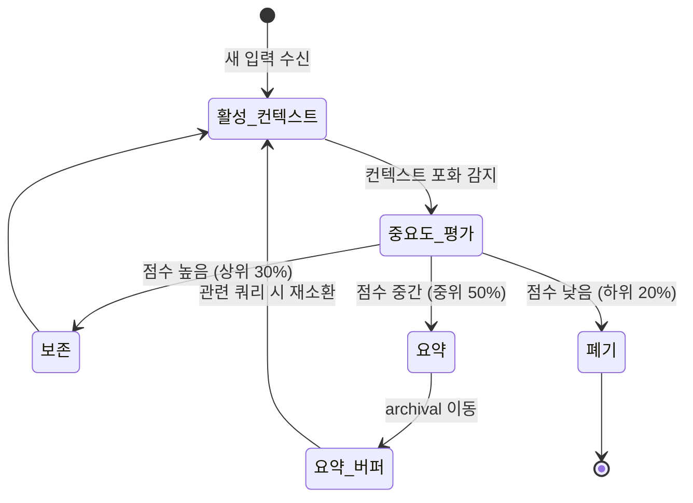

# Adaptive Context Compression for Long-Running Agents

장기 실행 에이전트(long-running agent) 또는 멀티턴(multi-turn) 대화에서 컨텍스트 윈도우(context window)가 포화되지 않도록, 중요도(importance) 기반으로 토큰(token)을 선택적으로 보존·요약·폐기하는 기법. 단순 슬라이딩 윈도우(sliding window) 방식과 달리 내용의 가치를 평가해 압축한다.

## 왜 중요한가

1M+ 토큰 컨텍스트 윈도우가 등장했지만 비용(cost)과 지연(latency)은 길이에 비례한다. 2026년 2-3월 arXiv에 adaptive compression, PoC(Performance-oriented Context Compression), Latent Context Compilation(LCC), Active Context Compression(ACON) 등 신기법이 집중 투고되며, 긴 윈도우에서도 토큰·지연을 수십 % 절감하는 것이 agentic RAG의 실전 과제가 됐다.

## 핵심 개념: 컨텍스트 압축의 3가지 전략

이 다이어그램은 압축 전략 세 가지가 병렬적으로 사용될 수 있음을 보여준다.

## 주요 논문 및 기법

### ACON (Active Context Compression)
- arXiv 2601.07190 - 에이전트가 스스로 메모리를 관리하는 자율 메모리 관리(autonomous memory management) 방식
- 에이전트 루프(agent loop) 내에서 매 스텝마다 컨텍스트 중요도를 재평가
- 중요도 점수(importance score)가 임계값(threshold) 이하인 청크(chunk)를 archival memory로 이동

### PoC (Performance-oriented Context Compression)
- arXiv 2603.19733 - 다운스트림 태스크(downstream task) 성능을 직접 예측해 압축 여부 결정
- 단순 토큰 절감이 아닌 "이 정보를 제거했을 때 최종 답변 품질이 몇 % 하락하는가"를 추정

### Latent Context Compilation (LCC)
- arXiv 2602.21221 - 긴 컨텍스트를 소형 latent 표현(latent representation)으로 증류(distill)
- KV-cache(key-value cache)를 직접 압축하는 방식으로 컨텍스트를 이식 가능한(portable) 메모리로 변환
- 모델 간 이식에 제한이 있으나 동일 아키텍처 내에서 강력한 성능

### "When Less is More" (Scaling Paradox)
- arXiv 2602.09789 - 컨텍스트 길이를 늘려도 성능이 포화(saturation)되거나 오히려 하락하는 역설 규명
- 압축이 단순 삭제가 아닌 "노이즈 필터링"의 효과를 내기 때문에 적절한 압축이 오히려 성능 향상 가능

## 중요도 평가 방법론

| 방법 | 원리 | 장점 | 단점 |
|------|------|------|------|
| 어텐션 가중치(Attention Weight) | 이전 레이어의 어텐션 점수로 중요도 추정 | 추가 모델 불필요 | 어텐션이 관련성과 항상 일치하지 않음 |
| LLM 평가(LLM-as-Judge) | 별도 LLM이 각 청크 중요도 점수 부여 | 정확도 높음 | 추가 비용 발생 |
| 휴리스틱(Heuristic) | 최신성(recency), 키워드 밀도, 엔티티(entity) 등 규칙 기반 | 빠르고 결정론적 | 도메인 의존적 |
| 태스크 성능 예측 | 다운스트림 예측 모델로 압축 후 성능 추정 | 목적 함수와 직결 | 태스크별 미세조정 필요 |

## 에이전트 루프에서의 적용 패턴

이 상태 전이 다이어그램은 에이전트가 컨텍스트를 동적으로 관리하는 사이클을 보여준다.

## 실무 적용 지침

- **압축 트리거 시점**: 컨텍스트가 윈도우의 70-80% 도달 시 선제적으로 압축 시작
- **요약 단위**: 대화(conversation)는 턴(turn) 단위, 문서(document)는 청크 단위로 요약
- **중요도 보정**: 사용자의 최신 쿼리와 관련 높은 과거 청크는 중요도를 상향 조정
- **가역성**: 요약된 원본은 archival 메모리에 보존해 필요 시 재소환 가능하도록 설계
- **평가 지표**: ROUGE(Recall-Oriented Understudy for Gisting Evaluation) 대신 태스크 성능(task accuracy)으로 압축 품질을 측정

## 관련 문서

- [[ai-hot-topics-2026-04|2026년 4월 AI 개발 핫토픽 100선]]
- [[embedding-leaderboard-shakeup-2026|Qwen3 / Voyage-4 Embedding Leaderboard Shakeup]]
- [[graphrag-in-production|GraphRAG / LightRAG / LazyGraphRAG in Production]]
- [[letta-stateful-agent-runtime|Letta (MemGPT) Stateful Agent Runtime]]
- [[mem0-universal-memory-layer|Mem0 Universal Memory Layer]]
- [[agent-memory-systems|에이전트 메모리 시스템]]
