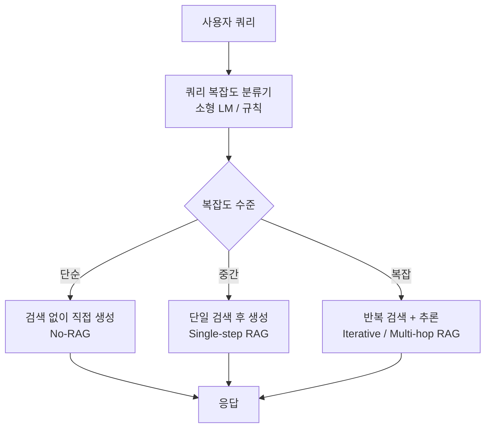
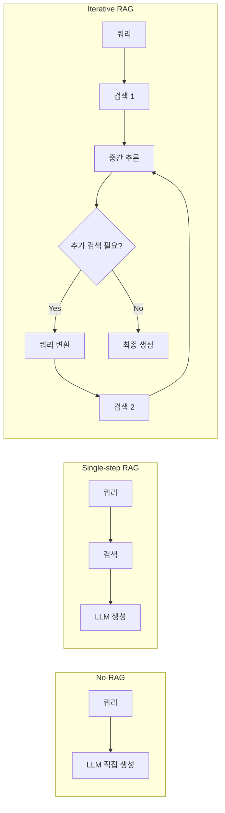

# 적응형 RAG (Adaptive RAG)

적응형 RAG(Adaptive RAG)는 **쿼리의 복잡도를 사전에 분류**하고, 복잡도에 따라 단일 검색, 반복 검색, 검색 생략 등 다른 전략을 선택적으로 적용하는 RAG 프레임워크다. 단일 검색 파이프라인이 간단한 질의부터 복잡한 멀티홉 질의까지 동일하게 처리하는 비효율을 해소하기 위해 제안됐다.

## 핵심 개념: 쿼리 복잡도 라우팅



- **단순 쿼리**: 상식적 사실, 인사, 정의 등 모델 내부 지식으로 충분히 답할 수 있는 유형. 검색을 건너뛰어 레이턴시를 줄인다.
- **중간 쿼리**: 특정 팩트나 최신 정보가 필요하지만 한 번의 검색으로 충분한 유형. 표준 [[rag-pipeline]]을 적용한다.
- **복잡 쿼리**: 여러 문서에서 정보를 수집·비교·추론해야 하는 멀티홉 유형. [[query-transformation]], 반복 검색, 체인오브소트를 결합한다.

## 분류기 구현 방식

### 소형 분류 모델 학습

별도의 소형 언어 모델(BERT 계열 또는 경량 LLM)을 쿼리 복잡도 레이블 데이터로 파인튜닝한다.

- 장점: 빠르고 저렴, 추론 파이프라인에 최소 오버헤드
- 단점: 레이블 데이터 수집 비용, 도메인 편향 가능성

### LLM 프롬프트 기반 라우팅

GPT-4o-mini 등 저비용 LLM에 분류 프롬프트를 주입해 실시간으로 복잡도를 판단한다.

```python
router_prompt = """
질의를 다음 3가지 중 하나로 분류하라:
- simple: 모델 내부 지식만으로 답 가능
- medium: 외부 문서 1회 검색 필요
- complex: 여러 단계 검색/추론 필요

질의: {query}
분류:
"""
```

### 규칙 기반 휴리스틱

질의 길이, 특정 키워드(비교, 이유, 차이점, 연도 등), 의문사 유형으로 복잡도를 근사한다. 정확도는 낮지만 레이턴시 오버헤드가 없다.

## 전략별 파이프라인



복잡 쿼리 경로에서는 [[query-transformation]] 기법(서브쿼리 분해, HyDE, RAG Fusion)을 조합해 검색 품질을 높인다.

## Self-RAG와의 차이

| 항목 | Adaptive RAG | [[self-rag]] |
|------|-------------|-------------|
| 복잡도 판단 위치 | 외부 분류기 (파이프라인 앞단) | 모델 내부 리플렉션 토큰 |
| 모델 파인튜닝 | 분류기만 파인튜닝 | 생성 모델 자체 파인튜닝 |
| 범용성 | 임의 LLM 백엔드 적용 가능 | 파인튜닝 모델 필수 |
| 검색 품질 판단 | 없음 (외부 평가 필요) | 내장 (IsSup, IsRel 토큰) |

Adaptive RAG는 **기존 LLM API를 그대로 쓰면서** 라우팅 레이어만 추가하므로 프로덕션 도입 장벽이 낮다.

## LangGraph 구현 패턴

LangGraph로 Adaptive RAG를 구현할 때의 일반적인 노드 설계:

```python
# 노드: 쿼리 복잡도 분류
def route_query(state):
    complexity = classifier.predict(state["query"])
    return {"complexity": complexity}

# 조건부 엣지
graph.add_conditional_edges(
    "route_query",
    lambda s: s["complexity"],
    {
        "simple": "generate_direct",
        "medium": "single_retrieve",
        "complex": "iterative_retrieve",
    }
)
```

## 실무 고려사항

- **분류기 오류 비용**: 복잡 쿼리를 단순으로 오분류하면 품질이 크게 저하된다. 오분류 방향성(false simple vs false complex)을 비대칭적으로 설계해 복잡 방향으로 보수적으로 라우팅하는 것이 안전하다.
- **레이턴시 버짓**: 각 전략의 평균 지연을 측정하고 SLA에 맞게 전략 트리거 임계값을 조정한다.
- **피드백 루프**: 사용자 만족도 신호를 분류기 재훈련 데이터로 활용해 점진적으로 정확도를 높인다.
- **캐싱 연계**: 단순 쿼리는 결과를 캐싱해 동일 질의 반복 시 검색·생성 비용을 제거한다.

## 관련 문서

- [[rag-pipeline]] - Adaptive RAG가 감싸는 기본 RAG 파이프라인
- [[query-transformation]] - 복잡 쿼리 경로에서 활용하는 쿼리 변환 기법
- [[self-rag]] - 모델 내부에서 적응형 검색을 수행하는 대안
- [[agentic-rag]] - 복잡 쿼리 경로를 에이전트 루프로 처리하는 확장 패턴
