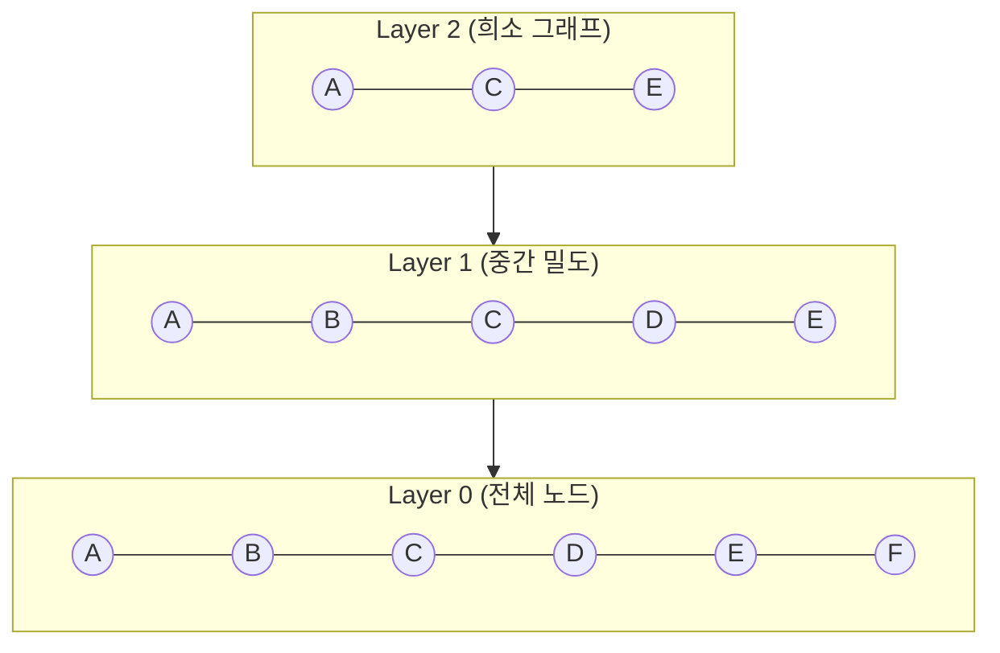
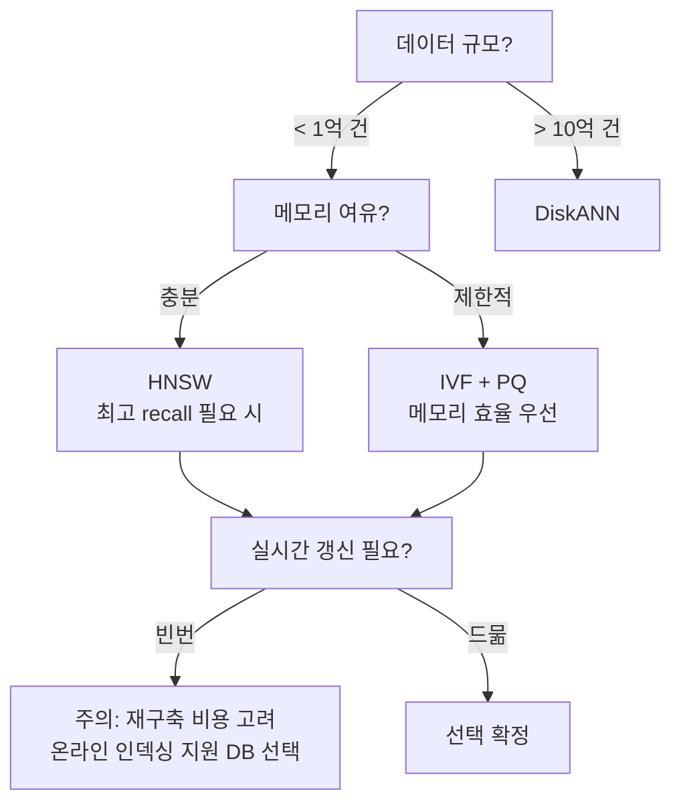

# 근사 최근접 이웃 탐색 (Approximate Nearest Neighbor / ANN)

## 개요

벡터 검색에서 **정확한 최근접 이웃(Exact Nearest Neighbor)**을 구하려면 쿼리 벡터와 전체 데이터셋의 모든 벡터를 일일이 비교해야 한다. 수억 개의 고차원 벡터에서 이는 비현실적이다. **ANN(Approximate Nearest Neighbor, 근사 최근접 이웃)**은 약간의 정확도(recall)를 희생해 수십~수백 배 빠른 검색을 가능하게 한다.

## 왜 Brute-Force 검색은 불가한가

- 벡터 차원 $d = 1536$ (OpenAI ada-002 기준), 데이터 수 $n = 100$M
- Brute-force 비교 횟수: $O(n \times d) = 1.536 \times 10^{11}$
- 쿼리 1회당 수십 초 소요 -> 프로덕션 비현실적
- 메모리에서 100M x 1536 x 4 bytes = **약 600GB** 필요

ANN은 검색 공간을 미리 인덱싱해 탐색 범위를 대폭 줄인다. 대부분의 실제 응용에서 top-10 결과의 recall@10 95% 이상이면 충분하다.

## 3대 ANN 알고리즘 계열

### 1. HNSW (Hierarchical Navigable Small World)

다층 그래프 구조를 사전에 구축해 검색한다.

탐색은 최상위 레이어(희소)에서 시작해 가장 가까운 노드를 따라 하위 레이어로 내려간다. 하위로 갈수록 그래프 밀도가 높아져 최종 후보를 정밀 탐색한다.

- 검색 복잡도: $O(\log n)$
- recall 높음 (파라미터 `ef` 조정으로 trade-off 제어)
- 단점: 인덱스 크기가 원본 벡터의 1.5-3x. 메모리 소모가 큼
- 인덱스 구축 후 삭제/갱신 비용이 높음
- **주요 채택**: Qdrant, Weaviate, Chroma 기본 인덱스

**핵심 파라미터**:
- `M`: 레이어당 최대 연결 수 (높을수록 품질 UP, 메모리 UP)
- `ef_construction`: 구축 시 탐색 범위 (높을수록 품질 UP, 구축 느림)
- `ef`: 검색 시 탐색 범위 (높을수록 recall UP, 검색 느림)

### 2. IVF (Inverted File Index)

데이터를 클러스터로 나눈 뒤, 쿼리와 가까운 클러스터만 탐색한다.

- **구축**: k-means로 데이터를 `nlist`개 클러스터로 분할. 각 클러스터의 중심(centroid)을 저장
- **검색**: 쿼리와 가장 가까운 `nprobe`개 클러스터만 탐색
- 검색 복잡도: $O(\text{nprobe} \times n / \text{nlist})$
- HNSW 대비 메모리 효율적 (그래프 오버헤드 없음)
- recall은 `nprobe` 값에 크게 의존 (기본값 낮으면 recall 저하)
- **주요 채택**: FAISS 기본 인덱스 (`IndexIVFFlat`, `IndexIVFPQ`)

### 3. DiskANN (Vamana 그래프)

SSD 기반 그래프 인덱스. 메모리에 모든 벡터를 올릴 수 없는 **10억 규모** 데이터셋에 적합하다.

- Vamana 알고리즘: 탐욕적(greedy) 그래프 구축으로 장거리 연결 유지
- SSD에서 필요한 노드만 읽어 탐색 -> 메모리 요구량 대폭 감소
- 10억 벡터에서도 수십 ms 검색 달성
- I/O 레이턴시 예산에 민감 -> NVMe SSD 권장
- **주요 채택**: Azure Cognitive Search, Microsoft 내부 검색

## 양자화(Quantization)와 결합

ANN 알고리즘에 양자화를 더하면 메모리를 추가로 절감할 수 있다.

| 양자화 방식 | 압축 비율 | 품질 손실 | 설명 |
|------------|---------|---------|------|
| **PQ** (Product Quantization) | 8-32x | 중간 | 벡터를 서브벡터로 쪼개 코드북으로 압축. FAISS `IndexIVFPQ` |
| **SQ** (Scalar Quantization) | 4x (float32 -> int8) | 낮음 | 차원별 스칼라를 정수로 양자화. 정밀도 거의 유지 |
| **BQ** (Binary Quantization) | 32x | 높음 | 각 차원을 1 bit로 표현. 해밍 거리로 검색. 모델 특화 필요 |

## 비교 표

| 항목 | HNSW | IVF | DiskANN |
|------|------|-----|---------|
| 검색 속도 | 매우 빠름 | 빠름 | 중간 (I/O 의존) |
| 메모리 사용 | 높음 (그래프) | 낮음-중간 | 매우 낮음 (SSD) |
| Recall | 높음 | 중간 (nprobe 의존) | 높음 |
| 스케일 | ~수억 건 | ~수억 건 | ~수십억 건 |
| 동적 갱신 | 비효율적 | 비효율적 | 비효율적 |
| 대표 라이브러리 | Qdrant, Weaviate | FAISS | DiskANN (OSS) |

## 선택 가이드

## Recall vs Latency Trade-off

HNSW의 `ef`, IVF의 `nprobe` 같은 파라미터를 올리면 recall이 올라가지만 검색 레이턴시도 증가한다. 프로덕션 설정 전 **recall@k vs latency** 벤치마크를 반드시 수행해야 한다.

일반적인 프로덕션 목표값:
- recall@10: 95% 이상
- p99 레이턴시: 50ms 이하 (단일 인스턴스)

## 관련 문서

- [[vector-db-comparison]]
- [[embedding-models-for-rag]]
- [[dense-retrieval]]
- [[hybrid-search-rrf]]
- [[reranking-and-cross-encoders]]
