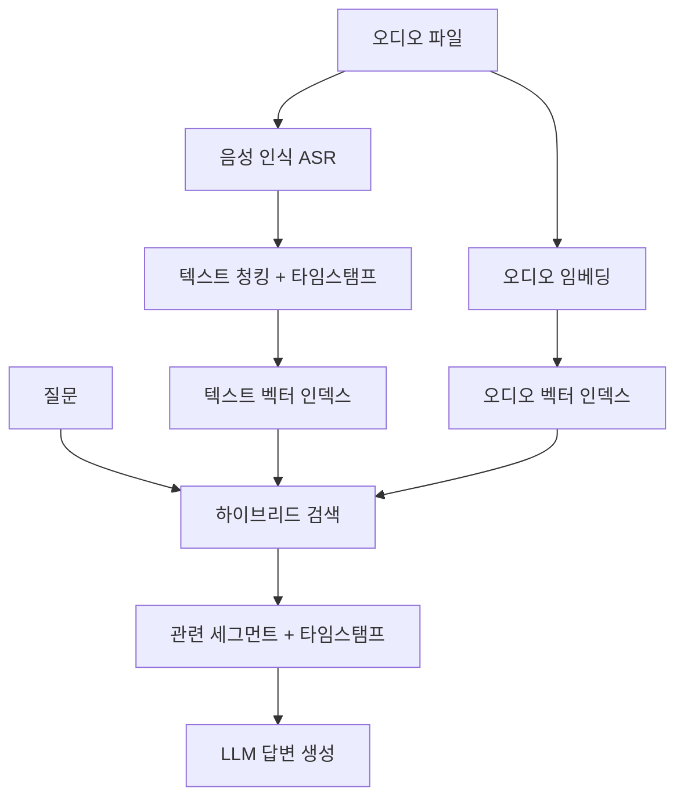

# 오디오 RAG

음성/오디오 콘텐츠를 검색 가능하게 만들어 RAG 파이프라인에 통합하는 기법. 팟캐스트, 회의록, 강의, 콜센터 녹취 등 비정형 오디오 데이터를 텍스트 기반 질의로 검색하고 답변에 활용한다.

## 파이프라인

## 핵심 구성 요소

### 1. 음성 인식 (ASR)

Whisper, Deepgram, AssemblyAI 등으로 오디오를 텍스트로 변환. **단어 수준 타임스탬프** 보존이 중요 -- 답변에서 원본 오디오 위치를 참조할 수 있어야 한다.

### 2. 화자 구분 (Diarization)

"누가 말했는가"를 식별. pyannote-audio 등으로 화자별 세그먼트를 분리하면 "김 과장이 말한 예산 관련 내용"같은 질의에 대응 가능.

### 3. 청킹 전략

오디오 특화 청킹:
- **침묵 기반**: 자연스러운 발화 단위로 분할
- **화자 전환 기반**: 화자가 바뀔 때 청크 경계
- **시간 윈도우**: 30-60초 고정 윈도우 + 오버랩

### 4. 오디오 임베딩

텍스트 변환 없이 오디오 자체를 임베딩하는 접근:
- CLAP (Contrastive Language-Audio Pretraining): 텍스트-오디오 공동 임베딩
- 음성 감정, 톤, 강세 등 비언어적 정보 보존

## [[video-rag|비디오 RAG]]와의 관계

비디오 RAG의 오디오 트랙 처리 모듈로도 활용된다. 비디오에서 시각 정보(키프레임)와 오디오 정보(전사)를 각각 인덱싱하는 멀티모달 파이프라인.

## 관련 문서

- [[rag-pipeline]] -- RAG 파이프라인
- [[video-rag]] -- 비디오 RAG
- [[chunking-strategies]] -- 청킹 전략
- [[dense-sparse-hybrid-retrieval]] -- 하이브리드 검색
